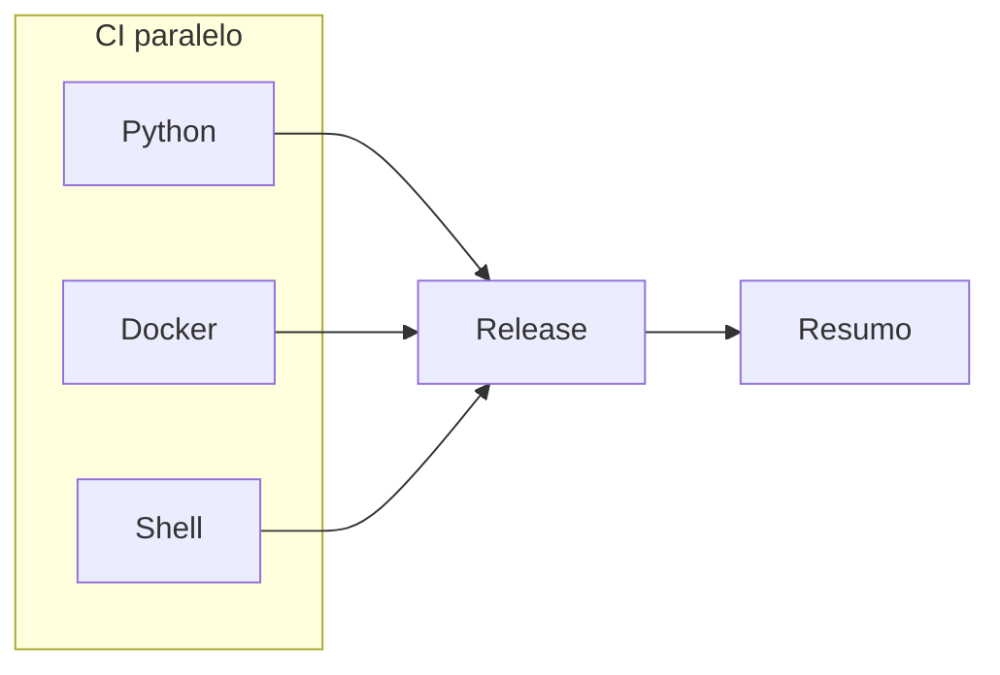

# GitHub Actions

CI por stack real do Aether (Python, Docker, Shell). JSON e YAML nao sao stacks: validam-se em steps `Python | JSON *` e `Python | YAML *`. CD = semantic-release apos CI verde. Sem Kubernetes, Terraform, Azure, GHCR deploy ou destroy.

## Visao (push em `main`)



| Fase | Job | Notas |
|------|-----|-------|
| CI | Python | Steps unicos: Lint, JSON/YAML, Validate, Seguranca, Testes, Build |
| CI | Docker | Steps unicos: Lint, Validate, Seguranca, Testes, Build |
| CI | Shell | Steps unicos: Lint, Validate, Seguranca, Testes, Build |
| Release | Semantic release | Apos gates verdes no push `main` |

Crash-first em cada stack: lint, validate, security, test, build. Jobs por tecnologia; cada stage e um step nomeado (sem step agregador "matriz").

## Workflows

| Workflow | Gatilho | Uso |
|----------|---------|-----|
| [ci.yml](workflows/ci.yml) | push/PR `main`, manual | CI por stack (Python/Docker/Shell); release no push `main` |

## Composite actions

```text
.github/actions/
├── shared/pipeline-summary/
└── ci/
    ├── setup-python/
    ├── release/
    └── sync-tags/
```

Pre-commit e CI usam os mesmos nomes de step (`Python | Lint`, `Docker | Lint`, `Shell | Lint`).
