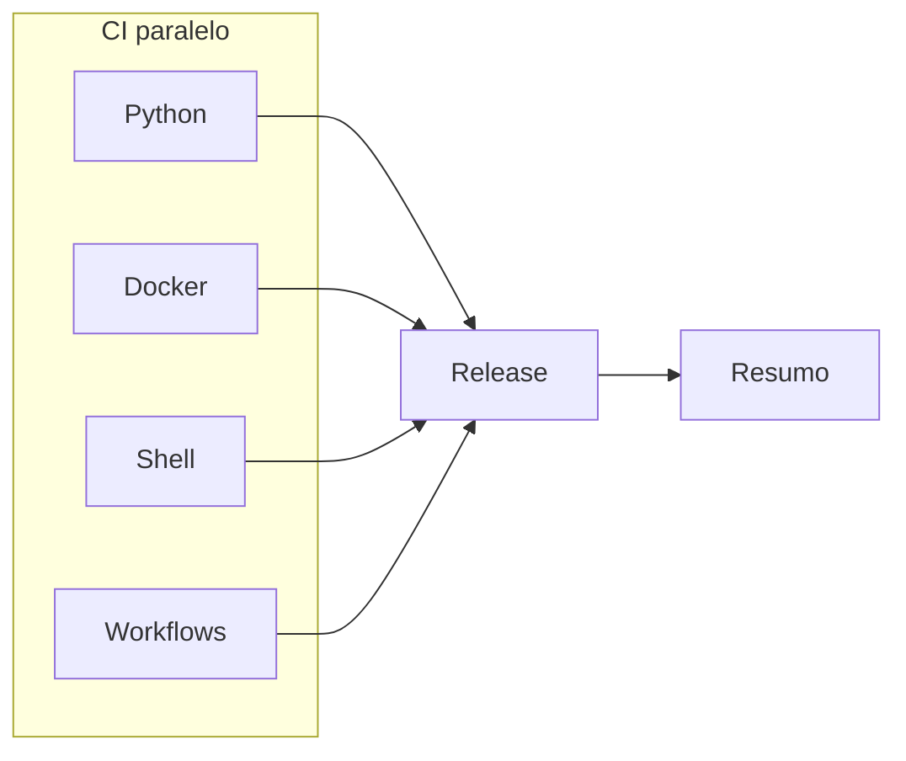

# GitHub Actions

CI por stack real do Aether (Python, Docker, Shell, Workflows). JSON e YAML nao sao stacks: validam-se em steps `Python | JSON *` e `Python | YAML *`. Actionlint vive em `CI - Workflows`. CD = semantic-release apos CI verde.

## Visao (push em `main`)



| Fase | Job | Steps (formato `Area \| Stage`) |
|------|-----|----------------------------------|
| CI | Python | Lint, JSON/YAML, Validate, Seguranca, Testes, Build |
| CI | Docker | Lint, Validate, Seguranca, Testes, Build |
| CI | Shell | Lint, Validate, Seguranca, Testes, Build |
| CI | Workflows | Lint (actionlint) |
| Release | Release | Tags, Semantic (+ Baseline/Status) |
| Resumo | Resumo | Pipeline |

Crash-first em cada stack: lint, validate, security, test, build. Jobs por tecnologia; cada stage e um step unico (sem `strategy.matrix`).

## Workflows

| Workflow | Gatilho | Uso |
|----------|---------|-----|
| [ci.yml](workflows/ci.yml) | push/PR `main`, manual | CI por stack; release no push `main` |

## Composite actions

```text
.github/actions/
├── shared/pipeline-summary/
└── ci/
    ├── setup-python/
    ├── workflows/
    ├── release/
    └── sync-tags/
```

Pre-commit e CI usam os mesmos nomes de stage (`Python | Lint`, `Docker | Lint`, `Shell | Lint`).
