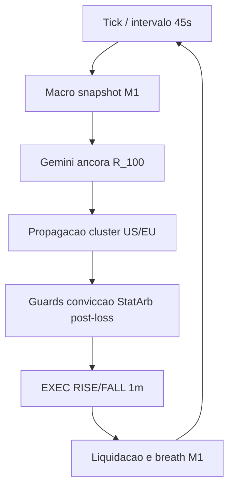

# Arquitetura — sinteticos M1

## Fluxo do ciclo

## Modulos principais

| Modulo | Responsabilidade |
|--------|------------------|
| `synthetic_universe.py` | Ancora padrao, clusters US/EU, reexport de timing M1 |
| `contract_timing.py` | Espacamento pos-liquidacao e breath alinhados ao contrato 1m |
| `llm_cluster_propagate_region.py` | Fallback de indice quando lider bloqueado |
| `cluster_post_loss.py` | Veto `repeat_loss_setup` e cooldown |
| `llm_refresh_policy.py` | Refresh LLM por tag; reconsulta se conviccao abaixo do piso |
| `config_symbols.py` | Lista de simbolos a partir de clusters menos `excluded_symbols` |

## Tags macro e clusters

| Tag | Cluster exclusivo | Simbolos tipicos |
|-----|-------------------|------------------|
| `risk_on` | US | `R_10`, `R_25`, `R_50` |
| `risk_off` | EU | `1HZ50V`, `1HZ100V` |
| `divergence_us_leads` | US | `R_10`, `R_25`, `R_50` |
| `divergence_eu_leads` | EU | `R_75`, `1HZ50V`, `1HZ100V` |
| `indefinido` | Por forca regional | Ambos conforme LLM |

## Logs operacionais

- `CLUSTER_INVERT`: inversao LLM no indice (`cluster_invert_llm_side`)
- `CLUSTER_BEST` / `CLUSTER_BLOCK`: indice escolhido ou bloqueado
- `CLUSTER_REFRESH`: macro atualizada sem nova chamada Gemini quando cache valido
- `EXEC_SKIP (post_settlement_spacing)`: aguardando janela pos-win (~13s em M1)

## Backtest

Scripts em `app/scripts/backtest/` com granularidade M1 (`timeframe.py`, `data_loader.py`). Usar esta branch para coleta e walk-forward sintetico.
