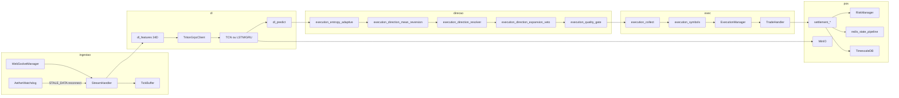

# Arquitetura — Aether Quantum Engine

Motor assíncrono para trading na Deriv com decisão exclusiva por **Deep Learning** (TCN, LSTM ou GRU) nos índices **Drift** (`RDBEAR`, `RDBULL`). A metodologia de negócio quantitativa está em [`medallion.md`](medallion.md); este documento descreve o software.

---

## 1. Visão geral

| Aspecto | Valor atual (`config/settings.json`) |
|---------|--------------------------------------|
| Símbolos | `RDBEAR`, `RDBULL` (âncora `RDBULL`) |
| Granularidade OHLC (DL) | **900 s / M15** (`data_handler.granularity`) |
| Relógio operacional | **60 s / M1** (`data_handler.micro_granularity`) |
| Histórico para treino | 15552 barras M15 (`training_history_bars`, ~162 dias) |
| Lookback | 48 barras M15 por sequência (**12 h** de contexto) |
| Features | **34** (`FEATURE_DIM` em `dl_feature_build.py`) |
| Contrato | `RISE_FALL`, duração **60 s** (execução micro M1) |
| Ciclo do orquestrador | 60 s (`cycle_interval_seconds`, virada M1) |
| Decisão | `collect_deep_learning_decisions` |
| Fases | `FASE TREINO` → `FASE OPERACAO` |
| Execução | Seletiva (`mandatory_trade_each_cycle: false`) ou **contínua** (`true`) |

O mercado é tratado como **série temporal ruidosa**: o modelo estima probabilidade de alta; um **motor de direção** composto e uma **camada de qualidade** (penalidade ou veto conforme modo) decidem CALL, PUT ou skip do ciclo.

---

## 2. Pipeline de dados



### 2.4 Infraestrutura híbrida

Com `infra.enabled: true`, o motor valida Redis, TimescaleDB e MinIO em `localhost` antes do WebSocket (fail-fast). Estado de risco e sessão persistem em Redis via pipeline atômico (`redis_state_pipeline.write_state_bundle`); ticks e barras vão para Timescale; checkpoints DL sincronizam com MinIO mantendo cache local em `data/dl/`.

**Bootstrap de modelos** (`bootstrap_and_validate_models`):

1. Baixa `{symbol}.pth` e `latest_ts.pt` do MinIO.
2. Valida manifest (`feature_dim`, `lookback`, `norm_mean`/`norm_std`).
3. Forward pass multi-probe em TorchScript (`torchscript_sanity_probes`: zeros, extremos, **regime estressado** RSI/CMO/vol).
4. Com `infra.triton.enabled`: espelha artefatos em `infra/docker/triton-models`, recarrega repositório Triton, valida schema HTTP e executa **`verify_triton_stressed_inference_async`** (inferência concorrente sob tensores estressados; fail-fast se NaN/Inf ou probabilidade fora de `[0, 1]`).

**Inferência de produção** via `TritonGrpcClient` (`triton_grpc_client.py`):

- Canal persistente `grpc.aio.insecure_channel` com keepalive (sem handshake repetido a cada ciclo).
- Predições de `RDBEAR` e `RDBULL` em paralelo com `asyncio.gather`.
- **Timeout rigido de 2,0 s** por requisição (`asyncio.wait_for`); se o Triton exceder o limite, dispara `TritonInferenceTimeout` e fallback imediato para TorchScript em cache local (`dl_predict_triton.py`, log `TRITON_TIMEOUT_FALLBACK`), preservando a janela de 60 s do orquestrador.
- Facade em `triton_inference_client.py` para o restante do motor.

**Resiliência de ingestão** (`watchdog_service.py` + `stream_reconnect.py`):

- `AetherWatchdog` roda como task assíncrona perpétua após bootstrap do stream.
- Monitora `TickBuffer.last_tick_monotonic()`; se a inanição exceder `watchdog_stale_tick_seconds` (padrão 30 s) com WebSocket aparentemente conectado, entra em estado `STALE_DATA`.
- Antes de reconectar: persiste snapshot de risco (`save_full_state`); em seguida `StreamHandler.reconnect_stream` fecha o WS, reabre sessão OTP e reativa subscrições OHLC/tick sem backfill pesado.
- Encerrado no graceful shutdown (`graceful_shutdown.stop_ingestion_watchdog`).

Config em `orchestrator`: `watchdog_enabled`, `watchdog_stale_tick_seconds`, `watchdog_poll_interval_seconds`.

Redis local usa AOF `appendfsync everysec` (`infra/docker/redis.conf`). `make docker-up` aplica `host-prereq.sh` (`vm.overcommit_memory=1` no WSL).

**Persistência pós-settlement** (`save_full_state`): uma transação Redis `MULTI/EXEC` grava snapshot JSON, hash de risco (`consecutive_losses`, `pending_loss`, cooldowns), hash `session:current`, chaves `session:current:start_balance` e `session:current:target_win`, `recovery:skip_counter` e assinatura de mercado — sem round-trips bloqueantes adicionais na thread principal.

---

### 2.1 Bootstrap

1. `app/run.py` carrega `config/settings.json` e PAT do `.env` (`AETHER_DERIV_PAT` + `AETHER_DERIV_APP_ID`).
2. `validate_infra_services` (quando `infra.enabled`) e `bootstrap_and_validate_models` (checkpoint + TorchScript + sanity + Triton).
3. `restore_orchestrator_state` e `AuthManager` abrem sessão REST/WebSocket via OTP PAT.
4. `Orchestrator` instancia stream, risco, executor e persistência.
5. Após autenticação, `bootstrap_active_session_targets` captura banca inicial e define meta de 1% (`session_target_bootstrap.py`).
6. `StreamHandler.start_candle_stream` busca histórico OHLC e assina velas (`style: candles`) e ticks (`style: ticks`).

### 2.2 Buffer e microestrutura

- `buffer_limit` limita velas em memória por símbolo.
- `history_bars` / `training_history_bars` definem recorte para treino e predição.
- `StreamHandler` assina **dois fluxos OHLC** por símbolo: **M15 (900 s)** para tensor DL `[1, 48, 34]` e **M1 (60 s)** para o relógio do orquestrador.
- `TickBuffer` agrega microestrutura apenas no fechamento de barras **M15**.
- `get_data_state_signature()` combina assinatura **M1 + M15** para reavaliar o cenário a cada minuto sem inferência redundante na GPU.

### 2.3 Assinatura de estado de dados

Para evitar inferências duplicadas na virada de vela, o orquestrador usa `get_data_state_signature()`: concatena epoch e OHLC do último candle fechado por símbolo. Se a assinatura for idêntica ao ciclo anterior, o motor aguarda sem reprocessar.

---

## 3. Deep Learning

### 3.1 Labels e features

**Rótulo** (`dl_labels.py`, modo `ma_trend`):

```
Y[i] = 1.0 se média móvel suavizada indica alta na barra i + horizon
horizon = label_horizon_bars (padrão 1)
```

**34 features** (`FEATURE_DIM` em `dl_feature_build.py`):

| Grupo | Dim | Conteúdo |
|-------|-----|----------|
| Microestrutura | 5 | ticks/barra, intervalo médio, velocidade, aceleração, std diffs |
| Tradicionais | 22 | RSI, delta-RSI, BB, ATR, EMAs, MACD, estocástico, CCI, ADX, DI, Williams, CMO, Keltner, ROC-RSI, etc. |
| Volatilidade | 5 | vol rolling, vol vs alvo, z-score, implied vol ratio, vol_ratio short/long |
| Persistência | 2 | Hurst (R/S), variance ratio |

Normalização anti-leakage: `fit_norm_stats` somente no split de treino walk-forward.

### 3.2 Modelo

- Arquitetura: **`tcn`** (padrão), **`lstm`** ou **`gru`** via `deep_learning.arch`.
- Saída: probabilidade bruta de alta (`raw_prob`).
- Checkpoint v4 em `data/dl/{symbol}.pth` + TorchScript `{symbol}_ts.pt` (espelho MinIO `latest_ts.pt`).
- Inferência via `TritonGrpcClient.infer_symbols_concurrent` quando `infra.triton.enabled`; tensor FP32 **`[1, 48, 34]`** (48 barras M15 = **12 h** de contexto).
- `collect_cluster_orders` suporta modo contínuo: penalidade de qualidade em vez de SKIP; fallback por entropia e mandatory pick.

### 3.3 Treino walk-forward

- Splits temporais com embargo (`dl_splits.py`).
- Early stopping pela perda de validação.
- Retreino: bootstrap de sessão, nova vela, rolling, forçado após loss.
- Treino deferido (`dl_deferred_train.py`): thread em background serializada.
- Deploy gate opcional (`dl_deploy_eval.py`): `deploy_ok=false` bloqueia execução.
- Gate de treinamento: símbolo sem treino da sessão recebe `gate_reason: training`.

### 3.4 Predição

`predict_symbol_decision_async` (`dl_predict_async.py` / `dl_predict_triton.py`):

- Sempre `execute=True` quando a predição técnica é bem-sucedida.
- Calcula indicadores, trend (`dl_trend.py`) e enriquece métricas para o resolver.
- `gate_reason=None` após predição OK; bloqueio só em exceção (`predict_error`).
- Thresholds `confidence_call/put` (0.53/0.47) são bases; com `dynamic_threshold.enabled`, flutuam por `bb_width`, `atr_norm` e regime de volatilidade.
- Com Triton ativo: inferência via `infer_symbol_async`; timeout 2 s dispara fallback TorchScript em cache (`TRITON_TIMEOUT_FALLBACK`).
- Grava `calibrated_prob`, `calibrated_edge` e thresholds dinâmicos em metrics para resolver e quality gate.

---

## 4. Direção e qualidade

### 4.1 Motor de direção (`execution_direction_resolver.py`)

Substitui travas binárias por scoring composto CALL vs PUT:

| Sinal | Comportamento |
|-------|---------------|
| `calibrated_prob` | Peso principal via `dl_raw_weight` (fallback: `raw_prob`) |
| `dynamic_call/put_threshold` | Pivot dinâmico para inferência DL |
| `val_accuracy` | Bias lateral |
| `trend_direction` + votos | `trend_bias` |
| RSI/Keltner extremos | `exhaustion_flip` (mean-reversion) |
| RSI+CMO+Keltner alinhados | `exhaustion_hard_gate` — atenua peso DL em 80% |
| Entropia de probabilidade | `execution_entropy_adaptive` — comprime `w_eff` em regime incerto |
| Hurst, ADX, vol_ratio, CMO | `indicator_regime` no scoring composto |
| Correlação cross-symbol | `execution_direction_cross_corr` — matriz Timescale + softmax |

**Barramento de 4 Regimes Universais** (`UniversalRegimeEvaluator` em `execution_universal_regime_evaluator.py`), aplicado após o scoring em `resolve_execution_direction`:

Prioridade risco-primeiro:

| Regime | Critério | Ação |
|--------|----------|------|
| `CLIMAX_EXHAUSTION` | `adx ≥ 0.23`, RSI extremo, `\|cmo\| ≥ 0.45` | Inverte contra o DL esticado; score **0.76** |
| `COMPRESSION_TRAP` | `adx < 0.20`, `hurst ≤ 0.50`, `vol_ratio < 0.85` | Inverte se RSI esticado **e** `bb_width < 0.01` no M1; caso contrário segue TCN estrita |
| `TREND_EXPANSION` | `adx ≥ 0.23`, `hurst > 0.53`, `vol_ratio ≥ 1.00` | Mantém direção do DL |
| `ENTROPIC_NOISE` | votos empatados ou `hurst < 0.45` | `gate_penalty=noise`; SKIP do ciclo fora de recovery/contínuo |
| `NEUTRO` | nenhum regime classificado no M15 | sem inversão; sujeito ao Gate Assimétrico de Proteção |

Configuração em `orchestrator.execution.regime_evaluator`. Auditoria em `gather_cluster_candidates`:

`[C0042] REGIME: CLIMAX_EXHAUSTION | Invertido=True | ord=PUT dl=CALL | RDBULL`

Pesos configuráveis em `orchestrator.execution.direction_scoring`.

#### Veto de Inversão por Convicção DL (`execution_direction_inversion_veto.py`)

Aplicado em `resolve_execution_direction` **antes** de `apply_regime_direction_boost`, com `DL_INVERSION_VETO_SCORE = 0.60`:

| Condição | Ação |
|----------|------|
| Regime pede inversão tática **e** `P(lado_DL) ≥ 0.60` | Proíbe a inversão: `direction_inverted=False`, `trap_boost_score=None`, executa a direção estrita da TCN (`dl_dir`) |

`P(lado_DL)` deriva de `calibrated_prob`, com fallback para `raw_prob` e depois `trade_score`. O motor de direção não sobrescreve predições de alta convicção do modelo convolucional profundo; a flag `dl_inversion_veto=True` é persistida para auditoria.

### 4.2 Gate de qualidade (`execution_quality_gate.py`)

Aplicado **após** resolução direcional em `gather_cluster_candidates`:

| Modo | Comportamento |
|------|---------------|
| Seletivo (`mandatory_trade_each_cycle: false`) | Pisos de score/edge podem resultar em SKIP do ciclo |
| Contínuo (`mandatory_trade_each_cycle: true`) | Penalidade de score/edge; mandatory pick garante ordem |

| Piso | Valor padrão | Efeito |
|------|--------------|--------|
| `mandatory_min_trade_score` | 0.68 | Score efetivo mínimo (modo normal) |
| `recovery_min_trade_score` | 0.64 | Piso em recovery (escala com perdas consecutivas) |
| `recovery_hurst_persistence_min` | 0.58 | Hurst mínimo para persistência em recovery N2+ |
| `min_edge_execute` | 0.04 | Edge mínimo (usa `calibrated_edge`; respeita `dynamic_min_edge`) |
| `min_direction_margin` | 0.05 | Clareza CALL vs PUT no resolver |
| `inverted_min_score` | 0.74 | Score extra quando `direction_inverted=true` |

Em recovery N2+, `recovery_skip_counter` no Redis reduz o limiar Hurst linearmente ou com decaimento logarítmico em drawdown severo.

#### Gate Assimétrico de Proteção (`validate_recovery_asymmetric_gate`)

Veto mandatório aplicado em `gather_cluster_candidates` e `apply_quality_penalty_to_metrics`, **independente** de `mandatory_trade_each_cycle` ou recovery ativo (`pending_total > 0`):

| Condição | Ação |
|----------|------|
| `universal_regime == NEUTRO` **e** `trade_score < 0.68` | SKIP absoluto do ciclo (`gate_reason=low_conviction_neutral_skip`) |

Justificativa: operar o relógio micro M1 sem tendência macro M15 e com convicção abaixo do piso institucional degrada a expectativa de payoff — o sinal é ruído puro, não edge recuperável.

#### Micro Noise Gate (`validate_micro_noise_gate`)

Veto estrutural aplicado em `gather_cluster_candidates` e no bloqueio de ciclo mandatório, forçando SKIP absoluto (aborta inclusive os fallbacks obrigatórios do modo contínuo). Pisos config-driven em `orchestrator.execution.micro_noise_gate` (`enabled`, `adx_floor`, `bb_extreme`, `hurst_random_walk_max`), com fallback nas constantes `MICRO_ADX_FLOOR = 0.15`, `MICRO_BB_EXTREME = 0.01`, `MICRO_HURST_RANDOM_WALK_MAX = 0.48`. Calibração ativa: `adx_floor = 0.12` para devolver atividade em índices Drift de baixa direcionalidade.

| Condição | Ação |
|----------|------|
| `adx < 0.15` | SKIP (`gate_reason=micro_adx_chop_skip`) |
| `bb_width < 0.01` **e** `hurst < 0.48` | SKIP (`gate_reason=micro_squeeze_breakout_skip`) |

Justificativa: ADX colapsado indica ausência de tendência (chop); squeeze extremo com Hurst em random walk sinaliza esmagamento sem reversão limpa — ambos convertem a inferência micro em sorteio de expectativa negativa.

#### Filtro de Exaustão de Barreira Micro (`validate_micro_boundary_exhaustion`)

Último estágio de `resolve_execution_direction` (`execution_direction_micro_boundary.py`), executado sobre a direção final. Rebaixa `trade_score` para `min(trade_score, 0.55)` quando a ordem compraria o topo ou venderia o fundo do canal micro M1:

| Direção final | Gatilho de saturação | Ação |
|---------------|----------------------|------|
| `CALL` | `keltner > 1.10` **ou** `bb_pct_b ≥ 0.95` (banda superior de Bollinger M1) | `trade_score = min(trade_score, 0.55)` + `micro_boundary_exhaustion=True` |
| `PUT` | `keltner < -0.10` **ou** `bb_pct_b ≤ 0.05` (banda inferior de Bollinger M1) | `trade_score = min(trade_score, 0.55)` + `micro_boundary_exhaustion=True` |

`validate_micro_boundary_saturation_gate` converte a marca em SKIP absoluto (`gate_reason=micro_boundary_saturation_skip`) em `gather_cluster_candidates` e no bloqueio de ciclo mandatório, soberano sob `mandatory_trade_each_cycle=true`. Justificativa: derrubar o score abaixo do piso de 0.68 congela compras de topo e vendas de fundo em zonas saturadas de ticks, aguardando o recuo saudável do preço. O `bb_pct_b` é exposto em `dl_predict_build` para a checagem do último fechamento contra as bandas.

### 4.3 Pool e seleção

- `execution_recovery_gate.cluster_entry_eligible` — bloqueio **somente técnico** + exige `raw_prob` ou direção.
- `execution_collect_helpers.recovery_hurst_blocks_collect` — filtro de persistência Hurst antes da seleção.
- `execution_direction.build_execution_candidate` — delega ao resolver.
- `execution_symbols.select_best_execution_candidate` / `select_mandatory_execution_candidate` — ranking por `market_decision_score`.
- `execution_mandatory_pick` / `execution_entropy_fallback` — fallbacks em modo contínuo.

---

## 5. Execução

### 5.1 Fases

- **FASE TREINO** — `_training_phase_gate` suspende ordens até `session_trained` em todos os símbolos.
- **FASE OPERACAO** — `collect_cluster_orders` seleciona melhor candidato ou mandatory pick.

### 5.2 ExecutionManager

- Monta ordens com stake de `RiskManager.calculate_stake`.
- Settlement assíncrono; reentrada via `post_settlement_cycle`.
- Contratos via `TradeHandler.buy_with_parameters`: RISE_FALL, **60 s** (M1), com contexto DL em **M15**.
- Após settlement: `save_full_state` persiste bundle atômico no Redis.

---

## 6. Gerenciamento de risco

| Mecanismo | Módulo / config |
|-----------|-----------------|
| Kelly fracionário | `kelly_base_fraction.py`, `stake_sizing.py`, `kelly.fraction` — compressão base de 60% em regime normal (`0.0035 → 0.0012`) |
| Target Proximity Damping | `stake_target_proximity.py` + `RiskManager.apply_kelly_target_proximity_damping` — `Stake_Kelly × (0.40 + 0.60 × remaining_target_pct)` |
| Consensus Entropy Penalty | `consensus_stake_penalty.py` — penalidade convexa em `f*` quando ord diverge dos votos; atenua por `di_diff`, `cmo`, `rsi`; piso `stake_min` em baixo consenso |
| Regime Edge Sizing (waiver) | `consensus_stake_penalty.py` — em recovery, `retention = 1.0` para inversão tática, votos unânimes (6×0/0×6) ou `trade_score >= 0.68` |
| Recovery score waiver | `consensus_stake_penalty.py` — com `pending_loss > 0` ou `consecutive_losses_linear > 0` e votos unânimes ou `trade_score >= 0.68`, `retention = 1.0` |
| Recovery financeiro persistente | `risk_recovery_state.py` — `consecutive_losses_linear` **nao reseta** em WIN operacional enquanto `pending_loss > 0`; reset somente quando o drawdown pendente zera por retornos reais |
| Stop win por sessão ativa | `stop_win_target.py` + `session_target_bootstrap.py` — meta = `session_start_balance × compounding_rate_daily`; sem reset por relógio/calendário |
| Encerramento por meta | `StateManager.check_session_limits()` — `pnl_sessao >= target_win` → `graceful_shutdown` |
| Stop loss | **Desativado** — sem `daily_max_loss_limit` nem disjuntor de perda no motor |
| D'Alembert recovery | `dlambert_sizing.py`, `recovery_conviction.py` — stake linear `Kelly_base + n×U_eff` com Amortization Booster e piso progressivo por cluster |
| Circuit Breaker D'Alembert | `dlambert_sizing.dlambert_circuit_breaker` — trava rígida em recovery ativo, config-driven em `risk_management.dlambert` (`circuit_breaker_max_linear_level=8`, `circuit_breaker_max_stake_u_multiple=10.0×U`, `circuit_breaker_max_session_drawdown_u` calibrado para `250.0×U`); violação força stake `0.0` (ou `$1.00` em modo contínuo estrito) com log `DLAMBERT_CIRCUIT_BREAK` |
| Retração D'Alembert | WIN parcial em recovery: `consecutive_losses_linear = max(1, n-1)` |
| Super-concordance Kelly | booster desligado em recovery; ativo em Kelly puro com P≥0.75, 6×0, Hurst>0.55 |
| Trava Hurst N2+ | `recovery_hurst_gate.py` |
| Decaimento Hurst acelerado | `recovery_hurst_decay.py` — `recovery_skip_counter` no Redis |
| Cooldown entrada | `risk_cooldown.py` |
| Cooldown por loss no símbolo | `symbol_loss_cooldown.py` |

### 6.1 Sessão ativa e juros compostos

A meta de lucro segue a planilha de juros compostos (`compounding_rate_daily`, padrão **0,01 = 1%**), aplicada **estritamente por instância de processo**:

1. **Boot** (`ws_bootstrap` → `bootstrap_active_session_targets`): lê saldo vivo da Deriv ou override `session_start_balance` em `risk_management.params`.
2. **Cálculo**: `target_win = session_start_balance × compounding_rate_daily` via `StopWinManager.calculate_session_targets`.
3. **Persistência Redis**: `{prefix}:session:current:start_balance` e `{prefix}:session:current:target_win` no pipeline atômico; hash `session:current` com métricas correntes.
4. **Encerramento**: após settlement, `check_session_limits()` compara `session_profit` com `daily_stop_win_target`; se atingido, `graceful_shutdown` encerra o motor e `clear_current_session_redis_keys` remove as chaves da sessão.
5. **Nova sessão**: reiniciar `run.py` captura novo saldo e recalcula meta — o operador decide quantas sessões executar no mesmo dia civil.

Log de bootstrap: `SESSAO INICIADA | Alvo de 1%: $XX.XX | Stop Loss: DESATIVADO`.

Com `compounding_enabled: false`, o motor usa alvo legado (`small_account_stop_win` / `large_account_stop_win_pct`).

Logs de sizing expõem `pend=$` (drawdown pendente) e `pnl_sess=$` (P&L acumulado da sessão) em cada cálculo de stake.

### 6.2 Sizing defensivo de proximidade de alvo

Política aplicada sobre a stake Kelly bruta **antes** da escada D'Alembert:

| Etapa | Fórmula / regra |
|-------|-----------------|
| Compressão Kelly base | `fraction_efetiva = fraction × 0.40` (referência `0.0035 → 0.0012`); recovery mantém `fraction` integral |
| Distância relativa à meta | `remaining_target_pct = max(0, (target_win − pnl_sessao) / target_win)` |
| Amortecimento dinâmico | `target_damping = 0.40 + 0.60 × remaining_target_pct` |
| Stake Kelly comprimida | `Stake_Kelly = Stake_Kelly_raw × target_damping` |

Comportamento: no início da sessão (`pnl_sessao = 0`), `target_damping = 1.0` e apenas a compressão Kelly base atua. Com ~90% da meta atingida, o fator cai para **0.46**, reduzindo superexposição nos ciclos finais antes do stop win.

Persistência: `data/session_state.json` (métricas da sessão corrente), Redis (snapshot atômico + chaves `session:current:*`), `data/state.json` (contratos legado).

---

## 7. Orquestrador

`Orchestrator` (`orchestrator/__init__.py`):

1. `setup_trading_session` — autenticação Deriv e WebSocket.
2. `bootstrap_active_session_targets` — captura banca inicial e meta de stop win da sessão.
3. `start_ingestion_watchdog` — monitoramento de inanição de ticks (modo contínuo).
3. A cada vela do âncora ou `cycle_interval_seconds`:
   - `tick_bars_since_train`
   - `collect_deep_learning_decisions` (inferência Triton concorrente com fallback TorchScript)
   - `executor.execute_cluster`
4. Reconciliação periódica de contratos abertos.
5. Após liquidação: `post_settlement_cycle` → `save_full_state`.

**Graceful shutdown** (`graceful_shutdown.py`): encerra watchdog, Triton gRPC, Timescale, Redis e WebSocket sem vazamento de tasks; limpa chaves `session:current:*`; excepthook instalado em `run.py`.

---

## 8. Configuração crítica

| Bloco | Chaves relevantes |
|-------|-------------------|
| `data_handler` | `granularity`, `history_bars`, `fetch_count`, `buffer_limit` |
| `deep_learning` | `arch`, `lookback`, `confidence_*`, `min_val_accuracy`, `deploy_gate` |
| `orchestrator` | `watchdog_*`, `cycle_interval_seconds`, `idle_cycle_watchdog_seconds` |
| `orchestrator.execution` | `direction_scoring`, `quality_gate`, `exhaustion_gate`, `mean_reversion_*`, `expansion_inversion_*`, `mandatory_trade_each_cycle` |
| `risk_management.kelly` | `fraction`, `consensus_penalty_*`, `penalty_smoothing_*`, `recovery_*` |
| `risk_management.dlambert` | `dlambert_enabled`, `dlambert_unit_override`, `recovery_*_conviction` |
| `risk_management.params` | `compounding_enabled`, `compounding_rate_daily`, `session_start_balance`, `duration`, stakes |
| `infra.triton` | `enabled`, `grpc_url`, `http_url`, `model_repo_path` |
| `trading` | `mode` (`demo` / `live`) |

---

## 9. Camadas de software

| Camada | Módulos principais |
|--------|-------------------|
| Application / DL | `decision_bridge`, `dl_predict_async`, `dl_predict_triton`, `dl_gating`, `dl_trend`, `dl_cycle_*`, `model` |
| Application / Direção | `execution_direction_resolver`, `execution_direction_mean_reversion`, `execution_direction_expansion_veto`, `execution_direction_cross_corr`, `execution_entropy_adaptive`, `execution_quality_gate` |
| Application / Execução | `execution_collect`, `execution_collect_gather`, `execution_market_rank`, `execution_symbols`, `execution_mandatory_pick` |
| Application / Orchestrator | `Orchestrator`, `execution_manager`, `session_target_bootstrap`, `execution_recovery_gate`, `watchdog_service`, `graceful_shutdown`, `settlement_*`, `post_settlement_cycle`, `orchestrator_run_loop` |
| Domain | `trade`, `market_data`, `probability_entropy`, `risk_manager`, `stop_win_target`, `risk_recovery_state`, `consensus_stake_penalty`, `recovery_hurst_gate`, `dlambert_sizing`, `recovery_conviction`, `stake_sizing` |
| Infrastructure | `triton_grpc_client`, `triton_inference_client`, `websocket_manager`, `stream_handler`, `stream_reconnect`, `tick_buffer`, `trade_handler`, `minio_model_store`, `torchscript_sanity`, `redis_state_pipeline` |
| Presentation | `logger`, `log_dedupe` |

---

## 10. Observabilidade

| Ferramenta | Caminho |
|------------|---------|
| Log ao vivo | `logs/engine.log` |
| Monitor Rich | `app/scripts/monitor/live_monitor.py` |
| CI local | `app/scripts/operations/clean_workspace.py` |
| PAT Deriv | `app/scripts/operations/deriv_pat_connect.py` |

Marcadores de log relevantes:

| Marcador | Significado |
|----------|-------------|
| `[C####] MARTINGALE` / `KELLY` | Stake calculada com `pend=$` e `pnl_sess=$` |
| `RISK: WIN operacional` / `Lucro parcial` | WIN sem reset de recovery enquanto `pending_loss > 0` |
| `RISK: Recovery financeiro zerado` | Drawdown pendente extinto; reset de `consecutive_losses` |
| `SESSAO INICIADA` | Bootstrap de meta por sessão ativa (1% composto; stop loss desativado) |
| `TRITON_TIMEOUT_FALLBACK` | Inferência Triton excedeu 2 s; fallback TorchScript local |
| `WATCHDOG: STALE_DATA` | Inanição de ticks; reconexão controlada do stream |

---

## 11. Garantia de qualidade

- Cobertura **100%** em `app/src` (pytest + coverage).
- Pre-commit: Ruff, Interrogate, Vulture, pylint duplicate-code, máximo **300 linhas** por arquivo em `app/src`.

---

## 12. Referências

- [medallion.md](medallion.md) — princípios quant e perfil de qualidade
- [README.md](../README.md) — execução e pré-requisitos
- [deriv-api.md](deriv-api.md) — API Deriv
- [infra-docker.md](infra-docker.md) — stack Docker, Triton, Redis AOF
- [CHANGELOG.md](CHANGELOG.md) — histórico de releases
