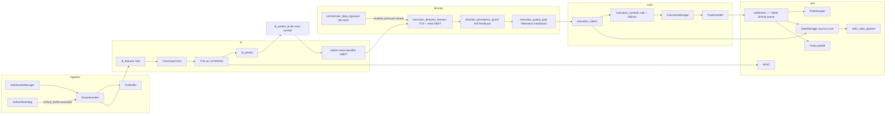
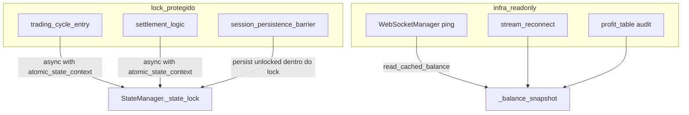
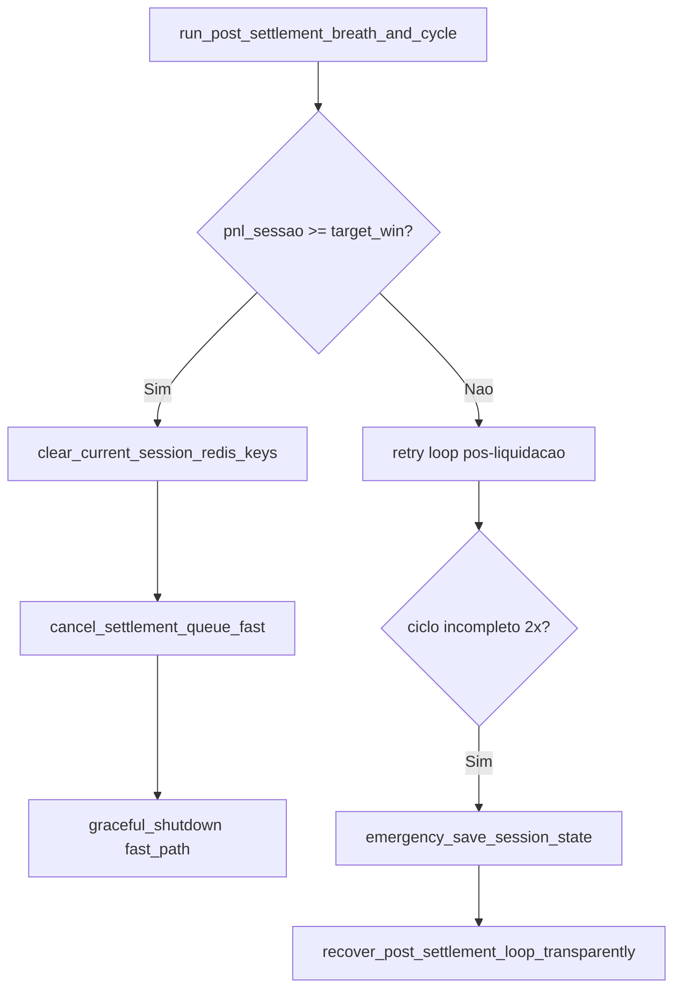
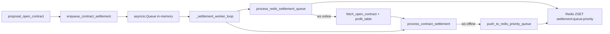

# Arquitetura — Aether Quantum Engine

Motor assíncrono para trading na Deriv com decisão exclusiva por **Deep Learning** (TCN, LSTM ou GRU) nos índices **Drift** (`RDBEAR`, `RDBULL`). A metodologia de negócio quantitativa está em [`medallion.md`](medallion.md); este documento descreve o software.

---

## 1. Visão geral

| Aspecto | Valor atual (`config/settings.json`) |
|---------|--------------------------------------|
| Símbolos | `RDBEAR`, `RDBULL` (âncora `RDBULL`) |
| Granularidade OHLC (DL) | **900 s / M15** (`data_handler.granularity`) |
| Relógio operacional | **60 s / M1** (`data_handler.micro_granularity`) |
| Histórico para treino | 15552 barras M15 (`training_history_bars`, ~162 dias) |
| Lookback | 48 barras M15 por sequência (**12 h** de contexto) |
| Features | **34** (`FEATURE_DIM` em `dl_feature_build.py`) |
| Contrato | `RISE_FALL`, duração **60 s** (execução micro M1) |
| Ciclo do orquestrador | 60 s (`cycle_interval_seconds`, virada M1) |
| Decisão | `collect_deep_learning_decisions` |
| Fases | `FASE TREINO` → `FASE OPERACAO` |
| Execução | Seletiva (`mandatory_trade_each_cycle: false`) ou **esteira mandatária contínua** (`true`) |

O mercado é tratado como **série temporal ruidosa**: o modelo estima probabilidade de alta; um **motor de direção** segue o sinal da TCN (`P(CALL) > pivot` → CALL, caso contrário PUT), refinado pelo meta-regressor LightGBM e pelo **Z-Score estatístico do payoff** (`meta_payoff_edge_zscore`). O **ranking multiplicativo** `tcn × max(0.1, 1+z)` prioriza setups `WIN_EXPECTED` sobre TCN bruto degradado. Em modo mandatário (`mandatory_trade_each_cycle: true`), o motor exige mandatory pick quando há candidatos aprovados pelo quality gate dual. Cooldown pós-LOSS, blackout de broker e Hurst em recovery permanecem neutralizados.

**Invariante de acoplamento temporal:** inferências e rotações de ciclo seguem estritamente a fronteira configurada em `signature_boundary_seconds` (fallback para `cycle_interval_seconds`), mitigando ruído microestrutural e evitando inferências redundantes fora da janela macro.

---

## 2. Pipeline de dados

O grafo abaixo reflete o pipeline **aprovado no pre-commit**: o subgrafo `direcao` contém o resolver TCN + meta-regressor, o gate de qualidade com janelas dinâmicas e a assinatura M1+M15 para invalidação de cache.



### 2.4 Infraestrutura híbrida

Com `infra.enabled: true`, o motor valida Redis, TimescaleDB e MinIO em `localhost` antes do WebSocket (fail-fast). Estado de risco e sessão persistem em Redis via pipeline atômico (`redis_state_pipeline.write_state_bundle`); ticks e barras vão para Timescale; checkpoints DL sincronizam com MinIO mantendo cache local em `data/dl/`.

**Bootstrap de modelos** (`bootstrap_and_validate_models`):

1. Baixa `{symbol}.pth` e `latest_ts.pt` do MinIO.
2. Valida manifest (`feature_dim`, `lookback`, `norm_mean`/`norm_std`).
3. Forward pass multi-probe em TorchScript (`torchscript_sanity_probes`: zeros, extremos, **regime estressado** RSI/CMO/vol).
4. Com `infra.triton.enabled`: espelha artefatos em `infra/docker/triton-models`, recarrega repositório Triton, valida schema HTTP e executa **`verify_triton_stressed_inference_async`** (inferência concorrente sob tensores estressados; fail-fast se NaN/Inf ou probabilidade fora de `[0, 1]`).

**Inferência de produção** via `TritonGrpcClient` (`triton_grpc_client.py`):

- Canal persistente `grpc.aio.insecure_channel` com keepalive (sem handshake repetido a cada ciclo).
- Predições de `RDBEAR` e `RDBULL` em paralelo com `asyncio.gather`.
- **Timeout rigido de 2,0 s** por requisição (`asyncio.wait_for`); se o Triton exceder o limite, dispara `TritonInferenceTimeout` e fallback imediato para TorchScript em cache local (`dl_predict_triton.py`, log `TRITON_TIMEOUT_FALLBACK`), preservando a janela de 60 s do orquestrador.
- Facade em `triton_inference_client.py` para o restante do motor.

**Meta-regressor tabular** (`aether-meta-classifier`, porta host `8005`):

- Container Python 3.13-slim com FastAPI expõe `POST /v2/predict_meta`.
- Artefatos LightGBM (`.pkl`) montados em `infra/docker/meta-models` → `/models`.
- `MetaClassifierClient` (`meta_classifier_client.py`) consulta o serviço com `httpx.AsyncClient`, timeout **1,0 s** e fallback neutro (`predicted_payoff_edge=0.0`) em falha ou timeout — preserva `trade_score` orgânico da TCN.
- `payoff_edge_zscore.py` mantém buffer adaptativo de **15–45** amostras (Hurst macro, variação ATR, compressão BB), calcula `meta_payoff_edge_zscore` e classifica `WIN_EXPECTED` / `NO_EDGE_NEUTRAL` / `LOSS_EXPECTED`.
- Vetor tabular **39D** enviado ao GBDT: **34** features TCN + **3** cross-symbol (`cross_symbol_prob_delta`, `cross_symbol_vol_ratio_diff`, `cross_symbol_rsi_spread`) + **2** de fluxo micro (`micro_tick_acceleration`, `keltner_deviation_ratio`).
- `prepare_meta_classifier_cross_symbol_bundle` (`dl_predict_build.py`) centraliza telemetria micro M1 paralela (`stamp_micro_frame_telemetry`) e anexa spreads cross-symbol (`attach_cross_symbol_features_to_decisions`) **antes** do prefetch HTTP.
- `collect_deep_learning_decisions` chama o bundle e em seguida `prefetch_meta_payoff_for_decisions`; `execution_direction_resolver` aplica `meta_payoff_regression.apply_meta_regression_edge` sobre o `predicted_payoff_edge` retornado pelo regressor e `attach_payoff_edge_zscore_metrics` calcula o Z-Score estatístico do edge (`meta_payoff_edge_zscore`) usado no ranking final.
- Healthcheck nativo Python (`urllib.request`) — sem dependência de `curl` na imagem slim.
- Treino offline: `train_meta_classifier.py` + `train_meta_optuna.py` + `train_meta_vector.py` (Optuna **maximiza Information Ratio**; rejeita trials com Z-Score médio de payoff OOS < **+1,00**; `LGBMRegressor` huber; alvo contínuo `Y = PnL_Real / Stake`).

**Spread de convicção cross-symbol** (`meta_classifier_cross_symbol.py`):

| Feature | Fórmula |
|---------|---------|
| `cross_symbol_prob_delta` | `abs(P(CALL)_RDBULL − P(PUT)_RDBEAR)` |
| `cross_symbol_vol_ratio_diff` | `vol_ratio_micro_BULL − vol_ratio_micro_BEAR` (spread linear M1) |
| `cross_symbol_rsi_spread` | `rsi_micro_BULL − rsi_micro_BEAR` (divergência estocástica 60 s) |

Em regimes de drift paralelo (ambos símbolos com scores altos na mesma direção), o spread baixo sinaliza saturação espelhada — insumo do LightGBM para evitar entradas sem viés relativo.

**Resiliência de ingestão** (`watchdog_service.py` + `stream_reconnect.py`):

- `AetherWatchdog` roda como task assíncrona perpétua após bootstrap do stream.
- Monitora `TickBuffer.last_tick_monotonic()`; se a inanição exceder `watchdog_stale_tick_seconds` (padrão 30 s) com WebSocket aparentemente conectado, entra em estado `STALE_DATA`.
- Antes de reconectar: persiste snapshot de risco (`save_full_state`); em seguida `StreamHandler.reconnect_stream` fecha o WS, reabre sessão OTP e reativa subscrições OHLC/tick sem backfill pesado.
- Encerrado no graceful shutdown (`graceful_shutdown.stop_ingestion_watchdog`).

Config em `orchestrator`: `watchdog_enabled`, `watchdog_stale_tick_seconds`, `watchdog_poll_interval_seconds`.

Redis local usa AOF `appendfsync everysec` (`infra/docker/redis.conf`). `make docker-up` aplica `host-prereq.sh` (`vm.overcommit_memory=1` no WSL).

**Persistência pós-settlement** (`orchestrator_persistence.save_full_state`): uma transação Redis `MULTI/EXEC` grava snapshot JSON, hash de risco (`consecutive_losses`, `pending_loss`, cooldowns), hash `session:current`, chaves `session:current:start_balance` e `session:current:target_win`, `recovery:skip_counter` e assinatura de mercado — sem round-trips bloqueantes adicionais na thread principal.

### 2.5 Barreira atômica de concorrência assíncrona

O motor opera em Windows/WSL com múltiplas coroutines concorrentes (inferência Triton, liquidação WebSocket, persistência Redis, watchdog de reconexão). Race conditions pós-reset linear D'Alembert (transição entre clusters e inferência subsequente) eram causadas por escritas de `settlement_logic` e leituras paralelas de `execution_collect_gather` sobre o mesmo agregado de risco.

**Design DDD (Domain/Infrastructure Barrier):**



| Componente | Caminho | Papel |
|------------|---------|-------|
| Lock central | `infrastructure/state/state_manager.py` | `self._state_lock = asyncio.Lock()`; `async def atomic_state_context()` |
| Facade orquestrador | `orchestrator_atomic_state.py` | `orchestrator_atomic_state_context(orch)` — delega ao `StateManager`; bypass em `MagicMock` (testes) |
| Persistência | `orchestrator_persistence.py` | `save_full_state()` (com lock); `persist_full_state_unlocked()` (sem reentrância dentro de seções já protegidas) |
| Ciclo de trading | `trading_cycle_entry.py` | Lock envolvendo `collect_deep_learning_decisions` → cache de correlação → `execute_cluster` |
| Liquidação | `settlement_logic.py` | Lock em `_complete_contract_settlement()` (WIN/LOSS, linear, pend, reset) |
| Barreira pós-reset | `session_persistence_barrier.py` | Sequência limpeza de risco + persistência + yield 0,1 s após reset linear; flag `_session_persistence_write_active` bloqueia ciclo concorrente |
| Leitura não bloqueante | `read_cached_balance()` / `orchestrator_balance_snapshot()` | Snapshot de saldo para tarefas de infra (ping WS, reconexão) sem adquirir o lock principal |
| Manutenção broker | `api_maintenance_guard.py` | Hibernação cooperativa quando a API retorna janela de indisponibilidade; evita starvation do loop principal |

**Regras de serialização:**

1. Inferência DL + decisão + boletamento **nunca** rodam concorrentemente com liquidação ou gravação de estado de risco.
2. `post_settlement_cycle` **não** envolve lock duplo — o ciclo subsequente já entra protegido via `trading_cycle_entry`.
3. Settlement interno usa `_persist_full_state_unlocked()` quando já está dentro do lock; `_save_full_state()` adquire lock próprio no loop de polling de `execution_settlement.py`.
4. `_linear_reset_occurred` em `risk_recovery_state.py` dispara `run_linear_reset_persistence_barrier` antes do próximo ciclo de inferência.

---

### 2.1 Bootstrap

1. `app/run.py` carrega `config/settings.json` e PAT do `.env` (`AETHER_DERIV_PAT` + `AETHER_DERIV_APP_ID`).
2. `validate_infra_services` (quando `infra.enabled`) e `bootstrap_and_validate_models` (checkpoint + TorchScript + sanity + Triton).
3. `restore_orchestrator_state` e `AuthManager` abrem sessão REST/WebSocket via OTP PAT.
4. `Orchestrator` instancia stream, risco, executor e persistência.
5. Após autenticação, `bootstrap_active_session_targets` captura banca inicial e define meta de 2,60% (`session_target_bootstrap.py`).
6. `StreamHandler.start_candle_stream` busca histórico OHLC e assina velas (`style: candles`) e ticks (`style: ticks`).

### 2.2 Buffer e microestrutura

- `buffer_limit` limita velas em memória por símbolo.
- `history_bars` / `training_history_bars` definem recorte para treino e predição.
- `StreamHandler` assina **dois fluxos OHLC** por símbolo: **M15 (900 s)** para tensor DL `[1, 48, 34]` e **M1 (60 s)** para o relógio do orquestrador.
- `TickBuffer` agrega microestrutura apenas no fechamento de barras **M15**.
- `get_data_state_signature()` (`orchestrator_data_signature.py`) combina assinatura **M1 + M15** com fronteira de minuto obrigatória para reavaliar o cenário a cada virada M1 sem inferência redundante na GPU.

### 2.3 Assinatura de estado de dados (M1 + M15)

Para evitar inferências duplicadas na mesma fronteira de minuto, o orquestrador usa `get_data_state_signature()`:

| Componente | Função |
|------------|--------|
| `m1_boundary_epoch()` | Epoch Unix alinhado ao minuto corrente (`max` entre relógio e `_last_epoch` do âncora) |
| Assinatura micro | `m1:{sym}@{epoch}` por símbolo — último candle M1 fechado |
| Assinatura macro | `m15:{sym}@{epoch}` por símbolo — último candle M15 fechado |
| Formato final | `m1b:{boundary};m1:{...};m15:{...}` |

Em `trading_cycle_entry.run_trading_cycle_if_ready`:

1. Se a assinatura mudou, o ciclo **não** é bloqueado apenas por `_last_processed_epoch == _last_epoch` (cache invalidado).
2. Se a assinatura é idêntica ao ciclo anterior, o motor aguarda sem reprocessar.
3. Log DEBUG: `DATA_SIG: cache invalidado por divergencia M1 | anterior=... | atual=...`.

---

## 3. Deep Learning

### 3.1 Labels e features

**Rótulo** (`dl_labels.py`):

| Modo | Config | Comportamento |
|------|--------|---------------|
| `spot_forward` | padrão legado | Preço futuro > preço atual |
| `ma_trend` | `label_mode: ma_trend` | Média móvel suavizada indica tendência |
| **`triple_barrier`** | `label_mode: triple_barrier` | Barreira superior/inferior dinâmica por σ de ticks; neutro (0) se nenhuma barreira rompida no horizonte M1 |

Parâmetros Triple Barrier (tunáveis por símbolo em `deep_learning`):

| Chave | Padrão | Função |
|-------|--------|--------|
| `label_vol_window_bars` | 15 | Janela de σ (barras M15 ≈ 15 min) |
| `label_vol_multiplier` | 1.0 | Multiplicador da largura de barreira |

Resolução via `dl_horizon.resolve_label_vol_window_bars` / `resolve_label_vol_multiplier`; propagados por `dl_params`, `dl_sequence_extract`, `dl_training` e `dl_symbol_train`.

**34 features** (`FEATURE_DIM` em `dl_feature_build.py`):

| Grupo | Dim | Conteúdo |
|-------|-----|----------|
| Microestrutura | 5 | ticks/barra, intervalo médio, velocidade, aceleração, std diffs |
| Tradicionais | 22 | RSI, delta-RSI, BB, ATR, EMAs, MACD, estocástico, CCI, ADX, DI, Williams, CMO, Keltner, ROC-RSI, etc. |
| Volatilidade | 5 | vol rolling, vol vs alvo, z-score, implied vol ratio, vol_ratio short/long |
| Persistência | 2 | Hurst (R/S), variance ratio |

Normalização anti-leakage: `fit_norm_stats` somente no split de treino walk-forward.

### 3.2 Modelo e perda

- Arquitetura: **`tcn`** (padrão), **`lstm`** ou **`gru`** via `deep_learning.arch`.
- Saída: probabilidade bruta de alta (`raw_prob`).
- **Perda assimétrica** (`model.high_volatility_asymmetric_focal_loss`): BCE focal com penalidade **2,5×** para previsão direcional errada em instantes de alta volatilidade (percentil 75 do proxy de vol no batch); integrada em `dl_training_epochs._masked_loss`.
- **Cabeça auxiliar de regressão** (`dl_tcn.regression_head`): multi-task learning com delta de preço relativo (`sequence_price_deltas`); peso auxiliar 0,15 na perda combinada para regularizar embeddings convolucionais.
- Checkpoint v4 em `data/dl/{symbol}.pth` + TorchScript `{symbol}_ts.pt` (espelho MinIO `latest_ts.pt`).
- Inferência via `TritonGrpcClient.infer_symbols_concurrent` quando `infra.triton.enabled`; tensor FP32 **`[1, 48, 34]`** (48 barras M15 = **12 h** de contexto).
- `collect_cluster_orders` opera de forma contínua quando `mandatory_trade_each_cycle: true`; o quality gate registra telemetria sem vetar candidatos.

### 3.3 Treino walk-forward

- Splits temporais com embargo (`dl_splits.py`).
- Early stopping pela perda de validação.
- Retreino: bootstrap de sessão, nova vela, rolling, forçado após loss.
- Treino deferido (`dl_deferred_train.py`): thread em background serializada.
- Deploy gate opcional (`dl_deploy_eval.py`): `deploy_ok=false` bloqueia execução.
- Gate de treinamento: símbolo sem treino da sessão recebe `gate_reason: training`.

### 3.4 Predição

`predict_symbol_decision_async` (`dl_predict_async.py` / `dl_predict_triton.py`):

- Sempre `execute=True` quando a predição técnica é bem-sucedida.
- Calcula indicadores, trend (`dl_trend.py`) e enriquece métricas para o resolver.
- `gate_reason=None` após predição OK; bloqueio só em exceção (`predict_error`).
- Thresholds `confidence_call/put` (0.53/0.47) são bases; com `dynamic_threshold.enabled`, flutuam por `bb_width`, `atr_norm` e regime de volatilidade.
- Com Triton ativo: inferência via `infer_symbol_async`; timeout 2 s dispara fallback TorchScript em cache (`TRITON_TIMEOUT_FALLBACK`).
- Grava `calibrated_prob`, `calibrated_edge` e thresholds dinâmicos em metrics para resolver e quality gate.

---

## 4. Direção e qualidade

### 4.1 Motor de direção com edge contínuo do meta-regressor (`execution_direction_resolver.py`)

A direção macro (`dl_direction`) segue a TCN (M15). O **meta-regressor** (M1) refina o gatilho de execução micro de 60 s via expectativa de retorno contínua:

| Etapa | Comportamento |
|-------|---------------|
| `infer_dl_direction` | Direção pré-computada pelo bridge ou `P(CALL) > pivot` → CALL, caso contrário PUT |
| Probabilidade | `calibrated_prob` (fallback `raw_prob`); pivot = média dos thresholds dinâmicos ou `0.5` |
| Regressão GBDT | `MetaClassifierClient` retorna `predicted_payoff_edge` (prefetch ou sync) |
| **Edge positivo** | `predicted_payoff_edge > 0.0`: mantém `dl_direction` e `trade_score` orgânico da TCN |
| **Edge negativo severo + squeeze** | `predicted_payoff_edge < -0.15` com `bb_width < 0.06` ou `micro_tick_acceleration < 0`: `trade_score=0.52`; `meta_squeeze_downgrade=true`; log `[D-SQUEEZE]` |
| Edge negativo leve | Mantém direção TCN e score orgânico |
| `direction_margin` | `abs(P(lado_escolhido) − 0.50)` — distância da confiança lateral ao neutro; CALL usa `calibrated_prob`; PUT usa `1 − prob` |
| `ensure_direction_margin` | Recalcula margem a partir de prob + direção final (`exec_direction`/`resolved_direction`/`dl_direction`), ignorando valor sobrescrito pelo meta stacking |
| `attach_payoff_edge_zscore_metrics` | Calcula Z-Score adaptativo do `predicted_payoff_edge`; expõe `edge_zscore_window` nas métricas |
| `direction_inverted` | Permanece `False` no fluxo de regressão (sem flip binário) |

**Gatilho D-SQUEEZE** (`meta_payoff_regression.py` + `meta_direction_flip.log_d_squeeze_audit`):

| Condição de squeeze | Detecção |
|---------------------|----------|
| Canal Bollinger esmagado | `bb_width < 0.06` (M1, via `micro_indicators` / `indicators`) |
| Desaceleração institucional | `micro_tick_acceleration < 0` (via `flow_features`) |

Em squeeze com edge severamente negativo, o `trade_score=0.52` força o `consensus_stake_penalty` a comprimir a stake ao piso mínimo da API Deriv ($1.00), sem inverter `exec_direction`.

Bloqueio absoluto (`resolve_execution_direction` retorna `None`) em:

- Falha técnica: `deploy_ok == False` ou `gate_reason ∈ {data, predict_error, training}`
- Regras de âncora estrita (`_strict_anchor_direction`) e guarda de persistência direcional

O quality gate dual pode suspender o cluster via `quality_conviction_suspends_cluster` quando margem TCN, payoff meta ou Z-Score estatístico falham (ver seção 4.2).

### 4.1.1 Filtro AntiTrendLock (`direction_persistence_guard*.py`)

Após **2 perdas consecutivas na mesma direção** por símbolo, o motor ativa o filtro anti-trend-lock antes do quality gate:

| Componente | Camada | Papel |
|------------|--------|-------|
| `direction_persistence_guard.py` | Application | Orquestra bloqueio, flip cross-symbol e congelamento de ciclo |
| `direction_persistence_guard_helpers.py` | Application | Probabilidades cross-symbol, spread de convicção, deduplicação de logs |
| `evaluate_anti_trend_lock` | Domain (`risk_recovery_state.py`) | Política pura: `KEEP`, `FLIP to PUT/CALL`, `FREEZE: SKIP CYCLE` |

Fluxo de decisão (domínio puro):

1. Com `< 2` perdas consecutivas na direção proposta → `KEEP`.
2. Em `RDBULL` + CALL após 2 losses: tenta flip para PUT se probabilidade PUT no par expande (`bear_put_prob > bull_call_prob` ou `cross_symbol_prob_delta > média`) **e** `predicted_payoff_edge >= 0`.
3. Em `RDBEAR` + PUT após 2 losses: simétrico com flip para CALL.
4. Sem expansão cross-symbol ou edge negativo → `FREEZE: SKIP CYCLE` (`signal_status = SIGNAL_SUSPENDED`, `regime_classification = CHOP_CONGESTION`).

Telemetria: `[C####] REGIME_GUARD | {AntiTrendLock: ...}` via `log_regime_guard` (deduplicado por ciclo para `FREEZE`).

A matriz de correlação cross-symbol (`execution_direction_cross_corr`) e o `execution_volatility_booster` permanecem como telemetria/pisos consultivos.

### 4.2 Gate de qualidade dual (`execution_quality_gate*.py`)

O motor avalia candidatos por **dois portões complementares**, selecionados por candidato em `execution_quality_gate_cluster`:

| Portão | Condição de ativação | Módulo | Critério |
|--------|---------------------|--------|----------|
| TCN + meta payoff | Sem `meta_payoff_edge_zscore` / `edge_zscore` com `edge_expectancy` | `execution_quality_gate` | `direction_margin` ≥ piso dinâmico **e** `predicted_payoff_edge` ≥ piso (quando meta aplicado) |
| Meta Z-Score | `edge_expectancy` + (`meta_payoff_edge_zscore` ou `edge_zscore`) | `execution_quality_gate_meta` | Z-Score estatístico do payoff vs buffer móvel |

`resolve_dynamic_quality_limits` ajusta pisos por regime (regular/recovery), drawdown (`execution_quality_gate_drawdown`) e inanição (`execution_quality_gate_starvation`).

**Válvula de Escape por Inanição (Starvation Escape Valve):**
Para evitar que o motor entre em bloqueio permanente devido a restrições de qualidade muito rígidas (especialmente o piso de margem direcional de `0.12` durante o regime de recovery), o módulo `execution_quality_gate_starvation` gerencia um contador de ciclos pulados consecutivamente devido ao quality gate (`state:risk:skipped_cycles_counter`):
- **Decaimento Temporal**: Quando o número de ciclos descartados consecutivamente atinge ou excede o limiar de **15 ciclos**, o piso de margem direcional é atenuado multiplicando-o pelo fator de decaimento:
  $$\text{fator} = \max\left(0.50, 1.0 - (\text{ciclos} - 14) \times 0.05\right)$$
  Isso reduz gradualmente a margem direcional exigida em 5% a cada ciclo, até um piso de 50% da margem original.
- **Integração no Ciclo**:
  1. No início de cada ciclo de trading, o contador de inanição é carregado a partir do Redis (`prepare_quality_skipped_cycles_counter`).
  2. Se o ciclo for suspenso por decisão do quality gate (`quality_conviction_suspends_cluster`), o contador é incrementado e persistido no Redis (`record_quality_guard_cycle_skip`).
  3. Se o ciclo prosseguir para a execução bem-sucedida do cluster (`execute_cluster`), o contador é zerado e limpo no Redis (`reset_quality_skipped_cycles_counter_for_orch`).

**Suspensão de cluster** (`quality_conviction_suspends_cluster`):

- Modo TCN: qualquer falha sem aprovação paralela suspende o cluster.
- Modo meta: suspende apenas se **todos** os candidatos elegíveis falharem (`meta_mode and any_pass` → continua).
- Logs TCN/Payoff: prefixo `[AETHER] QUALITY_GUARD |` via `execution_quality_gate_reason`.
- Logs Meta Z-Score: prefixo `[AETHER] EXECUTION_FLOW |` via `format_quality_guard_reject_message`.

**Módulos auxiliares:**

| Módulo | Função |
|--------|--------|
| `execution_quality_gate_reason.py` | `build_quality_gate_reason`, formatação de mensagens |
| `execution_quality_gate_fallback.py` | Bloqueio de fallback em recovery |
| `execution_quality_skip_yield.py` | Yield após rejeição silenciosa do meta-gate |

**Portões neutralizados (não bloqueantes em modo mandatário):**

| Módulo | Função | Retorno |
|--------|--------|---------|
| `post_settlement_loss_cooldown` | `post_loss_cooldown_blocks_trading_cycle` | `False` |
| `session_persistence_barrier` | `session_persistence_blocks_trading_cycle` | `False` |
| `api_maintenance_guard` | `api_maintenance_blocks_trading_cycle` | `False` |
| `execution_recovery_gate` | `recovery_hurst_blocks_collect` | `False` |

### 4.3 Pool, ranking e seleção

**Score multiplicativo de alta convicção** (`execution_market_rank.market_decision_score`):

```
zscore_rank_factor(z) = max(0.1, 1.0 + z)
market_decision_score = tcn_score × zscore_rank_factor(meta_payoff_edge_zscore) + ajustes secundários
```

| Comportamento | Efeito |
|---------------|--------|
| Z negativo (`meta_payoff_edge_zscore < 0`) | Deflação geométrica agressiva (fator mínimo **0,1**) |
| Z positivo | Bônus linear de priorização (`1.0 + z`) |
| Penalidades secundárias | `val_accuracy < 0.50`, Brier alto, margem baixa, recovery, `direction_inverted` |

Sinais classificados como `WIN_EXPECTED` (Z ≥ **0,50** e edge > 0) tendem ao topo absoluto do ranking, mesmo com TCN ligeiramente inferior ao par degradado.

**Redirect inter-símbolo em modo contínuo** (`execution_symbols.try_inter_symbol_zscore_redirect`):

| Condição | Ação |
|----------|------|
| Âncora com `meta_payoff_edge_zscore < -0.50` | Sinal degradado no contêiner micro |
| Par alternativo com `meta_payoff_edge_zscore > +0.50` e quality gate OK | Desvia execução inteira para o par forte |
| Modo | `mandatory_trade_each_cycle: true` via `select_mandatory_execution_candidate` / `select_best_execution_candidate(orch=...)` |

Mantém frequência operacional minuto a minuto sem forçar entrada no ativo degradado.

Demais componentes:

- `execution_recovery_gate.cluster_entry_eligible` — bloqueio **somente técnico** + exige `raw_prob` ou direção.
- `execution_direction.build_execution_candidate` — delega ao resolver linear.
- `execution_symbols.select_best_execution_candidate` / `select_mandatory_execution_candidate` — ranking por `market_decision_score` com diversificação suave pós-loss.
- `execution_mandatory_pick` / `execution_entropy_fallback` — fallbacks que garantem ordem no modo contínuo quando o pool não está vetado coletivamente.

---

## 5. Execução

### 5.1 Fases

- **FASE TREINO** — `_training_phase_gate` suspende ordens até `session_trained` em todos os símbolos.
- **FASE OPERACAO** — `collect_cluster_orders` seleciona melhor candidato ou mandatory pick.

### 5.2 ExecutionManager

- Monta ordens com stake de `RiskManager.calculate_stake`.
- **Lotes fracionados** (`execution_fractional_lots.dispatch_fractional_orders`): stakes acima de `max_single_stake_limit` (padrão **$200**) são fatiadas em N sub-lotes com **proposta atômica individual** por pedaço. Entre sub-propostas, `resolve_fractional_lot_stagger_seconds` aplica jitter estocástico escalado pelo RTT medido em `WebSocketManager.last_rtt_seconds`. Se qualquer proposta falhar, o cluster fragmentado aborta sem incrementar `pending_loss` (`fractional_lot_technical_failure=True`).
- Settlement assíncrono; reentrada via `post_settlement_cycle`.
- Contratos via `TradeHandler.buy_with_parameters`: RISE_FALL, **60 s** (M1), com contexto DL em **M15**.
- Após settlement: `save_full_state` persiste bundle atômico no Redis.
- **Reconciliação de stake executada** (`executed_stake_reconciliation.py`): quando a Deriv reduz stake na compra (`stake_downgrade`), o residual é aplicado ao `pending_loss` antes de `register_result` — WIN parcial não zera drawdown cegamente.

---

### 5.3 Pós-liquidação, barreira atômica e encerramento

`settlement_logic.process_contract_settlement` executa liquidação (WIN/LOSS, atualização de `pending_loss`, reset linear D'Alembert) dentro de `orchestrator_atomic_state_context`. Quando `_linear_reset_occurred`, dispara `run_linear_reset_persistence_barrier` antes do próximo ciclo DL.

`post_settlement_cycle.py` agenda reentrada após liquidação com fôlego configurável (`post_settlement_breath_seconds`). O fluxo prioriza **stop win** antes de qualquer round-trip Redis ou ciclo de trading:



| Etapa | Módulo | Comportamento |
|-------|--------|---------------|
| Curto-circuito stop win | `check_session_limits_before_post_settlement` / `finalize_stop_win_shutdown` | Checa meta; purge Redis bloqueante; log CRITICAL `[AETHER] STOP_WIN | ...`; fast-path shutdown |
| Abort Redis | `clear_current_session_redis_keys` | Remove chaves `session:current:*` sem aguardar MULTI/EXEC pendente |
| Cancelamento de fila | `settlement_queue_ops.cancel_settlement_queue_fast` | Cancela worker e drena fila sem `task_done` handshake |
| Shutdown rápido | `graceful_shutdown(fast_path=True)` | Encerra infra sem aguardar tasks fantasmas pós-reconexão |
| Teto de retry | `_post_settlement_incomplete_streak` | Após 2 ciclos incompletos consecutivos, sinaliza deadlock |
| Recovery transparente | `orchestrator_run_loop` + `post_settlement_resilience` | Persiste bundle de emergência; chama `recover_post_settlement_loop_transparently`; reinicia contadores sem encerrar o processo |

Settlement assíncrono via `orchestrator_settlement_queue.py`: worker consome fila in-memory sem bloquear o loop principal; no fast-path a fila é cancelada e drenada imediatamente.

### 5.4 Fila de liquidação Redis (prioridade)

Quando o broker fica offline durante liquidação (`orch.ws.is_running == False`), o motor enfileira payloads em Redis para reconciliação posterior:



| Componente | Caminho | Comportamento |
|------------|---------|---------------|
| Enfileiramento offline | `settlement_logic.process_contract_settlement` | Early return após `push_to_redis_priority_queue` |
| Chave Redis | `settlement_queue_ops.REDIS_SETTLEMENT_QUEUE_KEY` | `settlement:queue:priority` (ZSET; score = `contract_id`) |
| Consumo | `process_redis_settlement_queue` | Itera itens; confirma P&L via `fetch_open_contract` ou `fetch_profit_table`; remove com `zrem` após confirmação |
| Worker | `_settlement_worker_loop` | A cada iteração: drena Redis priority **antes** de aguardar fila local (timeout 0,25 s) |
| Cancel fast-path | `cancel_settlement_queue_fast` | Cancela worker, drena fila in-memory sem handshake; usado no stop win e shutdown |

Testes: `test_settlement_redis_queue.py`, `test_orchestrator_settlement_queue.py`.

---

## 6. Gerenciamento de risco

| Mecanismo | Módulo / config |
|-----------|-----------------|
| Kelly fracionário | `kelly_base_fraction.py`, `stake_sizing.py`, `kelly.fraction` — compressão base de 60% em regime normal (`0.0035 → 0.0012`) |
| Target Proximity Damping | `stake_target_proximity.py` + `RiskManager.apply_kelly_target_proximity_damping` — `Stake_Kelly × (0.40 + 0.60 × remaining_target_pct)` |
| Consensus Entropy Penalty | `consensus_stake_penalty.py` — penalidade convexa em `f*` quando ord diverge dos votos; atenua por `di_diff`, `cmo`, `rsi`; piso `stake_min` em baixo consenso |
| Regime Edge Sizing (waiver) | `consensus_stake_penalty.py` — em recovery, `retention = 1.0` para votos unânimes (6×0/0×6) ou `trade_score >= 0.68` |
| Recovery score waiver | `consensus_stake_penalty.py` — com `pending_loss > 0` ou `consecutive_losses_linear > 0` e votos unânimes ou `trade_score >= 0.68`, `retention = 1.0` |
| Recovery financeiro persistente | `risk_recovery_state.py` — `consecutive_losses_linear` **nao reseta** em WIN operacional enquanto `pending_loss > 0`; reset somente quando o drawdown pendente zera por retornos reais; `evaluate_anti_trend_lock` isola política AntiTrendLock no domínio |
| Stop win por sessão ativa | `stop_win_target.py` + `session_target_bootstrap.py` — meta = `session_start_balance × compounding_rate_daily`; sem reset por relógio/calendário |
| Encerramento por meta | `check_session_limits_before_post_settlement` + `graceful_shutdown(fast_path=True)` — aborta Redis e fila de settlement antes do shutdown |
| Stop loss | **Desativado** — sem `daily_max_loss_limit` nem disjuntor de perda no motor |
| Martingale Geométrico | `dlambert_sizing.geometric_martingale_stake` — `Stake = Effective_Base × 2^consecutive_losses_linear` com `Effective_Base = max(dlambert_unit_override, U)`; tag `D'ALEMBERT` quando `pending_total > 0` ou `consecutive_losses_linear > 0` |
| Ancoragem em recovery | `risk_stake_calc.py` ignora consensus penalty e piso `stake_min` quando `pending_total > 0`; evita tag `KELLY` e stake sub-dimensionada em estresse |
| Sem circuit breaker | Removidos `dlambert_circuit_breaker`, `MAX_LINEAR_LEVEL`, `MAX_STAKE_U_MULTIPLE`, `MAX_SESSION_DRAWDOWN_U` e o curto-circuito da tag `D'ALEMBERT_CB`; o cálculo prossegue livre na thread principal escalando exponencialmente até recuperar o passivo total |
| Retração de recovery | WIN parcial em recovery: `consecutive_losses_linear = max(1, n-1)`, reduzindo o expoente da curva |
| Reset linear D'Alembert | `risk_recovery_state._linear_reset_occurred` → `session_persistence_barrier` com yield 0,1 s |
| Super-concordance Kelly | booster desligado em recovery; ativo em Kelly puro com P≥0.75, 6×0, Hurst>0.55 |
| Trava Hurst N2+ | `recovery_hurst_gate.py` |
| Decaimento Hurst acelerado | `recovery_hurst_decay.py` — `recovery_skip_counter` no Redis |
| Cooldown entrada | `risk_cooldown.py` |
| Cooldown por loss no símbolo | `symbol_loss_cooldown.py` |

### 6.1 Sessão ativa e juros compostos

A meta de lucro segue a planilha de juros compostos (`compounding_rate_daily`, padrão **0,026 = 2,60%**), aplicada **estritamente por instância de processo**:

1. **Boot** (`ws_bootstrap` → `bootstrap_active_session_targets`): lê saldo vivo da Deriv ou override `session_start_balance` em `risk_management.params`.
2. **Cálculo**: `target_win = session_start_balance × compounding_rate_daily` via `StopWinManager.calculate_session_targets`.
3. **Persistência Redis**: `{prefix}:session:current:start_balance` e `{prefix}:session:current:target_win` no pipeline atômico; hash `session:current` com métricas correntes.
4. **Encerramento**: após settlement ou no início do pós-liquidação, `check_session_limits_before_post_settlement` compara `pnl_sessao` com `target_win`; se atingido, fast-path limpa Redis, cancela fila de settlement e chama `graceful_shutdown(fast_path=True)`.
5. **Deadlock pós-liquidação**: se o ciclo incompleto ocorrer 2 vezes consecutivas, `emergency_save_session_state` grava bundle financeiro e `recover_post_settlement_loop_transparently` reinicia o loop sem `sys.exit`.
6. **Nova sessão**: reiniciar `run.py` captura novo saldo e recalcula meta — o operador decide quantas sessões executar no mesmo dia civil.

Log de bootstrap: `SESSAO INICIADA | Alvo de 2,60%: $XX.XX | Stop Loss: DESATIVADO`.

Com `compounding_enabled: false`, o motor usa alvo legado (`small_account_stop_win` / `large_account_stop_win_pct`).

Logs de sizing expõem `pend=$` (drawdown pendente) e `pnl_sess=$` (P&L acumulado da sessão) em cada cálculo de stake.

### 6.2 Sizing defensivo de proximidade de alvo

Política aplicada sobre a stake Kelly bruta em regime **normal** (fora de recovery). Quando `recovery_active` e `consecutive_losses_linear > 0`, o sizing passa integralmente ao Martingale Geométrico `Kelly_base × 2^n`, sem amortecimento de proximidade:

| Etapa | Fórmula / regra |
|-------|-----------------|
| Compressão Kelly base | `fraction_efetiva = fraction × 0.40` (referência `0.0035 → 0.0012`); recovery mantém `fraction` integral |
| Distância relativa à meta | `remaining_target_pct = max(0, (target_win − pnl_sessao) / target_win)` |
| Amortecimento dinâmico | `target_damping = 0.40 + 0.60 × remaining_target_pct` |
| Stake Kelly comprimida | `Stake_Kelly = Stake_Kelly_raw × target_damping` |

Comportamento: no início da sessão (`pnl_sessao = 0`), `target_damping = 1.0` e apenas a compressão Kelly base atua. Com ~90% da meta atingida, o fator cai para **0.46**, reduzindo superexposição nos ciclos finais antes do stop win.

Persistência: `data/session_state.json` (métricas da sessão corrente), Redis (snapshot atômico + chaves `session:current:*`), `data/state.json` (contratos legado).

---

## 7. Orquestrador

`Orchestrator` (`orchestrator/__init__.py`):

1. `setup_trading_session` — autenticação Deriv e WebSocket.
2. `bootstrap_active_session_targets` — captura banca inicial e meta de stop win da sessão.
3. `start_ingestion_watchdog` — monitoramento de inanição de ticks (modo contínuo).
4. A cada vela do âncora ou `cycle_interval_seconds`:
   - `tick_bars_since_train`
   - `run_trading_cycle_if_ready` → valida assinatura M1+M15 → `async with orchestrator_atomic_state_context`:
     - `collect_deep_learning_decisions` (inferência Triton concorrente com fallback TorchScript)
     - `prepare_quality_skipped_cycles_counter` + `quality_conviction_suspends_cluster` (telemetria; não bloqueia)
     - `executor.execute_cluster` (salvo barreira de persistência de sessão ou abort de coleta)
5. Reconciliação periódica de contratos abertos.
6. Após liquidação: `post_settlement_cycle` (fast-path stop win ou retry com teto) → persistência via `orchestrator_persistence`.

**Cooldown pós-LOSS** (`post_settlement_loss_cooldown.py`):

- `schedule_post_loss_cooldown` emite **uma única linha** `CICLO: cooling-down {tempo}s pos-LOSS linear={linear}` no agendamento
- `post_loss_cooldown_blocks_trading_cycle` retorna sempre `False` (esteira mandatária)
- `log_trading_cycle_cooldown_skip` é no-op — sem contagem regressiva iterativa no console

**Guarda de manutenção da API** (`api_maintenance_guard.py`):

- Telemetria reativa (`[AETHER] API_GUARD`) permanece para observabilidade
- `api_maintenance_blocks_trading_cycle` e `proactive_blackout_blocks_cycle` retornam `False` — ciclo não é suspenso em modo mandatário

**Graceful shutdown** (`graceful_shutdown.py`):

- `graceful_shutdown(orch, fast_path=False)` — padrão; aguarda cancelamento de tasks.
- `graceful_shutdown(orch, fast_path=True)` — stop win: cancela fila de settlement (`cancel_settlement_queue_fast`), cancela task pós-liquidação sem handshake prolongado, depois `close_infrastructure_connections`.
- `close_infrastructure_connections` encerra watchdog, Triton gRPC, Timescale, Redis e WebSocket; limpa chaves `session:current:*`; excepthook instalado em `run.py`.

**Loop principal** (`orchestrator_run_loop.py`): a cada iteração verifica `_post_settlement_deadlock` via `_enforce_post_settlement_deadlock_exit`; em deadlock confirmado, persiste estado de emergência e chama `recover_post_settlement_loop_transparently` (log `Loop reinicializado de forma transparente`).

---

## 8. Configuração crítica

| Bloco | Chaves relevantes |
|-------|-------------------|
| `data_handler` | `granularity`, `history_bars`, `fetch_count`, `buffer_limit` |
| `deep_learning` | `arch`, `lookback`, `confidence_*`, `min_val_accuracy`, `deploy_gate` |
| `orchestrator` | `watchdog_*`, `cycle_interval_seconds`, `idle_cycle_watchdog_seconds` |
| `orchestrator.execution` | `mandatory_trade_each_cycle`, `include_anchor_trades`, `quality_gate`, `recovery_flip_direction_after_loss` |
| `risk_management.kelly` | `fraction`, `consensus_penalty_*`, `penalty_smoothing_*`, `recovery_*` |
| `risk_management.dlambert` | `dlambert_enabled`, `dlambert_unit_override` (base do Martingale Geométrico) |
| `risk_management.params` | `compounding_enabled`, `compounding_rate_daily`, `session_start_balance`, `duration`, stakes |
| `infra.triton` | `enabled`, `grpc_url`, `http_url`, `model_repo_path` |
| `infra.meta_classifier` | `enabled`, `http_url` (porta host `8005`), `timeout_seconds` |
| `trading` | `mode` (`demo` / `live`) |

---

## 9. Camadas de software

Inventário completo de **209 módulos** em [structure.md](structure.md). Resumo por camada:

| Camada | Módulos principais |
|--------|-------------------|
| Application / DL | `decision_bridge`, `dl_predict_build`, `dl_labels`, `dl_horizon`, `dl_training_epochs`, `model`, `dl_predict_async`, `dl_predict_triton`, `dl_params_blocks` |
| Application / Meta | `meta_classifier_stacking`, `meta_payoff_regression`, `payoff_edge_zscore`, `meta_classifier_features`, `meta_classifier_cross_symbol`, `meta_direction_flip` |
| Application / Direção | `execution_direction_resolver`, `direction_persistence_guard`, `direction_persistence_guard_helpers`, `execution_quality_gate`, `execution_quality_gate_reason`, `execution_quality_gate_meta`, `execution_quality_gate_cluster`, `execution_quality_gate_starvation` |
| Application / Execução | `execution_collect`, `execution_market_rank`, `execution_symbols`, `execution_symbols_overdrive`, `execution_fractional_lots`, `execution_contract_adoption`, `execution_split_abort` |
| Application / Orchestrator | `Orchestrator`, `execution_manager`, `trading_cycle_entry`, `orchestrator_data_signature`, `orchestrator_atomic_state`, `orchestrator_persistence`, `post_settlement_resilience`, `post_settlement_loss_cooldown`, `session_persistence_barrier`, `watchdog_service`, `graceful_shutdown`, `settlement_*`, `settlement_queue_ops`, `orchestrator_settlement_queue` |
| Domain | `trade`, `market_data`, `probability_entropy`, `risk_manager`, `risk_contract_result`, `risk_stake_flow`, `risk_cluster`, `stop_win_target`, `risk_recovery_state`, `consensus_stake_penalty`, `executed_stake_reconciliation`, `dlambert_sizing` |
| Infrastructure | `state_manager`, `triton_grpc_client`, `meta_classifier_client`, `websocket_manager`, `stream_handler`, `tick_buffer`, `trade_handler`, `minio_model_store`, `redis_state_pipeline` |
| Presentation | `logger`, `log_dedupe` |

---

## 10. Observabilidade

| Ferramenta | Caminho |
|------------|---------|
| Log ao vivo | `logs/engine.log` |
| Monitor Rich | `app/scripts/monitor/live_monitor.py` |
| CI local | `app/scripts/operations/clean_workspace.py` |
| PAT Deriv | `app/scripts/operations/deriv_pat_connect.py` |

Marcadores de log relevantes:

| Marcador | Significado |
|----------|-------------|
| `[C####] MARTINGALE` / `KELLY` | Stake calculada com `pend=$` e `pnl_sess=$` |
| `RISK: WIN operacional` / `Lucro parcial` | WIN sem reset de recovery enquanto `pending_loss > 0` |
| `RISK: Recovery financeiro zerado` | Drawdown pendente extinto; reset de `consecutive_losses` |
| `SESSAO INICIADA` | Bootstrap de meta por sessão ativa (2,60% composto; stop loss desativado) |
| `TRITON_TIMEOUT_FALLBACK` | Inferência Triton excedeu 2 s; fallback TorchScript local |
| `WATCHDOG: STALE_DATA` | Inanição de ticks; reconexão controlada do stream |
| `CICLO: ciclo pos-liquidacao incompleto` | Retry pós-liquidação; após 2× consecutivas → recovery transparente |
| `Loop reinicializado de forma transparente` | `post_settlement_resilience` resetou contadores pós-deadlock |
| `STOP_WIN` / fast-path | Meta da sessão atingida; purge Redis; log CRITICAL; shutdown imediato |
| `meta_payoff_edge_zscore` / `edge_expectancy` | Z-Score estatístico do edge LightGBM; classificação `WIN_EXPECTED`, `NO_EDGE_NEUTRAL`, `LOSS_EXPECTED` |
| `INTER_SYMBOL` redirect | Desvio de âncora degradada (Z < -0.50) para par forte (Z > +0.50) em modo mandatory |
| `[AETHER] EXECUTION_FLOW` | Telemetria de fluxo mandatário contínuo; válvula de inanição; substitui semântica legada `QUALITY_GUARD` |
| `CICLO: cooling-down` | Único log de cooldown pós-LOSS no agendamento; silêncio durante vigência do timer |
| `DATA_SIG: cache invalidado` | Assinatura M1+M15 mudou; inferência reinicializada na fronteira de minuto |
| `[D-SQUEEZE]` | Downgrade de score em compressão M1; métricas `bb_width`, `tick_accel`, `predicted_payoff_edge`, `score` |
| `[API_GUARD]` | Telemetria reativa de manutenção/blackout do broker (sem bloqueio de ciclo em modo mandatário) |
| `session_persistence_write_active` | Barreira pós-reset linear em andamento; ciclo de trading aguarda liberação |
| `REGIME_GUARD` | Filtro AntiTrendLock: `KEEP`, `FLIP to PUT/CALL`, `FREEZE: SKIP CYCLE` |
| `SETTLE:` | Enfileiramento/consumo da fila Redis `settlement:queue:priority` |
| Cooldown pós-loss | `LogDeduper.log_cooldown_schedule` + `CooldownDeduplicationFilter` — 1 log no agendamento; supressão por tick do loop |

---

## 11. Garantia de qualidade

- Cobertura **100%** em `app/src` (pytest + coverage; **246** arquivos de teste).
- Pre-commit: Ruff, Interrogate, Vulture, máximo **300 linhas** por arquivo em `app/src`.

---

## 12. Referências

- [medallion.md](medallion.md) — princípios quant e perfil de qualidade
- [README.md](../README.md) — execução e pré-requisitos
- [deriv-api.md](deriv-api.md) — API Deriv
- [infra-docker.md](infra-docker.md) — stack Docker, Triton, Redis AOF
- [CHANGELOG.md](CHANGELOG.md) — histórico de releases
