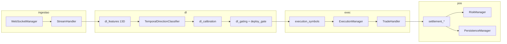

# Arquitetura — Aether Quantum Engine

Motor assíncrono para trading na Deriv com decisão por **Deep Learning** (classificador TCN) nos símbolos **Range Break** (`R_10`, `R_25`, `R_50`, `R_75`, `R_100`). A metodologia de negócio quantitativa está em [`medallion.md`](medallion.md); este documento descreve o software.

---

## 1. Visão geral

| Aspecto | Valor atual (`config/settings.json`) |
|---------|--------------------------------------|
| Símbolos | `R_10`, `R_25`, `R_50`, `R_75`, `R_100` (âncora `R_50`) |
| Granularidade OHLC | 60 s (`data_handler.granularity`) |
| Histórico para treino | 1440 barras (`training_history_bars`) |
| Lookback TCN | 32 barras por sequência |
| Contrato | `RISE_FALL`, duração 1 minuto |
| Ciclo do orquestrador | 60 s (`cycle_interval_seconds`) |
| Decisão | `collect_deep_learning_decisions` |
| Fases | `FASE TREINO` (operação suspensa) → `FASE OPERACAO` (um trade por ciclo) |
| Execução | Obrigatória por ranking de mercado (`mandatory_trade_each_cycle: true`) |

O mercado é tratado como **série temporal ruidosa**: o modelo estima probabilidade da próxima vela subir; camadas de **gating** e **risco** decidem se e quanto operar.

---

## 2. Pipeline de dados

### 2.1 Bootstrap

1. `app/run.py` carrega `config/settings.json` e PAT do `.env` (`AETHER_DERIV_PAT` + `AETHER_DERIV_APP_ID`).
2. `AuthManager` lista contas REST, obtém OTP e abre WebSocket autenticado via URL OTP.
3. `Orchestrator` instancia stream, risco, executor e persistência.
4. `StreamHandler.start_candle_stream` busca histórico e assina OHLC.

### 2.2 Buffer e janela de treino

- `buffer_limit` limita velas em memória por símbolo.
- `history_bars` / `training_history_bars` definem recorte para treino e predição.
- Features de par: spread e confirmação entre o símbolo e seu par de hedge (`dl_pair_features.py`).

---

## 3. Deep Learning

### 3.1 Features e rótulos

Por barra, **13 features** (`FEATURE_DIM`): retornos, volatilidade, RSI, EMA spread, distância SMA, retorno 5 barras, slope RSI, vol relativa, fase horária (sin/cos), mais 3 do par.

**Meta-labels:** amostras de treino só entram se o movimento da próxima vela superar `label_min_move_pct` e, quando aplicável, o spread do par confirmar a direção (`extract_sequences`).

### 3.2 Modelo

- Arquitetura: **TCN** dilatada (`dl_tcn.py` / `TemporalDirectionClassifier`).
- Saída: probabilidade de alta (`raw_prob`); margem mínima (`min_direction_margin`) pode vetar direção.
- Calibração: temperatura / Platt na fatia de calibração (`dl_calibration.py`).

### 3.3 Treino walk-forward

`train_model_walkforward` (`dl_training.py`):

- Splits temporais com embargo (`dl_splits.py`): treino / validação / calibração.
- Early stopping em score composto (val accuracy + anti-Brier).
- Checkpoint em `data/dl/{symbol}.pth`.

**Retreino** (`dl_retrain.py`):

- Nova vela (`train_on_new_candle_only`)
- Rolling (`rolling_retrain_bars`)
- Forçado após loss (`mark_force_retrain`)

**Treino deferido** (`dl_deferred_train.py`): o treino roda em background (thread) com **slot único** serializado por semáforo, sem bloquear o ciclo de execução. Enquanto existir símbolo sem primeiro treino válido (`runtime_in_training`, piso `brier_untrained_floor`), o slot é exclusivo desses símbolos (`training_priority_symbols`) — modelos prontos adiam o retreino por vela até todos estarem treinados.

**Deploy gate** (`dl_deploy_eval.py`): mini simulação nas últimas barras; `deploy_ok` bloqueia execução se reprovar.

**Gate de treinamento** (`_apply_training_gate`): símbolo sem primeiro treino válido recebe `gate_reason: training` e nunca opera, nem no modo obrigatório.

### 3.4 Predição e gating

`predict_symbol_decision` (`dl_predict.py`):

- `trade_score` calibrado, `edge`, `val_accuracy` misturada com win rate live (`dl_outcomes.py`).
- Bloqueios: convicção, edge, val_acc, Brier, gap calibrado/raw, saturação, alinhamento de regime (`require_regime_alignment`), `deploy_ok`.
- Recovery (perda pendente): thresholds em `recovery_gating` (com `recovery_allow_bypass` quando configurado).

Saída por símbolo: `{ direction, metrics }` consumida pelo orquestrador.

### 3.5 Feedback pós-trade

- `record_symbol_outcome` — histórico win/loss por símbolo.
- Pesos de amostra no próximo treino.
- Pausa de sessão por símbolo após sequência de losses (`session_max_losses_in_window`).
- Cooldown por símbolo (`symbol_loss_cooldown` no risk manager).

---

## 4. Execução

### 4.0 Fases de treinamento e operação

`ExecutionManager._training_phase_gate` separa o motor em duas fases:

- **FASE TREINO** — enquanto `collect_deep_learning_decisions` reportar símbolos sem primeiro treino válido (`orch._dl_training_symbols`), nenhuma ordem é enviada. Log deduplicado: `FASE TREINO || <símbolos> | aguardando primeiro treino | operacao suspensa`.
- **FASE OPERACAO** — quando o último modelo conclui o treino, a transição é registrada uma única vez (`FASE OPERACAO || todos os modelos treinados | operacao liberada`) e o fluxo obrigatório assume.

Se um modelo regredir a estado não treinado (retreino inválido), o motor volta automaticamente para a fase de treino.

### 4.1 Seleção e direção

- `execution_symbols.py` — filtra candidatos, escolhe melhor score; em recovery restringe ao par de hedge.
- `execution_symbols_recovery.py` — injeta candidato de hedge forçado após loss.
- `execution_direction.py` — `infer_dl_direction`, `recovery_hedge_target`, candidatos de ordem e bloqueios duros (`training`, `cooldown`, `session_pause`, `data`, `predict_error`).
- `execution_market_rank.py` — `resolve_market_direction` (DL + raw_prob + contexto binário da última vela; reversão à média em extremos `sma_z` quando o sinal bruto é fraco) e `market_decision_score` (score composto com bônus de alinhamento, deploy e diversificação em recovery).
- `execution_mandatory_pick.py` / `execution_direction_fallback.py` — ranking obrigatório: primeiro candidatos alinhados à direção do último loss com pisos de qualidade, depois melhor score de mercado, por fim fallback de último recurso (sempre respeitando os bloqueios duros).
- `mandatory_trade_each_cycle: true` — garante uma ordem por ciclo na fase de operação, com stake cap para sinais fracos.

### 4.2 ExecutionManager

- Monta ordens com stake de `RiskManager.calculate_stake` (passa `dl_metrics` para alinhar preview e execução).
- `execution_blockers.py` — logs `EXEC_NONE` (com métricas `s`/`r`/`v`/`b`) e `DL_TREINO` por ciclo.
- `log_dedupe.py` — mensagens repetidas (`EXEC_NONE`, `RISK: RECOVERY`, `FASE TREINO`, brief DL) só retornam ao `INFO` quando o conteúdo muda.
- Ciclos que executaram ordem são separados por linha em branco no log.
- Settlement assíncrono; reentrada via `post_settlement_cycle` após liquidação.

### 4.3 Contratos

`TradeHandler.buy_with_parameters`: `contract_type` e duração de `risk_management.params` (RISE_FALL, 1m).

---

## 5. Gerenciamento de risco

`RiskManager` (`domain/risk/`):

| Mecanismo | Módulo / config |
|-----------|-----------------|
| Kelly fracionário | `stake_sizing.py`, `kelly.fraction` |
| Stop win diário | `stop_win_target.py` |
| Martingale recovery | `martingale_gate.py` (ativo com `pending_loss > 0`) |
| Cooldown entrada | `risk_cooldown.py` |
| Cooldown por loss no símbolo | `symbol_loss_cooldown.py` |

Cálculo de stake em `risk_stake_calc.py`.

Logs típicos: `[Cn] MARTINGALE: stake=...`, `RISK: RECOVERY`, `STOP WIN`.

---

## 6. Orquestrador

`Orchestrator` (`orchestrator/__init__.py`):

1. `setup_trading_session` — autenticação Deriv e WebSocket.
2. A cada vela do âncora ou `cycle_interval_seconds`:
   - `tick_bars_since_train`
   - `collect_deep_learning_decisions` (publica `_dl_training_symbols`)
   - `executor.execute_cluster` (aplica `_training_phase_gate` antes de montar ordens)
3. Reconciliação periódica de contratos abertos.
4. Reset de sessão de risco no dia UTC (vela âncora).
5. Após liquidação: `post_settlement_cycle` retoma ciclo com retry.

Banner de startup: `decision_mode_banner.emit_decision_engine_banner`.

---

## 7. Configuração crítica

| Bloco | Chaves relevantes |
|-------|-------------------|
| `data_handler` | `granularity`, `history_bars`, `fetch_count`, `buffer_limit` |
| `deep_learning` | `lookback`, `training_history_bars`, `validation_bars`, `deploy_gate`, gating, `selection`, `recovery_gating` |
| `orchestrator` | `cycle_interval_seconds`, `execution.*`, `post_settlement_*` |
| `risk_management` | `kelly`, `params`, stop win |
| `symbols` / `anchor` | Universo Range Break |
| `trading` | `mode` (`demo` / `live`) |

---

## 8. Camadas de software

| Camada | Módulos principais |
|--------|-------------------|
| Application / DL | `decision_bridge`, `dl_*` (inclui `dl_deferred_train`), `model` |
| Application / Orchestrator | `Orchestrator`, `execution_manager`, `execution_collect`, `execution_blockers`, `settlement_*`, `post_settlement_cycle` |
| Application | `execution_direction`, `execution_direction_fallback`, `execution_market_rank`, `execution_mandatory_pick`, `execution_symbols`, `execution_symbols_recovery`, `log_dedupe` |
| Domain | `trade`, `market_data`, `risk_manager`, `martingale_gate`, `stake_sizing` |
| Infrastructure | `websocket_manager`, `stream_handler`, `trade_handler`, `persistence_manager` |
| Presentation | `logger` |

---

## 9. Observabilidade

| Ferramenta | Caminho |
|------------|---------|
| Log ao vivo | `logs/engine.log` |
| Monitor Rich | `app/scripts/monitor/live_monitor.py` |
| CI local | `app/scripts/operations/clean_workspace.py` |

---

## 10. Garantia de qualidade

- Cobertura **100%** em `app/src` (pytest + coverage).
- Pre-commit: Ruff, Interrogate, Vulture, pylint duplicate-code, máximo **300 linhas** por arquivo em `app/src`.

---

## 11. Referências

- [medallion.md](medallion.md) — princípios quant e perfil de qualidade
- [README.md](../README.md) — execução e pré-requisitos
- [deriv-api.md](deriv-api.md) — API Deriv
- [CHANGELOG.md](CHANGELOG.md) — histórico de releases
