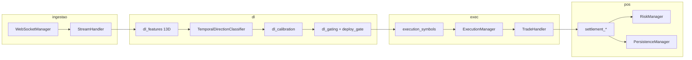

# Arquitetura — Aether Quantum Engine

Motor assíncrono para trading na Deriv com decisão por **Deep Learning** (classificador TCN) nos símbolos **Range Break** (`R_10`, `R_25`, `R_50`, `R_75`, `R_100`). A metodologia de negócio quantitativa está em [`medallion.md`](medallion.md); este documento descreve o software.

---

## 1. Visão geral

| Aspecto | Valor atual (settings padrão) |
|---------|-------------------------------|
| Símbolos | `R_10`, `R_25`, `R_50`, `R_75`, `R_100` (âncora `R_50`) |
| Granularidade OHLC | 300 s (5 min) |
| Histórico para treino | 288 barras (~1 dia) |
| Janela do modelo (lookback) | 96 barras por sequência |
| Contrato | `RISE_FALL`, duração 1 minuto |
| Ciclo do orquestrador | 300 s |
| Decisão | `collect_deep_learning_decisions` |

O mercado é tratado como **série temporal ruidosa**: o modelo estima probabilidade da próxima vela subir; camadas de **gating** e **risco** decidem se e quanto operar.

---

## 2. Pipeline de dados

### 2.1 Bootstrap

1. `app/run.py` carrega `config/settings.json` e PAT do `.env` (`AETHER_DERIV_PAT` + `AETHER_DERIV_APP_ID`).
2. `AuthManager` lista contas REST, obtém OTP e abre WebSocket autenticado via URL OTP.
3. `Orchestrator` instancia stream, risco, executor e persistência.
4. `StreamHandler.start_candle_stream` busca histórico (`fetch_count`, padrão 320 velas) e assina OHLC.

### 2.2 Buffer e janela de treino

- `buffer_limit` limita velas em memória por símbolo.
- `history_bars` / `training_history_bars` definem recorte para treino e predição (últimas N barras, padrão 288).
- Features de par: spread e confirmação entre o símbolo e seu respectivo par de hedge (`dl_pair_features.py`).

---

## 3. Deep Learning

### 3.1 Features e rótulos

Por barra, **13 features** (`FEATURE_DIM`): retornos, volatilidade, RSI, EMA spread, distância SMA, retorno 5 barras, slope RSI, vol relativa, fase horária (sin/cos do ciclo 5m), mais 3 do par.

**Meta-labels:** amostras de treino só entram se o movimento da próxima vela superar `label_min_move_pct` e, quando aplicável, o spread do par confirmar a direção (`extract_sequences`).

### 3.2 Modelo

- Arquitetura: **TCN** dilatada (`dl_tcn.py` / `TemporalDirectionClassifier`).
- Saída: probabilidade de alta (`raw_prob`); margem mínima (`min_direction_margin`) pode vetar direção.
- Calibração: temperatura / Platt na fatia de calibração (`dl_calibration.py`).

### 3.3 Treino walk-forward

`train_model_walkforward` (`dl_training.py`):

- Splits temporais com embargo (`dl_splits.py`): treino / validação / calibração.
- Early stopping em score composto (val accuracy + anti-Brier).
- Checkpoint em `data/dl/{symbol}.pth`.

**Retreino** (`dl_retrain.py`):

- Nova vela (`train_on_new_candle_only`)
- Rolling (`rolling_retrain_bars`)
- Forçado após loss (`mark_force_retrain`)

**Deploy gate** (`dl_deploy_eval.py`): mini simulação nas últimas barras; `deploy_ok` bloqueia execução se reprovar.

### 3.4 Predição e gating

`predict_symbol_decision` (`dl_predict.py`):

- `trade_score` calibrado, `edge`, `val_accuracy` misturada com win rate live (`dl_outcomes.py`).
- Bloqueios: convicção, edge, val_acc, Brier, gap calibrado/raw, saturação, regime (opcional), `deploy_ok`.
- Recovery (perda pendente): thresholds mais rígidos em `recovery_gating`.

Saída por símbolo: `{ direction, metrics }` consumida pelo orquestrador.

### 3.5 Feedback pós-trade

- `record_symbol_outcome` — histórico win/loss por símbolo.
- Pesos de amostra no próximo treino.
- Pausa de sessão após sequência de losses.
- Ban pós-loss por símbolo+direção (`dl_post_loss.py`).

---

## 4. Execução

### 4.1 Seleção e direção

- `execution_symbols.py` — filtra candidatos, escolhe melhor score entre os símbolos do par de hedge.
- `execution_direction.py` — `infer_dl_direction`, inversão opcional (`invert_dl_direction`).
- `mandatory_trade_each_cycle` — força operação CALL ou PUT quando habilitado.

### 4.2 ExecutionManager

- Monta ordens com stake de `RiskManager.calculate_stake` (passa `dl_metrics` para alinhar preview e execução).
- `execution_blockers.py` — log `EXEC_NONE` com motivos.
- Settlement assíncrono; reentrada via `post_settlement_cycle` após liquidação.

### 4.3 Contratos

`TradeHandler.buy_with_parameters`: `contract_type` e duração de `risk_management.params` (RISE_FALL, 1m).

---

## 5. Gerenciamento de risco

`RiskManager` (`domain/risk/`):

| Mecanismo | Módulo / config |
|-----------|-----------------|
| Kelly fracionário | `stake_sizing.py`, `kelly.fraction` |
| Stop win diário | `stop_win_target.py` |
| Martingale recovery | `martingale_gate.py`, `full_recovery_martingale` |
| Cooldown entrada | `risk_cooldown.py`, `entry_cooldown` |
| Cooldown por loss no símbolo | `symbol_loss_cooldown.py` |

Cálculo de stake extraído em `risk_stake_calc.py` (mantém `risk_manager.py` abaixo do limite estrutural de linhas).

Logs típicos: `[Cn] MARTINGALE: stake=...`, `RISK: RECOVERY`, `STOP WIN`.

---

## 6. Orquestrador

`Orchestrator` (`orchestrator/__init__.py`):

1. Sincroniza streams e warm-up de sessão (`trading_session.py`).
2. A cada `cycle_interval_seconds`, se não houver settlement pendente:
   - `tick_bars_since_train`, `tick_post_loss_bans`
   - `collect_deep_learning_decisions`
   - `executor.execute_cluster`
3. Reconciliação periódica de contratos abertos.
4. Reset de sessão de risco no dia UTC (vela âncora).

Banner de startup: `decision_mode_banner.emit_decision_engine_banner` (modo DL, lookback, histórico de treino).

---

## 7. Configuração crítica

| Bloco | Chaves relevantes |
|-------|-------------------|
| `data_handler` | `granularity`, `history_bars`, `fetch_count`, `buffer_limit` |
| `deep_learning` | `lookback`, `training_history_bars`, `validation_bars`, `deploy_gate`, gating, `selection` |
| `orchestrator` | `cycle_interval_seconds`, `execution.*` |
| `risk_management` | `kelly`, `params`, stop win |
| `symbols` / `anchor` | Universo RD |
| `trading.session` | Janela UTC opcional |

---

## 8. Camadas de software

| Camada | Módulos principais |
|--------|-------------------|
| Application / DL | `decision_bridge`, `dl_*`, `model` |
| Application / Orchestrator | `Orchestrator`, `execution_manager`, `settlement_*` |
| Application | `execution_direction`, `execution_symbols` |
| Domain | `trade`, `market_data`, `risk_manager`, `martingale_gate` |
| Infrastructure | `websocket_manager`, `stream_handler`, `trade_handler`, `persistence_manager` |
| Presentation | `logger` |

## 9. Observabilidade

| Ferramenta | Caminho |
|------------|---------|
| Log ao vivo | `logs/engine.log` |
| Monitor Rich | `app/scripts/monitor/live_monitor.py` |
| CI local | `app/scripts/operations/clean_workspace.py` |

---

## 10. Garantia de qualidade

- Cobertura **100%** em `app/src` (pytest + coverage).
- Pre-commit: Ruff, Interrogate, Vulture, pylint duplicate-code, máximo **300 linhas** por arquivo em `app/src`.
- Testes DL: `test_deep_learning*.py`, `test_dl_*`, `test_martingale_gate.py`, `test_execution_*`.

---

## 11. Referências

- [medallion.md](medallion.md) — princípios quant e perfil de qualidade
- [README.md](../README.md) — execução e pré-requisitos
- [deriv-api.md](deriv-api.md) — API Deriv
- [CHANGELOG.md](CHANGELOG.md) — histórico (não editado nesta revisão de docs)
