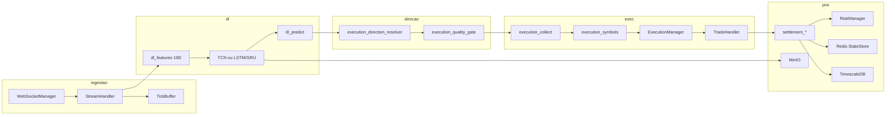

# Arquitetura — Aether Quantum Engine

Motor assíncrono para trading na Deriv com decisão exclusiva por **Deep Learning** (TCN, LSTM ou GRU) nos símbolos **Range Break** (`R_10`, `R_25`, `R_50`, `R_75`, `R_100`). A metodologia de negócio quantitativa está em [`medallion.md`](medallion.md); este documento descreve o software.

---

## 1. Visão geral

| Aspecto | Valor atual (`config/settings.json`) |
|---------|--------------------------------------|
| Símbolos | `R_10`, `R_25`, `R_50`, `R_75`, `R_100` (âncora `R_10`) |
| Granularidade OHLC | 180 s (`data_handler.granularity`) |
| Histórico para treino | 25920 barras (`training_history_bars`) |
| Lookback | 48 barras por sequência |
| Contrato | `RISE_FALL`, duração 180 s |
| Ciclo do orquestrador | 60 s (`cycle_interval_seconds`) |
| Decisão | `collect_deep_learning_decisions` |
| Fases | `FASE TREINO` → `FASE OPERACAO` |
| Execução | Seletiva com gate de qualidade; `mandatory_trade_each_cycle: false` |

O mercado é tratado como **série temporal ruidosa**: o modelo estima probabilidade de alta; um **motor de direção** composto e um **gate de qualidade** decidem CALL, PUT ou skip do ciclo.

---

## 2. Pipeline de dados



### 2.4 Infraestrutura hibrida

Com `infra.enabled: true`, o motor valida Redis, TimescaleDB e MinIO em `localhost` antes do WebSocket (fail-fast). Estado de risco e sessao persistem em Redis; ticks e barras vao para Timescale; checkpoints DL sincronizam com MinIO mantendo cache local em `data/dl/`. Ver [`infra-docker.md`](infra-docker.md).

---

### 2.1 Bootstrap

1. `app/run.py` carrega `config/settings.json` e PAT do `.env` (`AETHER_DERIV_PAT` + `AETHER_DERIV_APP_ID`).
2. `AuthManager` lista contas REST, obtém OTP e abre WebSocket autenticado via URL OTP.
3. `Orchestrator` instancia stream, risco, executor e persistência.
4. `StreamHandler.start_candle_stream` busca histórico OHLC e assina velas (`style: candles`) e ticks (`style: ticks`).

### 2.2 Buffer e microestrutura

- `buffer_limit` limita velas em memória por símbolo.
- `history_bars` / `training_history_bars` definem recorte para treino e predição.
- `TickBuffer` agrega por barra fechada: contagem de ticks, intervalo médio, velocidade, aceleração e desvio padrão de diffs consecutivas.

### 2.3 Assinatura de estado de dados

Para evitar inferências duplicadas na virada de vela, o orquestrador usa `get_data_state_signature()`: concatena epoch e OHLC do último candle fechado por símbolo. Se a assinatura for idêntica ao ciclo anterior, o motor aguarda sem reprocessar.

---

## 3. Deep Learning

### 3.1 Labels e features

**Rótulo** (`dl_labels.py`, modo `ma_trend`):

```
Y[i] = 1.0 se média móvel suavizada indica alta na barra i + horizon
horizon = label_horizon_bars (padrão 1)
```

**19 features** (`FEATURE_DIM` em `dl_feature_build.py`):

| Grupo | Dim | Conteúdo |
|-------|-----|----------|
| Microestrutura | 5 | diff consecutiva, velocidade, aceleração, std diffs, ticks/barra |
| Tradicionais | 9 | RSI, delta-RSI, BB %B e width, ATR norm, distância EMA20/50, log-return, ROC |
| Volatilidade | 3 | vol rolling, vol vs alvo do símbolo, z-score |
| Persistência | 2 | Hurst (R/S), variance ratio |

Normalização anti-leakage: `fit_norm_stats` somente no split de treino walk-forward.

### 3.2 Modelo

- Arquitetura: **`tcn`** (padrão), **`lstm`** ou **`gru`** via `deep_learning.arch`.
- Saída: probabilidade bruta de alta (`raw_prob`).
- Checkpoint v4 em `data/dl/{symbol}.pth` + TorchScript `{symbol}_ts.pt`.
- `dl_symbol_runtime.py` prefere modelo scripted; fallback eager.

### 3.3 Treino walk-forward

- Splits temporais com embargo (`dl_splits.py`).
- Early stopping pela perda de validação.
- Retreino: bootstrap de sessão, nova vela, rolling, forçado após loss.
- Treino deferido (`dl_deferred_train.py`): thread em background serializada.
- Deploy gate opcional (`dl_deploy_eval.py`): `deploy_ok=false` bloqueia execução.
- Gate de treinamento: símbolo sem treino da sessão recebe `gate_reason: training`.

### 3.4 Predição

`predict_symbol_decision` (`dl_predict.py`):

- Sempre `execute=True` quando a predição técnica é bem-sucedida.
- Calcula indicadores, trend (`dl_trend.py`) e enriquece métricas para o resolver.
- `gate_reason=None` após predição OK; bloqueio só em exceção (`predict_error`).
- Thresholds `confidence_call/put` (0.53/0.47) sao bases; com `dynamic_threshold.enabled`, flutuam por `bb_width`, `atr_norm` e regime de volatilidade.
- Grava `calibrated_prob`, `calibrated_edge` e thresholds dinamicos em metrics para resolver e quality gate.

`dl_gating.py` mantem utilitarios: `resolve_edge`, `resolve_calibrated_edge`, `direction_from_raw_prob`, `resolve_confidence_thresholds`.

`dl_calibration_fit.py` ajusta Platt logistico, isotonic (PAV) e temperatura no holdout (`deep_learning.calibration.method: auto`).

---

## 4. Direção e qualidade

### 4.1 Motor de direção (`execution_direction_resolver.py`)

Substitui travas binárias por scoring composto CALL vs PUT:

| Sinal | Comportamento |
|-------|---------------|
| `calibrated_prob` | Peso principal via `dl_raw_weight` (fallback: `raw_prob`) |
| `dynamic_call/put_threshold` | Pivot dinâmico para inferência DL |
| `val_accuracy` | Bias lateral |
| `trend_direction` + votos | `trend_bias` |
| RSI/Keltner extremos | `exhaustion_flip` (mean-reversion) |
| Hurst, ADX, vol_ratio, CMO | `indicator_regime` / `mean_reversion` |
| `val_accuracy` baixa | `low_val_flip` |

Retorna `(CALL|PUT, metrics)` com `direction_inverted`, `direction_margin`, `direction_hints`. Retorna `None` apenas em bloqueio técnico ou sem probabilidade calibrada/bruta.

Pesos configuráveis em `orchestrator.execution.direction_scoring`.

`execution_volatility_threshold.py` calcula `volatility_regime` e ajusta thresholds/edge por símbolo.

### 4.2 Gate de qualidade (`execution_quality_gate.py`)

Aplicado **após** resolução direcional em `_gather_cluster_candidates` e na validação final de `collect_cluster_orders`:

| Piso | Valor padrão | Efeito |
|------|--------------|--------|
| `mandatory_min_trade_score` | 0.68 | Score efetivo mínimo (modo normal) |
| `recovery_min_trade_score` | 0.64 | Piso em recovery (escala com perdas consecutivas) |
| `min_edge_execute` | 0.04 | Edge mínimo (usa `calibrated_edge`; respeita `dynamic_min_edge`) |
| `min_direction_margin` | 0.05 | Clareza CALL vs PUT no resolver |
| `inverted_min_score` | 0.74 | Score extra quando `direction_inverted=true` |
| `min_adx_normal` | 0.18 | ADX mínimo fora de recovery |

Ciclo sem candidato elegível → nenhuma ordem (qualidade > quantidade).

### 4.3 Pool e seleção

- `execution_recovery_gate.cluster_entry_eligible` — bloqueio **somente técnico** + exige `raw_prob` ou direção.
- `execution_direction.build_execution_candidate` — delega ao resolver.
- `execution_symbols.select_best_execution_candidate` — ranking por `market_decision_score` (penaliza inversão e margem baixa).
- `execution_mandatory_pick` / `execution_direction_fallback` — fallbacks quando `mandatory_trade_each_cycle: true`.

### 4.4 Logs DL (`dl_cycle_brief.py`, `dl_cycle_log.py`)

Linha curta por ciclo:

```
DL | exec R_10:CALL c=0.86 | bias R_50:PUT c=0.62→CALL(trend) | 1 bloq
DL REC | exec R_25:PUT c=0.68 +2
```

Resumo detalhado em DEBUG; deduplicação via `build_dl_cycle_brief_key`.

---

## 5. Execução

### 5.1 Fases

- **FASE TREINO** — `_training_phase_gate` suspende ordens até `session_trained` em todos os símbolos.
- **FASE OPERACAO** — `collect_cluster_orders` seleciona melhor candidato ou retorna lista vazia.

### 5.2 ExecutionManager

- Monta ordens com stake de `RiskManager.calculate_stake`.
- Settlement assíncrono; reentrada via `post_settlement_cycle`.
- Contratos via `TradeHandler.buy_with_parameters`: RISE_FALL, 180 s.

---

## 6. Gerenciamento de risco

| Mecanismo | Módulo / config |
|-----------|-----------------|
| Kelly fracionário | `stake_sizing.py`, `kelly.fraction` |
| Stop win diário | `stop_win_target.py` |
| Martingale recovery | `martingale_gate.py`, `martingale_conviction.py` |
| Cooldown entrada | `risk_cooldown.py` |
| Cooldown por loss no símbolo | `symbol_loss_cooldown.py` |

Persistência: `data/session_state.json` (métricas diárias), `data/state.json` (contratos). Stop win no boot exige `total_trades_today > 0` para evitar falso positivo.

---

## 7. Orquestrador

`Orchestrator` (`orchestrator/__init__.py`):

1. `setup_trading_session` — autenticação Deriv e WebSocket.
2. A cada vela do âncora ou `cycle_interval_seconds`:
   - `tick_bars_since_train`
   - `collect_deep_learning_decisions`
   - `executor.execute_cluster`
3. Reconciliação periódica de contratos abertos.
4. Após liquidação: `post_settlement_cycle`.

Banner: `decision_mode_banner.emit_decision_engine_banner`.

---

## 8. Configuração crítica

| Bloco | Chaves relevantes |
|-------|-------------------|
| `data_handler` | `granularity`, `history_bars`, `fetch_count`, `buffer_limit` |
| `deep_learning` | `arch`, `lookback`, `confidence_*`, `min_val_accuracy`, `min_edge_execute`, `deploy_gate` |
| `orchestrator.execution` | `direction_scoring`, `quality_gate`, `mandatory_trade_each_cycle`, settlement |
| `risk_management.kelly` | `mandatory_min_trade_score`, `recovery_min_trade_score`, martingale |
| `risk_management.params` | `duration` (180), stakes |
| `symbols` / `anchor` | Universo Range Break |
| `trading` | `mode` (`demo` / `live`) |

---

## 9. Camadas de software

| Camada | Módulos principais |
|--------|-------------------|
| Application / DL | `decision_bridge`, `dl_predict`, `dl_gating`, `dl_trend`, `dl_cycle_*`, `model` |
| Application / Direção | `execution_direction_resolver`, `execution_direction`, `execution_quality_gate` |
| Application / Execução | `execution_collect`, `execution_market_rank`, `execution_symbols`, `execution_mandatory_pick`, `execution_direction_fallback` |
| Application / Orchestrator | `Orchestrator`, `execution_manager`, `execution_recovery_gate`, `settlement_*`, `post_settlement_cycle` |
| Domain | `trade`, `market_data`, `risk_manager`, `martingale_*`, `stake_sizing` |
| Infrastructure | `websocket_manager`, `stream_handler`, `tick_buffer`, `trade_handler`, `persistence_manager` |
| Presentation | `logger`, `log_dedupe` |

---

## 10. Observabilidade

| Ferramenta | Caminho |
|------------|---------|
| Log ao vivo | `logs/engine.log` |
| Monitor Rich | `app/scripts/monitor/live_monitor.py` |
| CI local | `app/scripts/operations/clean_workspace.py` |
| PAT Deriv | `app/scripts/operations/deriv_pat_connect.py` |
| Reset demo | `app/scripts/operations/reset_demo_balance.py` |

---

## 11. Garantia de qualidade

- Cobertura **100%** em `app/src` (pytest + coverage).
- Pre-commit: Ruff, Interrogate, Vulture, pylint duplicate-code, máximo **300 linhas** por arquivo em `app/src`.

---

## 12. Referências

- [medallion.md](medallion.md) — princípios quant e perfil de qualidade
- [README.md](../README.md) — execução e pré-requisitos
- [deriv-api.md](deriv-api.md) — API Deriv
- [CHANGELOG.md](CHANGELOG.md) — histórico de releases
