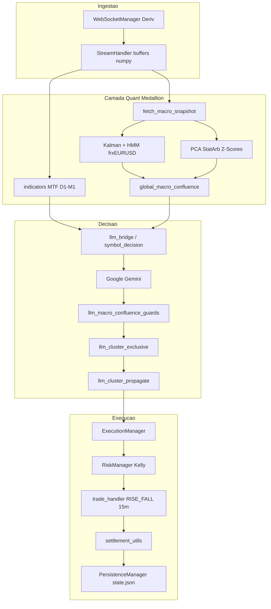

# Arquitetura — Aether Quantum Engine (Medallion)

Este documento descreve a arquitetura técnica do motor alinhada à metodologia **Medallion** (Renaissance Technologies / Jim Simons), documentada em [`medallion.md`](medallion.md). O mercado é tratado como um **sistema de processamento de sinais ruidosos**: anomalias estatísticas, microestrutura e lead-lag cross-asset em horizonte de **15 minutos**, sem narrativas macro discricionárias.

---

## 1. Princípios do Framework Medallion

| Princípio | Implicação no motor |
|-----------|---------------------|
| Sinais, não narrativas | Decisões derivadas de séries temporais, resíduos e regimes quantificáveis; a LLM interpreta contexto numérico, não headlines. |
| `frxEURUSD` como marcapasso | Proxy de liquidez global e diferencial Fed/BCE; variável observável primária para inferir regime e lead-lag nos índices. |
| Horizonte 15 min | Granularidade M15 (`900s`) no gatilho, clusters macro e contratos (`risk_management.params.duration: 15m`). |
| Regimes latentes | HMM bayesiano sobre retornos log do EURUSD suavizado (estados de volatilidade / reversão vs tendência). |
| Arbitragem estatística | Cointegração multivariada via PCA + Z-Score de resíduos nos índices US/EU em janela móvel. |
| Matriz dinâmica de sensibilidade | Clusters `US_CLUSTER` e `EU_CLUSTER` com betas regionais distintos; execução exclusiva por macro quando configurado. |

### 1.1 EURUSD: termômetro de liquidez (Risk-On / Risk-Off)

Conforme [`medallion.md`](medallion.md):

- **Risk-On:** enfraquecimento relativo do USD, `frxEURUSD` sobe; fluxo para ativos de risco (índices US/EU tendem a RISE).
- **Risk-Off:** repatriação para USD, `frxEURUSD` cai; aversão a risco (índices tendem a FALL).

O motor **não** assume correlação linear estática. Explora **descompasso temporal** (lead-lag) entre o marcapasso e os índices em barras M15, com fallback M5 quando o voto do cluster está `flat`.

### 1.2 Universo de ativos e sensibilidade esperada

| Ativo | Região | Risk-On (`frxEURUSD` ↑) | Risk-Off (`frxEURUSD` ↓) |
|-------|--------|---------------------------|---------------------------|
| `OTC_SPC` | US | Alta moderada (beta de mercado) | Queda sistemática |
| `OTC_NDX` | US | Alta agressiva (sensível a juros/liquidez) | Queda acentuada |
| `OTC_DJI` | US | Alta defensiva (valor/industriais) | Queda moderada |
| `OTC_GDAXI` | EU | Alta forte (exportador) | Queda severa |
| `OTC_FCHI` | EU | Alta consumo/luxo | Queda correlacionada Europa |
| `OTC_SSMI` | EU | Alta limitada (CHF como refúgio) | Desempenho relativo defensivo |
| `OTC_FTSE` | EU | Misto (commodities em USD) | Reação mista (mineradoras/energia) |

Configuração em `config/settings.json` → `strategy.clusters` e `symbols`.

---

## 2. Modelagem matemática (implementação)

A metodologia de [`medallion.md`](medallion.md) materializa-se em `src/application/services/llm/medallion_statarb.py` e é alimentada por `macro_snapshot_fetch.py`.

### 2.1 Filtro de Kalman (denoising)

Suaviza preços ruidosos do marcapasso e dos índices **sem lag excessivo**, antes de log-retornos e PCA.

```
Classe: KalmanFilter
Entrada: série de closes
Saída: preço suavizado recursivo (q, r configuráveis)
```

### 2.2 HMM — regimes de volatilidade no marcapasso

`MarketHMMClassifier` implementa um classificador bayesiano de **2 estados** sobre retornos log do `frxEURUSD` denoised:

| Estado | Interpretação operacional |
|--------|---------------------------|
| `0` | Reversão à média / volatilidade baixa (`sigma_low`) |
| `1` | Tendência-rompimento / volatilidade alta (`sigma_high`) |

Atualização por likelihood gaussiana e matriz de transição `A` (persistência de regime). Parâmetros: `strategy.macro.statarb_hmm_sigma_low`, `statarb_hmm_sigma_high`.

No snapshot macro: `hmm_state`, `hmm_prob` → guardrails em `llm_macro_confluence_guards.py` (boost de convicção em reversão; cautela em tendência, sem vetar direção da LLM).

### 2.3 Arbitragem estatística cross-asset (PCA + Z-Score)

`compute_pca_cointegration_zscores`:

1. Alinha closes dos índices US+EU em janela `statarb_lookback` (default 30 barras M15).
2. Aplica Kalman + log-preço por ativo.
3. Decomposição espectral da covariância → **PC1** (fator comum de mercado).
4. Resíduo idiossincrático por ativo → **Z-Score** no último período.

Interpretação Medallion: desvio do spread em relação ao fator comum (proxy da equação de reversão com coeficiente de hedge dinâmico). Z extremo em estado HMM `0` reforça CALL/PUT alinhados à reversão; em estado `1`, reduz convicção (cautela).

### 2.4 Indicadores de microestrutura (MTF)

`indicators.py` / `indicators_numeric.py` expõem ao prompt e aos guardrails:

| Indicador | Regra Medallion no motor |
|-----------|--------------------------|
| Hurst (H) | H > 0.55 → momentum; H < 0.45 → reversão via Z-Score |
| Z-Score | Extremos em mercados anti-persistentes |
| Entropia Shannon | Ruído elevado → cap de convicção (ex.: 0.70 em M1/M5) |
| Velocidade / Aceleração / Sigma | Inércia e regime de range nos timeframes D1→M1 |

Mandato: `llm.indicator_config.confluence_mandate: "medallion"`.

---

## 3. Pipeline de sinais (fluxo de execução)

Ciclo reativo à nova vela M15 do universo configurado (`orchestrator.cycle_interval_seconds: 15`):



### 3.1 Bootstrap e conectividade

1. `run.py` carrega `config/settings.json`, autentica via `AuthManager`, instancia `Orchestrator`.
2. `WebSocketManager` mantém túnel Deriv com keep-alive.
3. `StreamHandler` mantém buffers circulares multi-timeframe (D1, H4, H1, M15, M5, M1).

### 3.2 Snapshot macro transatlântico

`macro_snapshot_fetch.fetch_macro_snapshot`:

- Busca closes M15 (`cluster_granularity_seconds: 900`) para US, EU e `frxEURUSD`.
- Calcula HMM no marcapasso e Z-Scores StatArb nos índices.
- `build_macro_snapshot` + `classify_transatlantic_confluence` → tags: `risk_on`, `risk_off`, `divergence_us_leads`, `divergence_eu_leads`, `indefinido`.
- Fallback M5 se cluster `flat` (`cluster_use_m5_fallback_when_flat`).

### 3.3 Decisão e guardrails

- **LLM (Gemini):** emite `EURUSD`, `US_CLUSTER`, `EU_CLUSTER` (CALL/PUT independentes) com `Probabilidade`; mandato em `llm.system_prompt`.
- **Confluência macro:** `global_macro_confluence.py` agrega votos RISE/FALL por cluster; `macro_fx_reference.py` preenche `CONTEXTO_FX_REF` (USD/JPY, AUD/USD, NZD/USD) sem ordens.
- **Guardrails:** `apply_macro_confluence_guard` ajusta convicção via StatArb Z e HMM sem vetar direção da LLM.
- **Propagação:** `llm_cluster_propagate.propagate_cluster_decisions` aplica tags `US_CLUSTER` / `EU_CLUSTER` sem inversão; `llm_cluster_exclusive` limita um cluster por ciclo (`risk_on`→US, `risk_off`→EU, divergência→líder, `indefinido`→força quant maior; empate→sem ordens nos índices).
- **Gate:** `llm.min_conviction_execute` (ex.: 0.60) e payout mínimo.

### 3.4 Execução e persistência

- `ExecutionManager` dimensiona via `RiskManager` (Kelly fracionário, Stop Win).
- Contratos `RISE_FALL`, duração 15 minutos.
- Liquidação monitorada por `settlement_utils`; estado em `data/state.json`.

---

## 4. Camadas de software (`src`)

Organização em DDD com **separação explícita** entre processamento de sinais (quant), decisão (LLM + guardrails) e execução (infra).

| Camada | Papel Medallion | Módulos principais |
|--------|-----------------|-------------------|
| **Application / LLM** | Motor de sinais, snapshot macro, ponte LLM, guardrails | `medallion_statarb`, `macro_snapshot_fetch`, `global_macro_confluence`, `llm_bridge`, `llm_cluster_propagate`, `llm_cluster_exclusive`, `cluster_direction`, `cluster_statarb_select`, `llm_macro_confluence_guards`, `symbol_decision`, `indicators` |
| **Application / Orchestrator** | Ciclo 15m, filas de execução, settlement | `Orchestrator`, `ExecutionManager`, `settlement_*` |
| **Domain** | Modelos puros, Kelly | `MarketData`, `Trade`, `RiskManager` |
| **Infrastructure** | IO Deriv, persistência | `WebSocketManager`, `StreamHandler`, `trade_handler`, `PersistenceManager` |
| **Presentation** | Auditoria terminal | `TerminalLogger` |

### 4.1 Mapa conceitual Medallion → código

| Conceito [`medallion.md`](medallion.md) | Implementação |
|----------------------------------------|---------------|
| Variável preditora `frxEURUSD` | `config.anchor`, `strategy.correlation.anchor` |
| Estados Risk-On / Risk-Off | `classify_transatlantic_confluence` → `MacroSnapshot.tag` |
| HMM volatilidade no marcapasso | `MarketHMMClassifier` + `hmm_state` / `hmm_prob` (macro Risk-On/Off = voto US/EU) |
| Resíduos / cointegração curto prazo | `compute_pca_cointegration_zscores` → `statarb_spreads` |
| Lead-lag 15 min | Granularidade M15 + ciclo orchestrator; fallback M5 |
| Matriz beta por índice | Clusters + prompt `US_INTEL` / `EU_INTEL`; seleção exclusiva regional |
| Horizonte preditivo 15 min | `trigger_granularity_seconds: 900`, `duration: 15m` |

---

## 5. Configuração (`config/settings.json`)

Blocos críticos para a metodologia:

| Bloco | Função |
|-------|--------|
| `anchor` / `strategy.correlation` | Marcapasso EURUSD, propagação e seleção StatArb por índice |
| `strategy.macro` | Limiares de voto, StatArb, HMM, FX ref |
| `strategy.clusters` | Universo US (`OTC_SPC`, `OTC_NDX`, `OTC_DJI`) e EU (`OTC_FCHI`, `OTC_GDAXI`, `OTC_FTSE`, `OTC_SSMI`) |
| `llm` | Modelo Gemini, MTF, `system_prompt` (mandato Medallion; fallback `sovereign_system.py`), convicção mínima, telemetria |
| `llm.indicator_config` | Hurst, Z, entropia, janelas |
| `orchestrator.cycle_interval_seconds` | Sincronização com barras M15 |
| `risk_management` | Kelly, Stop Win, duração 15m |

---

## 6. Filosofia de risco

Postura alinhada ao Medallion quantitativo:

- **Zero Martingale:** sem progressão de stake em perdas.
- **Vantagem estatística:** execução apenas com convicção (`llm.min_conviction_execute`) e confluência macro acima dos pisos; StatArb/HMM podem **vetar** entradas com Z desalinhado (HMM reversão).
- **Assertividade Medallion:** divergência exige força do líder (`divergence_min_leader_strength`); `indefinido` exige líder claro e gap US/EU; cap de convicção em divergência (`divergence_max_conviction`).
- **Freio de drawdown:** `risk_management.kelly.session_max_drawdown_pct` pausa novas stakes quando a banca cai X% do pico da sessão (live e backtest Kelly).
- **Stop win diário:** meta de lucro por dia UTC (`large_account_stop_win_pct` 10% se banca >= `small_account_threshold`); ao atingir, o motor para novas entradas até o dia seguinte. Live: reset em `_maybe_reset_daily_risk_session` na vela âncora; backtest: reset por bloco de 96 velas M15.
- **Isolamento:** um ciclo por âncora; clusters propagam tags sem cópia cega por coeficiente fixo.
- **Anti-frágil:** execução exclusiva no cluster macro ativo; StatArb escolhe no máximo um índice (`statarb_index_min_abs_z`).

### 6.1 Política de entrada por cluster (Medallion)

| Tag macro | Cluster executado | Direção dos índices |
|-----------|-------------------|---------------------|
| `risk_on` | **US** (`OTC_SPC`, `OTC_NDX`, `OTC_DJI`) | `US_CLUSTER` da LLM |
| `risk_off` | **EU** (`OTC_FCHI`, `OTC_GDAXI`, `OTC_FTSE`, `OTC_SSMI`) | `EU_CLUSTER` da LLM |
| `divergence_us_leads` | **US** | `US_CLUSTER` |
| `divergence_eu_leads` | **EU** | `EU_CLUSTER` |
| `indefinido` | US **ou** EU (maior `macro_*_strength_quant`) | tag LLM do cluster ativo |
| Empate em `indefinido` | **Nenhum** índice no ciclo | aguardar próximo snapshot |

Não se opera EURUSD como trade (`include_anchor_trades: false`). Não se entram US+EU no mesmo ciclo quando `exclusive_cluster_by_macro: true`.

### 6.2 Seleção de índice por StatArb (dentro do cluster)

Com `strategy.correlation.statarb_index_select_enabled: true` (padrão), após definir o cluster ativo e a tag LLM (`US_CLUSTER` / `EU_CLUSTER`), o motor escolhe até `statarb_index_max_per_cluster` índices (default **1**) com melhor alinhamento ao spread:

| Direção cluster | Z favorável (reversão HMM `0`) |
|-----------------|--------------------------------|
| CALL | Z mais negativo (ativo subvalorizado vs fator comum) |
| PUT | Z mais positivo (ativo supervalorizado) |

Implementação: `cluster_statarb_select.py`. HMM em tendência (`1`) reduz o peso do score. Sem Z no snapshot, propaga todos os candidatos do cluster (`STATARB_INDEX_NO_Z_FALLBACK`).

---

## 7. Observabilidade

Dashboard Rich em `scripts/monitor/` (`live_monitor.py`, `monitor_ui.py`): lê `logs/engine.log` e `data/state.json` em tempo real. Utilitários de CI e diagnóstico permanecem em `scripts/operations/` (`clean_workspace.py`, `gemini_ping.py`).

Backtest walk-forward M15 em `scripts/backtest/` (`medallion_backtest.py`): reutiliza `build_macro_snapshot`, HMM, StatArb PCA, exclusividade regional e `cluster_statarb_select`. Modo **quant surrogate** (sem Gemini). Cada run baixa OHLC na Deriv (**sem cache**). PnL com RISE_FALL 15m; banca $100, Kelly + recuperacao, stop win diario e **runtime simulado** ate a meta (velas M15 x 15 min, como sessao ao vivo).

Auditoria imediata por decisão:

- `LLM_AUDIT` / `LLM_IO` (opcional): prompt, `mtf_matrix`, `macro_confluence`, `macro_sentiment`, `fx_reference_line`, `indicators_numeric_line`.
- Dump JSONL: `llm.log_llm_io_dump_path` com tokens sniper e bundle institucional.
- Métricas macro anexadas à âncora: `macro_us_strength_quant`, `macro_eu_strength_quant`, tags StatArb/HMM nas notas de guardrail.

---

## 8. Garantia de qualidade

- Cobertura de testes em `src` (meta 100% no CI).
- Suíte dedicada ao motor Medallion: `test_medallion_statarb.py`, `test_cluster_direction.py`, `test_llm_cluster_propagate.py`, confluência macro, guardrails e bridge LLM.
- Pre-commit: ruff, interrogate, detecção de segredos.

---

## 9. Referências internas

- Metodologia de negócio: [`medallion.md`](medallion.md)
- Visão geral e execução: [`README.md`](../README.md)
- Histórico de releases Medallion/StatArb: [`CHANGELOG.md`](CHANGELOG.md)
