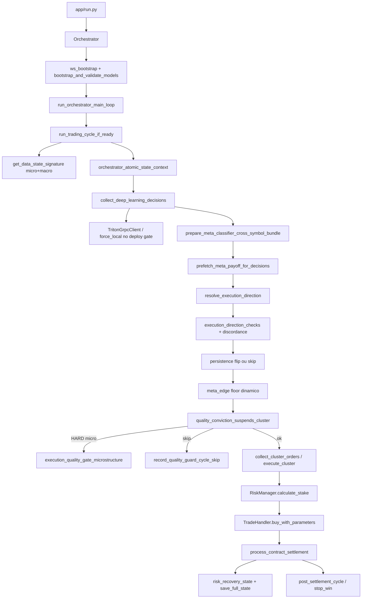
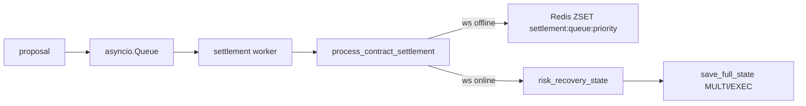
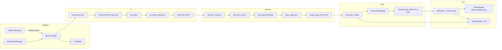

# Arquitetura — Aether Quantum Engine

Motor assíncrono para trading na Deriv com decisão por **Deep Learning** (TCN, LSTM ou GRU) no índice **`R_10`**. Metodologia quantitativa: [`medallion.md`](medallion.md). Inventário de módulos: [`structure.md`](structure.md). Infra Docker: [`infra-docker.md`](infra-docker.md).

---

## 1. Visão geral

| Aspecto | Valor atual (`config/settings.json`) |
|---------|--------------------------------------|
| Símbolos | `R_10` (âncora `R_10`) |
| Granularidade OHLC (DL) | **60 s** (`data_handler.granularity`; chave de assinatura `m1`) |
| Relógio operacional | **60 s** (`data_handler.micro_granularity`; chave de assinatura `m1`) |
| Histórico para treino | **23392** barras macro (`training_history_bars`, ~16 dias @ 60 s) |
| Lookback | **128** barras macro → tensor **`[1, 128, 34]`** (~2 h @ 60 s) |
| Features TCN | **34** (`FEATURE_DIM` em `dl_feature_build.py`) |
| Features meta GBDT | **43** (`META_FEATURE_DIM` = 34 + 4 micro-vol + 3 cross + 2 flow) |
| Contrato | `RISE_FALL`, duração **60 s** |
| Ciclo | **60 s** (`cycle_interval_seconds` / `signature_boundary_seconds`) |
| Execução | **Mandatória** (`mandatory_trade_each_cycle: true`; `force` off) + alinhamento `price_zone` |
| Fail-closed | Meta e Triton **opcionais** nos settings atuais (`require_meta_for_execution: false`; `infra.triton.enabled/require_for_execution: false`) |
| Label | `label_mode: ma_trend` (`spot_forward` / Triple Barrier via config) |
| Meta sessão | Stop win **3,00%** (`compounding_rate_daily: 0.03`); stop loss desativado |

O mercado é tratado como série temporal ruidosa: a TCN estima `P(CALL)` (thresholds **0.55/0.45**); o meta-regressor LightGBM estima `predicted_payoff_edge`; o ranking usa `tcn × max(0.1, 1+z)`. Com `price_zone`, BUY alinha CALL e SELL alinha PUT; edge meta positivo pode **manter** o lado TCN/meta contra a zona (`align_or_keep_meta_side`).

**Invariante temporal:** inferências seguem `signature_boundary_seconds` (fallback `cycle_interval_seconds`, padrão **60 s**) via `get_data_state_signature()` — formato `m1b:{boundary};m1:...`.

**Válvula de starvation:** após **6** ciclos consecutivos bloqueados pelo quality gate, pisos de margem/edge/Z são atenuados (`execution_quality_gate_starvation.py`). O piso de edge meta relaxa a partir de **8** skips (`edge_decay_cycles`) até `edge_decay_floor: 0.0` (passo `0.08`). Em skips extremos (≥30), a válvula GBDT mitiga veto tabular prolongado.

**Gatilho de Convicção Progressiva:** em recovery (`linear > 0`), `min_direction_margin` cai **20% a cada 5** ciclos de inanição (`0.80^(skips//5)`), permitindo sair de loops `EXEC_EMPTY` em mercado lateral.

**Dynamic Recovery Relaxation:** com `linear >= 2` e `pending_loss > 0`, os pisos de TCN Margin e Meta Payoff caem linearmente com o passivo (`execution_quality_gate_drawdown.py`); `recovery_relax.edge_floor: -0.55`.

**Calibração (settings atuais):** `neutral_half_width: 0.0` — zona neutra **OFF**; thresholds CALL/PUT **0.51/0.49**. Em `dl_calibration_tolerance` / `dl_predict_build`, se `raw_prob > 0.65` ou `< 0.35`, a TCN macro prevalece sobre a calibração de curto prazo.

**Settlement:** janela de tolerância **90 s** com reconciliação passiva (`portfolio` + Redis); pós-EXEC_EMPTY em recovery alinha a fronteira de assinatura (cap `exec_empty_retry_seconds`).

---

## 2. Layout e camadas DDD

```
aether-quantum-engine/
├── app/                 # Código de produção + testes + scripts
│   ├── run.py / train.py
│   ├── aether_asyncio.py
│   ├── src/             # 246 módulos Python (DDD)
│   ├── tests/           # 306 arquivos test_*.py (incluindo test_execution_coverage_gaps.py); cobertura 100% em src
│   └── scripts/         # operations, monitor, batch
├── config/settings.json # Runtime
├── data/                # state, session_state, dl/
├── docs/
├── infra/docker/        # Redis, Timescale, MinIO, Triton (repo R_10), meta-classifier
└── linters/             # Ruff, Interrogate, Vulture, ≤300 linhas/arquivo

```

```
presentation  →  application  →  domain
                    ↓
              infrastructure (adapters)
```

| Camada | Pasta | Papel |
|--------|-------|-------|
| Application | `application/services/` | Orquestração, DL, direção modular, quality gates, meta |
| Domain | `domain/` | Risco Kelly + Soft Recovery (`soft_recovery_policy`), `RiskPolicy`, modelos, math |
| Infrastructure | `infrastructure/` | Deriv WS/REST (retry 5xx), Redis, Triton, MinIO, Timescale |
| Presentation | `presentation/` | Logger terminal |

Regra: **domain** não importa application nem infrastructure. Implementações concretas vêm de `infra_factory.create_infra_services`.

---

## 3. Pipeline de runtime



### 3.1 Bootstrap

1. `app/run.py` carrega `config/settings.json` + PAT (`.env`: `AETHER_DERIV_PAT`, `AETHER_DERIV_APP_ID`) via `aether_asyncio.run`.
2. `Orchestrator.__init__`: `create_infra_services`, `AuthManager`, `WebSocketManager`, `StreamHandler`, `TradeHandler`, `RiskManager`, `StateManager`, `ExecutionManager`.
3. `validate_engine_risk_config` / `RiskPolicy` no boot (`risk_policy.py`).
4. `validate_infra_services` (fail-fast se `infra.enabled`) → `bootstrap_and_validate_models` (quando Triton/MinIO ativos):
   - MinIO → `{symbol}.pth` + `latest_ts.pt`
   - Sanity TorchScript multi-probe (`torchscript_sanity_probes`)
   - Sync Triton (`triton_model_sync`) no repositório **`R_10`** + schema + stress infer
5. Auth OTP (health PAT com retry em 502/503/504) → `bootstrap_active_session_targets` (meta 2,60%).
6. Streams macro+micro+ticks → watchdog → settlement worker → loop principal.

### 3.2 Ciclo de trading

`trading_cycle_entry.run_trading_cycle_if_ready`:

1. `process_redis_settlement_queue`
2. Guards (`trading_cycle_entry_guards`): stop-win, assinatura, cadência, contratos ativos
3. `prepare_quality_skipped_cycles_counter` (Redis `state:risk:skipped_cycles_counter`)
4. Sob `orchestrator_atomic_state_context`:
   - `collect_deep_learning_decisions`
   - `quality_conviction_suspends_cluster` → skip + incremento starvation **ou**
   - `executor.execute_cluster(decisions)` → reset starvation

**Lock atômico** (`StateManager._state_lock`): inferência + boleta **não** correm em paralelo com liquidação/persistência de risco.

### 3.3 Assinatura micro+macro (prefixos legados m5/m15)

| Componente | Função |
|------------|--------|
| `m5_boundary_epoch()` | Epoch alinhado ao bloco de **120 s** corrente (nome legado) |
| Micro | `m5:{sym}@{epoch}` — relógio **120 s** |
| Macro | `m15:{sym}@{epoch}` — relógio **600 s** |
| Formato | `m5b:{boundary};m5:...;m15:...` |

Cache inválido quando a assinatura muda; sem assinatura nova, o ciclo aguarda sem re-inferir.

---

## 4. Deep Learning

### 4.1 Features (34D)

| Grupo | Dim | Conteúdo |
|-------|-----|----------|
| Microestrutura | 5 | ticks/barra, intervalo, velocidade, aceleração, std diffs |
| Tradicionais | 22 | RSI, BB, ATR, EMAs, MACD, estocástico, CCI, ADX, Williams, CMO, Keltner, etc. |
| Volatilidade | 5 | vol rolling, vol vs alvo, z-score, implied vol, vol_ratio |
| Persistência | 2 | Hurst, variance ratio |

Módulos: `dl_feature_build.py` (séries), `dl_feature_matrix.py` (linhas/matrizes/tensores), `dl_feature_indicators*.py`, `dl_indicator_config.py`, facade `dl_features.py`.

**Config 100% JSON:** períodos, multiplicadores e thresholds de indicadores vivem em `deep_learning.indicators` (`config/settings.json`). O Python só resolve via `resolve_indicator_config` / `load_indicator_config_from_settings` — sem magic numbers de indicador no código. Mudar períodos sem retreinar o TCN altera a distribuição das features (fingerprint inválido até retreino).

**SSOT de knobs de runtime:** thresholds de negócio, timing/infra e parsers DL restantes também vivem só em `config/settings.json` (quality_gate/starvation/recovery_relax, soft_recovery, recovery_state, kelly runtime, loss_protection.disconnect, market_rank.composite, edge_zscore operacional, live_signal_metrics, meta_payoff_veto, regime/force/cross_corr, timeouts orchestrator/meta/triton/stream/history/shadow, aux_regression_weight, calibration bounds, dynamic_threshold clamps, price_zone, side_equilibrium, deploy_gate). Resolvers `resolve_*_config` / `*_from_settings` são fail-closed (chave ausente = `ValueError`). Exclusões: dims de tensor, enums/reason strings, chaves Redis, epsilons `1e-9`/`1e-12`.

Normalização anti-leakage: `fit_norm_stats` **somente** no split de treino (`dl_splits` purged/embargo).

### 4.2 Modelo e labels

| Peça | Path |
|------|------|
| TCN | `dl_tcn.TemporalDirectionClassifier` (+ `regression_head` multi-task) |
| LSTM/GRU | `dl_lstm.py`; `deep_learning.arch` |
| Perda | Focal assimétrica alta vol (`dl_training_epochs._masked_loss`) |
| Labels | `dl_labels.LabelSpec` — `spot_forward` / `ma_trend` / `triple_barrier` |
| Checkpoint | `data/dl/{symbol}.pth` + TorchScript / MinIO |
| Deploy gate | `dl_deploy_eval` com **`force_local=True`** (avalia modelo em memória, sem Triton) |

Config atual: `arch: tcn`, `lookback: 72`, `label_mode: spot_forward`, thresholds **0.51** / **0.49**, `neutral_half_width: 0.0`.

### 4.3 Treino de sessão

- Walk-forward: `dl_symbol_train` → `train_model_walkforward`
- Bootstrap sequencial: `dl_bootstrap_train` / `run_dl_training_session` via `asyncio.to_thread`
- Retreino deferido: `dl_deferred_train` (thread + semáforo)
- CUDA: init no main thread (`dl_device`); uploads MinIO via `loop.call_soon_threadsafe`
- Gate: `training` até `session_trained` (`dl_training_gate`)

### 4.4 Predição

`predict_symbol_decision_async` (`dl_predict_async.py`):

- Triton quando habilitado e **não** `force_local`
- Timeout `infra.triton.infer_timeout_seconds` (settings atuais **8 s** quando Triton ligado); com `require_for_execution: true` → fail-closed sem fallback local em produção
- Path sync (`dl_predict.py`) usado pelo mini-deploy de treino: `force_local=True` evita gRPC em thread de treino (bug `Future attached to a different loop`)
- Cliente gRPC loop-aware: `triton_grpc_client.get_triton_grpc_client` recria canal se o event loop mudou
- Cache por fingerprint do tensor (`dl_predict_cache`)
- Calibração: `dl_calibration_tolerance` — override TCN macro quando raw &gt;0.65 ou &lt;0.35; zona neutra **off** (`neutral_half_width: 0.0`)

---

## 5. Meta-classificador (LightGBM)

### 5.1 Serviço

| Item | Valor |
|------|-------|
| Container | `aether-meta-classifier` (FastAPI), host **8005→8000** |
| Endpoint | `POST /v2/predict_meta` |
| Cliente | `MetaClassifierClient` + `meta_classifier_pool` (rebind por loop) |
| Timeout | 1,0 s; fallback `predicted_payoff_edge=0.0` |
| Artefatos | `infra/docker/meta-models/*.pkl` |
| Execução | Meta **opcional** (`require_meta_for_execution: false`); Triton permanece obrigatório |

### 5.2 Vetor 43D

```
META_FEATURE_DIM = 34 (TCN) + 4 (micro-vol zscores) + 3 (cross-symbol) + 2 (flow) = 43
```

| Bloco | Features |
|-------|----------|
| Micro-vol | `micro_bid_ask_spread_momentum[_zscore]`, `volatility_shadow_ratio[_zscore]` |
| Cross | `cross_symbol_prob_delta`, `cross_symbol_vol_ratio_diff`, `cross_symbol_rsi_spread` |
| Flow | `micro_tick_acceleration`, `keltner_deviation_ratio` |

Montagem: `dl_predict_telemetry.prepare_meta_classifier_cross_symbol_bundle` → `extract_meta_feature_vector` → `prefetch_meta_payoff_for_decisions`.

**Nota:** o container Docker legado pode declarar `FEATURE_DIM=39` (sem o bloco micro-vol de 4). O **app** é a fonte de verdade (**43D**). Treino offline e artefato `.pkl` devem alinhar com `META_FEATURE_DIM`.

### 5.3 Stacking runtime

1. Bundle cross-symbol + telemetria micro **120 s**
2. Prefetch HTTP → `predicted_payoff_edge`
3. `attach_payoff_edge_zscore_metrics` (janela adaptativa 15–45)
4. `apply_meta_regression_edge`: edge > 0 mantém score TCN; edge < −0,15 + squeeze → `trade_score=0.52` (`[D-SQUEEZE]`)
5. Ranking: `market_decision_score = tcn × max(0.1, 1+z)`
6. Veto Z negativo: `meta_payoff_veto_gate` (waiver em recovery crítico)

### 5.4 Treino offline e anti-leakage

Scripts: `train_meta_vector.py`, `train_meta_data.py`, `train_meta_classifier.py`, `train_meta_optuna.py`.

- Alvo: `Y ≈ PnL / Stake`
- Optuna maximiza Information Ratio; constraint Z-Score OOS
- Anti-leakage: proxy de probabilidade via **retorno passado** (não label forward do horizonte de execução)
- Alinhamento temporal por epoch em `train_meta_vector`

---

## 6. Direção e quality gates

### 6.1 Motor de direção (modular)

`resolve_execution_direction` orquestra:

| Módulo | Papel |
|--------|-------|
| `execution_direction_checks` | Clamps, sniper stubs, discordance (se ligado), price zone prévia |
| `execution_direction_discordance` | Veto RSI/DI + votos (`discordance_veto_enabled`, default **false**) |
| `execution_direction_persistence` | Após 2 losses no mesmo lado: **flip** toxic escape se o oposto estiver livre; senão skip |
| `execution_direction_meta_edge` | Piso dinâmico de edge (`_resolve_meta_edge_floor`) + `_negative_edge_skip` |
| `execution_direction_resolver` | Finalize: meta regression, price zone + `align_or_keep_meta_side`, SIDE_EQ |
| `execution_price_zone_gate` | BUY/SELL; edge meta &gt; 0 pode manter lado contra a zona |
| `side_equilibrium_gate` | Small-N hard skip / large-N soft; toxic escape **preserva** edge positivo |

| Etapa | Comportamento |
|-------|---------------|
| `infer_dl_direction` | TCN: `P(CALL) ≥ pivot` → CALL, senão PUT (thresholds **0.51/0.49**) |
| Meta edge | Refina score / D-SQUEEZE (meta opcional); edge abaixo do piso dinâmico → `meta_negative_edge` |
| Persistence | Flip CALL↔PUT com `side_eq_toxic_escape` **ou** `persistence_guard_skip` |
| Bloqueio absoluto | `deploy_ok=false`, `gate_reason ∈ {data, predict_error, training}`; Triton fail-closed só se configurado |

### 6.2 Quality gate dual soft + HARD microestrutura

| Portão | Módulo | Critério |
|--------|--------|----------|
| TCN + meta soft | `execution_quality_gate` | Margem/edge com pisos regulares **0.0** nos settings atuais; Dynamic Recovery Relaxation com `linear≥2` e pendente |
| Meta Z-Score | `execution_quality_gate_meta` | Z vs buffer; waiver recovery se edge ∈ [-0.05, 0.04] e Z&gt;0.5 |
| Cluster | `execution_quality_gate_cluster` | `quality_conviction_suspends_cluster` |
| Microestrutura HARD | `execution_quality_gate_microstructure` | ADX / `vol_ratio` / val_accuracy quando limiares &gt; 0 (settings atuais ADX **0.0**) |
| Sniper stubs | `execution_sniper_gates` | Helpers de banda; stubs Hurst/BB retornam `False` |
| Starvation | `execution_quality_gate_starvation` | Limiar **6** ciclos; edge decay a partir de **8**; Convicção Progressiva (−20%/5 skips) |
| Drawdown relax | `execution_quality_gate_drawdown` | `edge_floor` até **-0.55** |
| Calibração | `dl_calibration_tolerance` | Zona neutra **off**; override TCN em raw extremos |
| Loss protection | `execution_loss_protection` | Caps edge/Z 999; margem operacional **0.0** |
| Meta veto | `meta_payoff_veto_gate` | Soft comprime score (não hard-blocka o resolve); hard só com shadow |
| Settlement | `orchestrator_settlement_queue` | Janela **90 s** + orphan cleaner |

Em modo mandatário, o quality guard emite telemetria `QUALITY_GUARD` / `EXECUTION_FLOW` e delega ao mandatory pick em vez de congelar a esteira por soft alone.

### 6.3 Ranking e seleção

- `execution_market_rank.market_decision_score`
- Redirect inter-símbolo: âncora Z < −0,50 → par Z > +0,50 (`try_inter_symbol_zscore_redirect`)
- `execution_collect` / `execution_mandatory_pick` / `execution_symbols`
- Cointegração Drift sob drawdown: `apply_cointegration_redirect`

---

## 7. Execução e settlement

### 7.1 Fases

- **FASE TREINO** — suspende ordens até `session_trained` em todos os símbolos
- **FASE OPERACAO** — mandatária por ciclo (`mandatory_trade_each_cycle: true`) com alinhamento de zona

### 7.2 ExecutionManager

- Stake via `RiskManager.calculate_stake` → `risk_stake_calc.calculate_stake_for_manager`
- `TradeHandler.buy_with_parameters`: RISE_FALL **120 s**
- Reconciliação de stake downgrade Deriv (`executed_stake_reconciliation`)

### 7.3 Settlement



Pós-liquidação (`post_settlement_cycle`): stop-win fast-path limpa Redis, cancela fila e `graceful_shutdown(fast_path=True)`; senão retry com teto e recovery transparente de deadlock.

Portões neutralizados em modo mandatário (não bloqueiam ciclo): cooldown pós-LOSS, blackout API, Hurst recovery collect, freeze yield, stubs sniper.

---

## 8. Gerenciamento de risco

| Mecanismo | Módulo |
|-----------|--------|
| Sizing | `risk_stake_calc.calculate_stake_for_manager`: EXPLORE→Kelly; RECOVER→Soft Recovery |
| Soft Recovery (RECOVER) | `soft_recovery_policy` + `dlambert_sizing` (`amort_cycles`, `max_safe_stake_pct`) |
| Tags de stake | `EXPLORE_KELLY` / `RECOVER_DAL_Ln` via `emit_cycle_stake_log` |
| Kelly (EXPLORE) | `kelly_base_fraction`, `stake_sizing`; `fraction: 0.08`, tetos 3,5% |
| Side equilibrium (LLN) | `side_equilibrium` / `side_equilibrium_gate` |
| Consensus entropy | `consensus_stake_penalty.consensus_kelly_retention` (`consensus_penalty_enabled: false`) |
| Recovery persistente | `pending_loss` + `consecutive_losses_linear` + `last_loss_stake` |
| Stop win sessão | `StopWinManager` + `compounding_rate_daily: 0.03` |
| Stop loss | Desativado |
| Policy boot | `RiskPolicy` / `validate_engine_risk_config` |
| Persistence | `execution_direction_persistence` → flip toxic escape / SKIP / FREEZE |
| Side equilibrium | `side_equilibrium_gate` (toxic escape mantém edge positivo) |
| Val accuracy gate | Limiar configurável (settings atuais sem piso hard de 0.63) |

Facade: `domain/risk/risk_manager.RiskManager.calculate_stake`.

**Sessão:** meta = `session_start_balance × 0.03` (banca ≥ $100) ou **$10** (banca &lt; $100). Log: `SESSAO INICIADA | Alvo de 3.00%: $… | Stop Loss: DESATIVADO`. Reiniciar o processo inicia sessão nova.

---

## 9. Infraestrutura

| Serviço | Porta | Uso |
|---------|-------|-----|
| Redis | 6379 | Estado atômico, settlement ZSET, starvation counter |
| TimescaleDB | 5432 | Ticks/OHLC; correlação |
| MinIO | 9000/9001 | Checkpoints TCN/TorchScript |
| Triton | 8000/8001 | Inferência GPU gRPC |
| Meta-classifier | 8005 | LightGBM HTTP |
| Deriv | WS/REST | Auth PAT, streams, propostas |

Config `infra.*`: `enabled`, `fail_fast`, `redis`, `timescale`, `minio`, `triton` (`infer_timeout_seconds: 0.50`, `require_for_execution`), `meta_classifier`.

Persistência: `redis_state_pipeline.write_state_bundle` (MULTI/EXEC) — snapshot, risk hash, pending_loss, session keys, skip counters, market_sig, settlement queue.

Watchdog: `AetherWatchdog` reconecta stream se ticks estagnarem (`watchdog_stale_tick_seconds`, **25 s**).

---

## 10. Configuração (`config/settings.json`)

### `data_handler`
`granularity` (**600**), `micro_granularity` (**120**), `history_bars` / `training_history_bars` (**23328**), `fetch_count`, `buffer_limit`, rate-limits de histórico.

### `deep_learning`
`arch`, `lookback` (**72**), `train_symbols`, `confidence_*` (**0.51/0.49**), `calibration.*` (`neutral_half_width: 0.0`), `indicator_gating.*`, `deploy_gate.*`, `label_mode` (`spot_forward`) + `label_*`, `tcn.channels`, `training_*`, `model_path_template`, `min_edge_execute`.

### `orchestrator` / `orchestrator.execution`
`cycle_interval_seconds` (**120**), `signature_boundary_seconds` (**120**), `watchdog_stale_tick_seconds` (**25**), `mandatory_trade_each_cycle`, `require_meta_for_execution` (**false**), `quality_gate.*` (`mandatory_min_trade_score: 0.50`, starvation/progressive_conviction/recovery_relax), `loss_protection.*` + `disconnect.*`, `bb_width_adaptive_squeeze.enabled` (**false**), `proposal_*`, `settlement_*` (**90 s** SSOT), `dynamic_threshold.*` (clamps inclusos), `warm_up_live_data_timeout_seconds` (**25**), `broker_handshake_timeout_seconds` (**15**), `state_lock_acquire_timeout_seconds` (**8**).

### `risk_management`
`kelly.*` (`fraction: 0.08`, tetos 3,5% — EXPLORE), `soft_recovery.*` (`enabled: true`, `max_safe_stake_pct: 0.035` — RECOVER), `min_validation_accuracy_gate` (**0.63**), `params.*` (duration **120**, compounding, stake_min, payout_estimate), `small_account_*`.

### `infra`
Redis/Timescale/MinIO/Triton/meta_classifier URLs e timeouts (`infer_timeout_seconds: 0.50`).

---

## 11. Observabilidade e QA

Marcadores de log frequentes: `QUALITY_GUARD`, `EXECUTION_FLOW`, `REGIME_GUARD`, `D-SQUEEZE`, `TRITON_TIMEOUT_*`, `META_CLASSIFIER_FALLBACK`, `STOP_WIN`, `SESSAO INICIADA`, `DATA_SIG`.

Pre-commit (`clean_workspace.py`):

| Stage | Conteúdo |
|-------|----------|
| lint | Ruff, Interrogate 100%, Vulture, ≤300 linhas/arquivo |
| test | pytest + cobertura **100%** em `app/src` (**305** `test_*.py`) |
| security | Bandit + pip-audit |
| clean | caches locais |

---

## 12. Diagrama condensado do software


