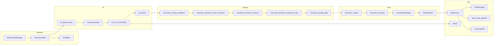

# Arquitetura — Aether Quantum Engine

Motor assíncrono para trading na Deriv com decisão exclusiva por **Deep Learning** (TCN, LSTM ou GRU) nos símbolos **Range Break** (`R_10`, `R_25`, `R_50`, `R_75`, `R_100`). A metodologia de negócio quantitativa está em [`medallion.md`](medallion.md); este documento descreve o software.

---

## 1. Visão geral

| Aspecto | Valor atual (`config/settings.json`) |
|---------|--------------------------------------|
| Símbolos | `R_10`, `R_25`, `R_50`, `R_75`, `R_100` (âncora `R_10`) |
| Granularidade OHLC | 180 s (`data_handler.granularity`) |
| Histórico para treino | 25920 barras (`training_history_bars`) |
| Lookback | 48 barras por sequência |
| Features | **34** (`FEATURE_DIM` em `dl_feature_build.py`) |
| Contrato | `RISE_FALL`, duração 180 s |
| Ciclo do orquestrador | 60 s (`cycle_interval_seconds`) |
| Decisão | `collect_deep_learning_decisions` |
| Fases | `FASE TREINO` → `FASE OPERACAO` |
| Execução | Seletiva (`mandatory_trade_each_cycle: false`) ou **contínua** (`true`) |

O mercado é tratado como **série temporal ruidosa**: o modelo estima probabilidade de alta; um **motor de direção** composto e uma **camada de qualidade** (penalidade ou veto conforme modo) decidem CALL, PUT ou skip do ciclo.

---

## 2. Pipeline de dados



### 2.4 Infraestrutura híbrida

Com `infra.enabled: true`, o motor valida Redis, TimescaleDB e MinIO em `localhost` antes do WebSocket (fail-fast). Estado de risco e sessão persistem em Redis via pipeline atômico (`redis_state_pipeline.write_state_bundle`); ticks e barras vão para Timescale; checkpoints DL sincronizam com MinIO mantendo cache local em `data/dl/`.

**Bootstrap de modelos** (`bootstrap_and_validate_models`):

1. Baixa `{symbol}.pth` e `latest_ts.pt` do MinIO.
2. Valida manifest (`feature_dim`, `lookback`, `norm_mean`/`norm_std`).
3. Forward pass multi-probe em TorchScript (`torchscript_sanity_probes`: zeros, extremos, **regime estressado** RSI/CMO/vol).
4. Com `infra.triton.enabled`: espelha artefatos em `infra/docker/triton-models`, recarrega repositório Triton, valida schema HTTP e executa **`verify_triton_stressed_inference_async`** (inferência concorrente sob tensores estressados; fail-fast se NaN/Inf ou probabilidade fora de `[0, 1]`).

**Inferência de produção** via `TritonGrpcClient` (`triton_grpc_client.py`):

- Canal persistente `grpc.aio.insecure_channel` com keepalive (sem handshake repetido a cada ciclo).
- Predições dos 5 símbolos em paralelo com `asyncio.gather`.
- Facade em `triton_inference_client.py` para o restante do motor.

Redis local usa AOF `appendfsync everysec` (`infra/docker/redis.conf`). `make docker-up` aplica `host-prereq.sh` (`vm.overcommit_memory=1` no WSL).

**Persistência pós-settlement** (`save_full_state`): uma transação Redis `MULTI/EXEC` grava snapshot JSON, hash de risco (`consecutive_losses`, `pending_loss`, cooldowns), sessão diária (`current_balance`, etc.), `recovery:skip_counter` e assinatura de mercado — sem round-trips bloqueantes adicionais na thread principal.

---

### 2.1 Bootstrap

1. `app/run.py` carrega `config/settings.json` e PAT do `.env` (`AETHER_DERIV_PAT` + `AETHER_DERIV_APP_ID`).
2. `validate_infra_services` (quando `infra.enabled`) e `bootstrap_and_validate_models` (checkpoint + TorchScript + sanity + Triton).
3. `restore_orchestrator_state` e `AuthManager` abrem sessão REST/WebSocket via OTP PAT.
4. `Orchestrator` instancia stream, risco, executor e persistência.
5. `StreamHandler.start_candle_stream` busca histórico OHLC e assina velas (`style: candles`) e ticks (`style: ticks`).

### 2.2 Buffer e microestrutura

- `buffer_limit` limita velas em memória por símbolo.
- `history_bars` / `training_history_bars` definem recorte para treino e predição.
- `TickBuffer` agrega por barra fechada: contagem de ticks, intervalo médio, velocidade, aceleração e desvio padrão de diffs consecutivas.

### 2.3 Assinatura de estado de dados

Para evitar inferências duplicadas na virada de vela, o orquestrador usa `get_data_state_signature()`: concatena epoch e OHLC do último candle fechado por símbolo. Se a assinatura for idêntica ao ciclo anterior, o motor aguarda sem reprocessar.

---

## 3. Deep Learning

### 3.1 Labels e features

**Rótulo** (`dl_labels.py`, modo `ma_trend`):

```
Y[i] = 1.0 se média móvel suavizada indica alta na barra i + horizon
horizon = label_horizon_bars (padrão 1)
```

**34 features** (`FEATURE_DIM` em `dl_feature_build.py`):

| Grupo | Dim | Conteúdo |
|-------|-----|----------|
| Microestrutura | 5 | ticks/barra, intervalo médio, velocidade, aceleração, std diffs |
| Tradicionais | 22 | RSI, delta-RSI, BB, ATR, EMAs, MACD, estocástico, CCI, ADX, DI, Williams, CMO, Keltner, ROC-RSI, etc. |
| Volatilidade | 5 | vol rolling, vol vs alvo, z-score, implied vol ratio, vol_ratio short/long |
| Persistência | 2 | Hurst (R/S), variance ratio |

Normalização anti-leakage: `fit_norm_stats` somente no split de treino walk-forward.

### 3.2 Modelo

- Arquitetura: **`tcn`** (padrão), **`lstm`** ou **`gru`** via `deep_learning.arch`.
- Saída: probabilidade bruta de alta (`raw_prob`).
- Checkpoint v4 em `data/dl/{symbol}.pth` + TorchScript `{symbol}_ts.pt` (espelho MinIO `latest_ts.pt`).
- `dl_symbol_runtime.py` mantém estado de treino/calibração; inferência via `TritonGrpcClient.infer_symbols_concurrent` quando `infra.triton.enabled`.
- `collect_cluster_orders` suporta modo contínuo: penalidade de qualidade em vez de SKIP; fallback por entropia e mandatory pick.

### 3.3 Treino walk-forward

- Splits temporais com embargo (`dl_splits.py`).
- Early stopping pela perda de validação.
- Retreino: bootstrap de sessão, nova vela, rolling, forçado após loss.
- Treino deferido (`dl_deferred_train.py`): thread em background serializada.
- Deploy gate opcional (`dl_deploy_eval.py`): `deploy_ok=false` bloqueia execução.
- Gate de treinamento: símbolo sem treino da sessão recebe `gate_reason: training`.

### 3.4 Predição

`predict_symbol_decision_async` (`dl_predict_async.py` / `dl_predict_triton.py`):

- Sempre `execute=True` quando a predição técnica é bem-sucedida.
- Calcula indicadores, trend (`dl_trend.py`) e enriquece métricas para o resolver.
- `gate_reason=None` após predição OK; bloqueio só em exceção (`predict_error`).
- Thresholds `confidence_call/put` (0.53/0.47) são bases; com `dynamic_threshold.enabled`, flutuam por `bb_width`, `atr_norm` e regime de volatilidade.
- Grava `calibrated_prob`, `calibrated_edge` e thresholds dinâmicos em metrics para resolver e quality gate.

---

## 4. Direção e qualidade

### 4.1 Motor de direção (`execution_direction_resolver.py`)

Substitui travas binárias por scoring composto CALL vs PUT:

| Sinal | Comportamento |
|-------|---------------|
| `calibrated_prob` | Peso principal via `dl_raw_weight` (fallback: `raw_prob`) |
| `dynamic_call/put_threshold` | Pivot dinâmico para inferência DL |
| `val_accuracy` | Bias lateral |
| `trend_direction` + votos | `trend_bias` |
| RSI/Keltner extremos | `exhaustion_flip` (mean-reversion) |
| RSI+CMO+Keltner alinhados | `exhaustion_hard_gate` — atenua peso DL em 80% |
| Entropia de probabilidade | `execution_entropy_adaptive` — comprime `w_eff` em regime incerto |
| Hurst, ADX, vol_ratio, CMO | `indicator_regime` / `mean_reversion` |
| Correlação cross-symbol | `execution_direction_cross_corr` — matriz Timescale + softmax |

**Mean Reversion Flip** (`execution_direction_mean_reversion.py`), aplicado antes do veto de expansão:

- Condição: `vol_ratio < 0.80` e exaustão extrema (`RSI > 0.72` e `CMO > 0.45`, ou espelho oversold).
- Ação: inverte a direção do DL (CALL→PUT ou PUT→CALL) com margem de segurança no `trade_score`.

**Veto de expansão** (`execution_direction_expansion_veto.py`):

- Com `vol_ratio > expansion_inversion_veto_vol_ratio` (padrão **1.15**), veta inversões por exaustão/mean-reversion.
- Preserva direção do DL e aplica `expansion_momentum_kelly_scale` (padrão 0.85) em `kelly_fraction_scale`.

Pesos configuráveis em `orchestrator.execution.direction_scoring`.

### 4.2 Gate de qualidade (`execution_quality_gate.py`)

Aplicado **após** resolução direcional em `_gather_cluster_candidates`:

| Modo | Comportamento |
|------|---------------|
| Seletivo (`mandatory_trade_each_cycle: false`) | Pisos de score/edge podem resultar em SKIP do ciclo |
| Contínuo (`mandatory_trade_each_cycle: true`) | Penalidade de score/edge; mandatory pick garante ordem |

| Piso | Valor padrão | Efeito |
|------|--------------|--------|
| `mandatory_min_trade_score` | 0.68 | Score efetivo mínimo (modo normal) |
| `recovery_min_trade_score` | 0.64 | Piso em recovery (escala com perdas consecutivas) |
| `recovery_hurst_persistence_min` | 0.58 | Hurst mínimo para persistência em martingale N2+ |
| `min_edge_execute` | 0.04 | Edge mínimo (usa `calibrated_edge`; respeita `dynamic_min_edge`) |
| `min_direction_margin` | 0.05 | Clareza CALL vs PUT no resolver |
| `inverted_min_score` | 0.74 | Score extra quando `direction_inverted=true` |

Em recovery N2+, `recovery_skip_counter` no Redis reduz o limiar Hurst linearmente ou com decaimento logarítmico em drawdown severo.

### 4.3 Pool e seleção

- `execution_recovery_gate.cluster_entry_eligible` — bloqueio **somente técnico** + exige `raw_prob` ou direção.
- `execution_collect_helpers.recovery_hurst_blocks_collect` — filtro de persistência Hurst antes da seleção.
- `execution_direction.build_execution_candidate` — delega ao resolver.
- `execution_symbols.select_best_execution_candidate` / `select_mandatory_execution_candidate` — ranking por `market_decision_score`.
- `execution_mandatory_pick` / `execution_entropy_fallback` — fallbacks em modo contínuo.

---

## 5. Execução

### 5.1 Fases

- **FASE TREINO** — `_training_phase_gate` suspende ordens até `session_trained` em todos os símbolos.
- **FASE OPERACAO** — `collect_cluster_orders` seleciona melhor candidato ou mandatory pick.

### 5.2 ExecutionManager

- Monta ordens com stake de `RiskManager.calculate_stake`.
- Settlement assíncrono; reentrada via `post_settlement_cycle`.
- Contratos via `TradeHandler.buy_with_parameters`: RISE_FALL, 180 s.
- Após settlement: `save_full_state` persiste bundle atômico no Redis.

---

## 6. Gerenciamento de risco

| Mecanismo | Módulo / config |
|-----------|-----------------|
| Kelly fracionário | `stake_sizing.py`, `kelly.fraction` |
| Consensus Entropy Penalty | `consensus_stake_penalty.py` — penalidade convexa em `f*` quando ord diverge dos votos; atenua por `di_diff`, `cmo`, `rsi`; piso `stake_min` em baixo consenso |
| Stop win diário | `stop_win_target.py` |
| Martingale recovery | `martingale_gate.py`, `martingale_conviction.py`, `martingale_sizing.py` |
| Martingale vol-adjust | defer 50% quando vol > 1.10 (N2+); sqrt(vol_ratio) quando defer inativo |
| Trava Hurst N2+ | `recovery_hurst_gate.py` |
| Decaimento Hurst acelerado | `recovery_hurst_decay.py` — `recovery_skip_counter` no Redis |
| Cooldown entrada | `risk_cooldown.py` |
| Cooldown por loss no símbolo | `symbol_loss_cooldown.py` |

Persistência: `data/session_state.json` (métricas diárias), Redis (snapshot atômico), `data/state.json` (contratos legado).

---

## 7. Orquestrador

`Orchestrator` (`orchestrator/__init__.py`):

1. `setup_trading_session` — autenticação Deriv e WebSocket.
2. A cada vela do âncora ou `cycle_interval_seconds`:
   - `tick_bars_since_train`
   - `collect_deep_learning_decisions` (inferência Triton concorrente)
   - `executor.execute_cluster`
3. Reconciliação periódica de contratos abertos.
4. Após liquidação: `post_settlement_cycle` → `save_full_state`.

---

## 8. Configuração crítica

| Bloco | Chaves relevantes |
|-------|-------------------|
| `data_handler` | `granularity`, `history_bars`, `fetch_count`, `buffer_limit` |
| `deep_learning` | `arch`, `lookback`, `confidence_*`, `min_val_accuracy`, `deploy_gate` |
| `orchestrator.execution` | `direction_scoring`, `quality_gate`, `exhaustion_gate`, `mean_reversion_*`, `expansion_inversion_*`, `mandatory_trade_each_cycle` |
| `risk_management.kelly` | `fraction`, `consensus_penalty_*`, martingale |
| `infra.triton` | `enabled`, `grpc_url`, `http_url`, `model_repo_path` |
| `trading` | `mode` (`demo` / `live`) |

---

## 9. Camadas de software

| Camada | Módulos principais |
|--------|-------------------|
| Application / DL | `decision_bridge`, `dl_predict_async`, `dl_predict_triton`, `dl_gating`, `dl_trend`, `dl_cycle_*`, `model` |
| Application / Direção | `execution_direction_resolver`, `execution_direction_mean_reversion`, `execution_direction_expansion_veto`, `execution_direction_cross_corr`, `execution_entropy_adaptive`, `execution_quality_gate` |
| Application / Execução | `execution_collect`, `execution_collect_gather`, `execution_market_rank`, `execution_symbols`, `execution_mandatory_pick` |
| Application / Orchestrator | `Orchestrator`, `execution_manager`, `execution_recovery_gate`, `settlement_*`, `post_settlement_cycle`, `orchestrator_run_loop` |
| Domain | `trade`, `market_data`, `probability_entropy`, `risk_manager`, `consensus_stake_penalty`, `recovery_hurst_gate`, `martingale_*`, `stake_sizing` |
| Infrastructure | `triton_grpc_client`, `triton_inference_client`, `websocket_manager`, `stream_handler`, `tick_buffer`, `trade_handler`, `minio_model_store`, `torchscript_sanity`, `redis_state_pipeline` |
| Presentation | `logger`, `log_dedupe` |

---

## 10. Observabilidade

| Ferramenta | Caminho |
|------------|---------|
| Log ao vivo | `logs/engine.log` |
| Monitor Rich | `app/scripts/monitor/live_monitor.py` |
| CI local | `app/scripts/operations/clean_workspace.py` |
| PAT Deriv | `app/scripts/operations/deriv_pat_connect.py` |

---

## 11. Garantia de qualidade

- Cobertura **100%** em `app/src` (pytest + coverage).
- Pre-commit: Ruff, Interrogate, Vulture, pylint duplicate-code, máximo **300 linhas** por arquivo em `app/src`.

---

## 12. Referências

- [medallion.md](medallion.md) — princípios quant e perfil de qualidade
- [README.md](../README.md) — execução e pré-requisitos
- [deriv-api.md](deriv-api.md) — API Deriv
- [infra-docker.md](infra-docker.md) — stack Docker, Triton, Redis AOF
- [CHANGELOG.md](CHANGELOG.md) — histórico de releases
