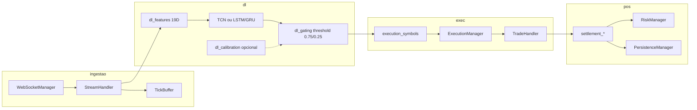

# Arquitetura — Aether Quantum Engine

Motor assíncrono para trading na Deriv com decisão exclusiva por **Deep Learning** (TCN, LSTM ou GRU) nos símbolos **Range Break** (`R_10`, `R_25`, `R_50`, `R_75`, `R_100`). A metodologia de negócio quantitativa está em [`medallion.md`](medallion.md); este documento descreve o software.

---

## 1. Visão geral

| Aspecto | Valor atual (`config/settings.json`) |
|---------|--------------------------------------|
| Símbolos | `R_10`, `R_25`, `R_50`, `R_75`, `R_100` (âncora `R_50`) |
| Granularidade OHLC | 60 s (`data_handler.granularity`) |
| Histórico para treino | 2880 barras (`training_history_bars`) |
| Lookback | 48 barras por sequência |
| Contrato | `RISE_FALL`, duração 60 s (1 barra) |
| Ciclo do orquestrador | 3 s (`cycle_interval_seconds`) |
| Decisão | `collect_deep_learning_decisions` |
| Fases | `FASE TREINO` (operação suspensa) → `FASE OPERACAO` |
| Execução | Seletiva: opera apenas quando `raw_prob >= 0.75` (CALL) ou `<= 0.25` (PUT); `mandatory_trade_each_cycle: false` |

O mercado é tratado como **série temporal ruidosa**: o modelo estima probabilidade de alta na próxima barra; um **threshold de confiança** (0.75 / 0.25) e camadas de **risco** decidem se e quanto operar.

---

## 2. Pipeline de dados



### 2.1 Bootstrap

1. `app/run.py` carrega `config/settings.json` e PAT do `.env` (`AETHER_DERIV_PAT` + `AETHER_DERIV_APP_ID`).
2. `AuthManager` lista contas REST, obtém OTP e abre WebSocket autenticado via URL OTP.
3. `Orchestrator` instancia stream, risco, executor e persistência.
4. `StreamHandler.start_candle_stream` busca histórico OHLC e assina velas (`style: candles`) e ticks (`style: ticks`).

### 2.2 Buffer e microestrutura

- `buffer_limit` limita velas em memória por símbolo.
- `history_bars` / `training_history_bars` definem recorte para treino e predição.
- `TickBuffer` (`infrastructure/handlers/tick_buffer.py`) agrega por barra fechada: contagem de ticks, intervalo médio, velocidade, aceleração e desvio padrão de diffs consecutivas.
- Stats de microestrutura são persistidas junto ao candle no fechamento da barra.

---

## 3. Deep Learning

### 3.1 Labels e features

**Rótulo binário** (`dl_labels.py`):

```
Y[i] = 1.0 se close[i + horizon] > close[i], senão 0.0
horizon = duration / granularity  →  60 s / 60 s = 1 barra
```

Treino BCE puro em todas as amostras válidas (sem meta-labeling).

**19 features** (`FEATURE_DIM` em `dl_feature_build.py`):

| Grupo | Dim | Conteúdo |
|-------|-----|----------|
| Microestrutura | 5 | diff consecutiva, velocidade, aceleração, std diffs, ticks/barra |
| Tradicionais | 9 | RSI, delta-RSI, BB %B e width, ATR norm, distância EMA20/50, log-return, ROC |
| Volatilidade | 3 | vol rolling (log-return), vol vs alvo do símbolo, z-score |
| Persistência | 2 | Hurst (R/S, janela 64), variance ratio |

`dl_hurst.py` implementa `hurst_exponent` com fallback estável para séries curtas.

**Extração otimizada:** `precompute_price_series` + `build_feature_matrix` montam a matriz uma única vez; cada janela de lookback é um fatiamento (sem recomputar indicadores por amostra).

**Normalização anti-leakage:** `fit_norm_stats` somente no split de treino walk-forward (`dl_splits.py`); val/calib/test apenas aplicam stats já ajustados.

### 3.2 Modelo

- Arquitetura configurável via `deep_learning.arch`: **`tcn`** (padrão), **`lstm`** ou **`gru`**.
- TCN dilatada (`dl_tcn.py` / `TemporalDirectionClassifier`).
- LSTM/GRU bidirecional leve (`dl_lstm.py`) + head sigmoid.
- Saída: probabilidade bruta de alta (`raw_prob`).
- Checkpoint v4 em `data/dl/{symbol}.pth` com trace **TorchScript** (`{symbol}_ts.pt`) para inferência rápida.
- `dl_symbol_runtime.py` prefere modelo scripted; fallback eager.

### 3.3 Treino walk-forward

`train_model_walkforward` (`dl_training.py`):

- Splits temporais com embargo (`dl_splits.py`): treino / validação / calibração.
- Early stopping pela perda de validação (patience configurável).
- Calibrador Platt opcional (logging); execução usa **prob raw** no threshold.
- Callback de progresso por época (`progress_cb`) registrado em `run_symbol_training` como `DL TREINO | epoca X/Y`.
- Checkpoint em `data/dl/{symbol}.pth`.

**Retreino** (`dl_retrain.py`):

- Bootstrap de sessão — todo símbolo retreina ao menos uma vez por sessão (`session_trained`)
- Nova vela (`train_on_new_candle_only`)
- Rolling (`rolling_retrain_bars`)
- Forçado após loss (`mark_force_retrain`)

**Treino deferido** (`dl_deferred_train.py`): thread em background com slot único serializado; prioridade para símbolos sem treino da sessão.

**Deploy gate** (`dl_deploy_eval.py`): mini simulação nas últimas barras; `deploy_ok=false` bloqueia execução.

**Gate de treinamento** (`_apply_training_gate`): símbolo sem primeiro treino válido recebe `gate_reason: training` e nunca opera.

### 3.4 Predição e gating

`predict_symbol_decision` (`dl_predict.py` + `dl_gating.py`):

```
raw_prob >= confidence_call_threshold (0.75)  →  CALL
raw_prob <= confidence_put_threshold (0.25)   →  PUT
caso contrário                                 →  abstém (direction=None)
```

Bloqueios adicionais: `min_val_accuracy` (0.53), `deploy_ok`, Brier elevado, cooldown, dados insuficientes.

Recovery (perda pendente): thresholds relaxados via `recovery_gating` quando configurado.

Saída por símbolo: `{ direction, metrics }` consumida pelo orquestrador.

### 3.5 Feedback pós-trade

- `record_symbol_outcome` — histórico win/loss por símbolo.
- Pesos de amostra no próximo treino (`dl_outcomes.py`).
- Pausa de sessão por símbolo após sequência de losses.
- Cooldown por símbolo (`symbol_loss_cooldown` no risk manager).

---

## 4. Execução

### 4.0 Fases de treinamento e operação

`ExecutionManager._training_phase_gate` separa o motor em duas fases:

- **FASE TREINO** — enquanto existir símbolo sem treino da sessão, nenhuma ordem é enviada.
- **FASE OPERACAO** — quando todos os modelos concluem o treino da sessão, a operação seletiva assume.

### 4.1 Seleção e direção

- `execution_symbols.py` — filtra candidatos com `execute=true` (passa threshold de confiança), escolhe melhor score.
- `execution_symbols_recovery.py` — candidatos de recovery com diversificação de símbolo.
- `execution_direction.py` — `infer_dl_direction` a partir de `direction` ou `raw_prob`; `recovery_hedge_target` para pares Range.
- `execution_market_rank.py` — `resolve_market_direction` e `market_decision_score` (raw_side, val_acc, edge, bônus recovery).
- `execution_mandatory_pick.py` / `execution_direction_fallback.py` — ranking quando `mandatory_trade_each_cycle: true`.

Com `mandatory_trade_each_cycle: false` (padrão atual), o motor **abstém** quando nenhum símbolo atinge o threshold de confiança.

### 4.2 ExecutionManager

- Monta ordens com stake de `RiskManager.calculate_stake`.
- `execution_blockers.py` — logs `EXEC_NONE` e `DL_TREINO` por ciclo.
- Settlement assíncrono; reentrada via `post_settlement_cycle` após liquidação.

### 4.3 Contratos

`TradeHandler.buy_with_parameters`: `contract_type` RISE_FALL, duração 60 s de `risk_management.params`.

---

## 5. Gerenciamento de risco

`RiskManager` (`domain/risk/`):

| Mecanismo | Módulo / config |
|-----------|-----------------|
| Kelly fracionário | `stake_sizing.py`, `kelly.fraction` |
| Stop win diário | `domain/risk/stop_win_target.py` |
| Martingale recovery | `martingale_gate.py` (ativo com `pending_loss > 0`) |
| Cooldown entrada | `risk_cooldown.py` |
| Cooldown por loss no símbolo | `symbol_loss_cooldown.py` |

---

## 6. Orquestrador

`Orchestrator` (`orchestrator/__init__.py`):

1. `setup_trading_session` — autenticação Deriv e WebSocket.
2. A cada vela do âncora ou `cycle_interval_seconds`:
   - `tick_bars_since_train`
   - `collect_deep_learning_decisions`
   - `executor.execute_cluster`
3. Reconciliação periódica de contratos abertos.
4. Após liquidação: `post_settlement_cycle`.

Banner de startup: `decision_mode_banner.emit_decision_engine_banner` (DL ou inativo).

---

## 7. Configuração crítica

| Bloco | Chaves relevantes |
|-------|-------------------|
| `data_handler` | `granularity`, `history_bars`, `fetch_count`, `buffer_limit` |
| `deep_learning` | `arch`, `lookback`, `confidence_call_threshold`, `confidence_put_threshold`, `min_val_accuracy`, `deploy_gate`, `tcn`, `lstm` |
| `orchestrator` | `cycle_interval_seconds`, `execution.mandatory_trade_each_cycle`, `post_settlement_*` |
| `risk_management` | `kelly`, `params.duration` (60), stop win |
| `symbols` / `anchor` | Universo Range Break |
| `trading` | `mode` (`demo` / `live`) |

---

## 8. Camadas de software

| Camada | Módulos principais |
|--------|-------------------|
| Application / DL | `decision_bridge`, `dl_labels`, `dl_hurst`, `dl_feature_build`, `dl_tcn`, `dl_lstm`, `dl_*`, `model` |
| Application / Orchestrator | `Orchestrator`, `execution_manager`, `execution_collect`, `settlement_*`, `post_settlement_cycle` |
| Application | `execution_direction`, `execution_market_rank`, `execution_mandatory_pick`, `execution_symbols`, `log_dedupe` |
| Domain | `trade`, `market_data`, `risk_manager`, `martingale_gate`, `stake_sizing` |
| Infrastructure | `websocket_manager`, `stream_handler`, `tick_buffer`, `trade_handler`, `persistence_manager` |
| Presentation | `logger` |

---

## 9. Observabilidade

| Ferramenta | Caminho |
|------------|---------|
| Log ao vivo | `logs/engine.log` |
| Monitor Rich | `app/scripts/monitor/live_monitor.py` |
| CI local | `app/scripts/operations/clean_workspace.py` |
| PAT Deriv | `app/scripts/operations/deriv_pat_connect.py` |
| Reset demo | `app/scripts/operations/reset_demo_balance.py` |

---

## 10. Garantia de qualidade

- Cobertura **100%** em `app/src` (pytest + coverage).
- Pre-commit: Ruff, Interrogate, Vulture, pylint duplicate-code, máximo **300 linhas** por arquivo em `app/src`.

---

## 11. Referências

- [medallion.md](medallion.md) — princípios quant e perfil de qualidade
- [README.md](../README.md) — execução e pré-requisitos
- [deriv-api.md](deriv-api.md) — API Deriv
- [CHANGELOG.md](CHANGELOG.md) — histórico de releases
