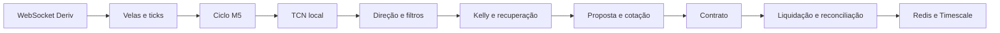

# Arquitetura — Aether Quantum Engine

O Aether executa contratos Rise/Fall de cinco minutos para `1HZ75V`. O motor Python 3.13.12 roda no host com `asyncio`; os serviços Redis, TimescaleDB, MinIO, meta LightGBM e loss-classifier rodam em Docker. A organização do código segue domínio, aplicação, portas, infraestrutura e apresentação. Consulte [a arquitetura sênior](engineering-architecture-senior.md) para os limites entre camadas.

## Relógios e dados

| Superfície | Configuração atual |
|---|---|
| Ciclo e assinatura | 300 s, alinhados à fronteira M5 |
| Micro e MINI | 300 s; histórico de treino de 25.000 velas M5 |
| Macro | 86.400 s; contexto diário D1 |
| TCN | 14 features, lookback 32, tensor `[1, 32, 14]` |
| Label | `spot_forward`, horizonte de uma vela M5 |
| Contrato | `RISE_FALL`, duração de 5 minutos |

O label usa closes futuros para treinar direção. Ele não é o spot executado nem uma liquidação confirmada pelo broker. A calibração fornece `P(CALL)`; o lado inicial é CALL quando a probabilidade calibrada é pelo menos 0,5 e PUT nos demais casos. O loss-classifier pode aplicar FLIP após aprendizado. Os quatro vetos de mercado e os bloqueios técnicos e econômicos são avaliados antes da compra.

## Fluxo

```mermaid
flowchart LR
    WS[WebSocket Deriv] --> Buffer[Velas e ticks]
    Buffer --> Cycle[Ciclo M5]
    Cycle --> TCN[TCN local]
    TCN --> Direction[Direção e filtros]
    Direction --> Risk[Kelly e recuperação]
    Risk --> Quote[Proposta e cotação]
    Quote --> Contract[Contrato]
    Contract --> Settle[Liquidação e reconciliação]
    Settle --> State[Redis e Timescale]
```

O treinamento separado grava um checkpoint TCN local. O verificador pós-treino exige pesos, normalização e geometria compatíveis com `settings.json`: dimensão de features, lookback, granularidade, label e horizonte. A execução não usa qualificação estatística da TCN nem simulação de liquidação por closes M5. DEMO e REAL seguem o mesmo caminho de decisão. Um checkpoint incompatível bloqueia a operação; com checkpoint válido, a stake inicial fica limitada a **1% da banca por ordem**, inclusive na recuperação `cover_l0`.

O meta LightGBM e o loss-classifier aprendem em sidecars. A TCN roda no host e não faz retreino durante a operação (`online_training=false`). A publicação de métricas e a captura Timescale não autorizam ordens; a proposta final é validada pelo payout e pelo edge calculado para o lado escolhido.

## Risco e estado

O estado de sessão e a fila de liquidação usam Redis; a fila prioritária é a ZSET `settlement:queue:priority`. Timescale guarda observações de mercado e contratos; MinIO guarda artefatos aplicáveis dos serviços. Kelly fracionário usa referência de payout 0,85 e stop win por sessão de 4,31%. A política não define stop loss nem teto acumulado de perda. Limites por ordem, bloqueios de execução e reconciliação de contratos continuam ativos.

## Referências

- [Configuração e resolvers](engineering-settings-ssot.md)
- [Treino TCN](engineering-deep-learning.md)
- [Orquestrador](engineering-orchestrator.md)
- [Liquidação](engineering-settlement.md)
- [Infraestrutura](infra-docker.md)
