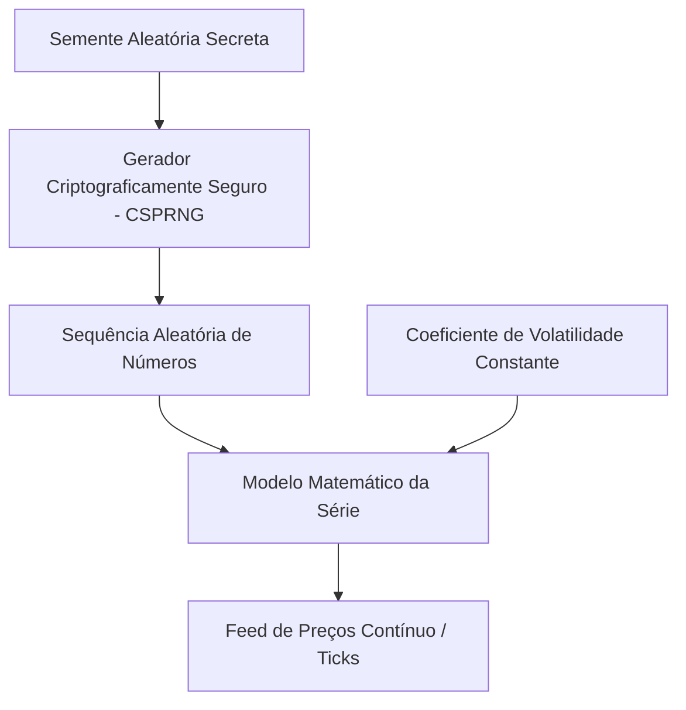

# Algoritmo de Índices Sintéticos da Deriv e Estratégia de Trading

Este documento detalha o funcionamento técnico dos índices sintéticos da Deriv (Volatility, incluindo **`R_10`**) e como o **Aether Quantum Engine** se posiciona estrategicamente para operá-los.

---

## 1. Como funciona o Algoritmo da Deriv

Os índices sintéticos da Deriv são gerados puramente por software e não são influenciados por eventos do mundo real ou notícias macroeconômicas.

### 1.1 Gerador CSPRNG

O motor central de preços da Deriv utiliza um **Gerador de Números Pseudo-Aleatórios Criptograficamente Seguro (CSPRNG)**.

- **Segurança criptográfica**: computacionalmente inviável prever o próximo tick a partir de histórico observável.
- **Auditorias externas**: entidades independentes (e.g., eCOGRA) certificam aleatoriedade e integridade.

### 1.2 Parâmetros e Coeficientes de Volatilidade

Cada símbolo possui parâmetros de volatilidade fixos (Volatility 10/50/75/100 na Deriv; no motor, o universo operacional atual é **`R_10`**). O mercado opera 24/7 com comportamento estatístico consistente.

---

## 2. Estratégias de Trading para Índices Sintéticos

Como prever a saída exata do CSPRNG é impossível, o foco é **exploração de distorções estatísticas, padrões temporais e gerenciamento de risco rigoroso**.

### 2.1 Padrões de Momento e Tendência com TCN

O Aether utiliza **TCN** (padrão), **LSTM** ou **GRU** com conexões dilatadas ou recorrentes.

- **Por que TCN?** Processa janelas longas de lookback (**72** barras × **600 s ≈ 12 h**) identificando persistência de tendência ou exaustão com menor ruído CSPRNG que horizontes curtos.
- **34 features**: OHLC normalizado, indicadores técnicos, microestrutura de ticks e regime (Hurst, ADX, vol_ratio, CMO).
- **Inferência**: Triton gRPC concorrente (`TritonGrpcClient`) quando `infra.triton.enabled`; fail-closed em produção (`require_for_execution: true`) — sem fallback eager local.
- **Detecção de regime**: EMAs, inclinação, ADX e votos de trend (`dl_trend.py`) alimentam o scoring direcional.

### 2.2 Exaustão micro e meta-regressor

Desvios extremos em microestrutura de **120 s** (RSI, Keltner, Bollinger, shadow de volatilidade, momentum de spread) alimentam o vetor tabular **43D** do `aether-meta-classifier` (`LGBMRegressor` huber, porta **8005**).

- **Regressão de payoff**: TCN fornece direção macro (`dl_direction`); meta-regressor estima `predicted_payoff_edge` com features cross-symbol (`prob_delta`, `vol_ratio_diff`, `rsi_spread`) e fluxo micro 120 s (`micro_tick_acceleration`, `keltner_deviation_ratio`).
- **Downgrade D-SQUEEZE** (`meta_payoff_regression`): quando `predicted_payoff_edge < -0.15` em squeeze micro (`bb_width < 0.06` ou `micro_tick_acceleration < 0`), rebaixa `trade_score=0.52` e emite log `[D-SQUEEZE]` — sem inverter direção. Nos settings atuais, snipers Hurst/BB-squeeze extremo são stubs (`False`); o veto HARD operacional é microestrutura (ADX / `vol_ratio` / `val_accuracy`).
- **Treino offline**: alvo contínuo `Y = PnL_Real / Stake`; Optuna **maximiza Information Ratio** com constraint OOS payoff Z-Score ≥ +1,00; rotulagem TCN padrão **`spot_forward`** (`ma_trend` / `triple_barrier` disponíveis via config).
- **Telemetria consultiva**: `execution_direction_cross_corr` e `execution_volatility_booster` permanecem como insumo analítico, sem veto autônomo.
- **Persistence guard**: após 2 perdas consecutivas na mesma direção, o resolver **skips** o candidato (`persistence_guard_skip`); flip CALL/PUT **não** é aplicado em produção; congestão micro pode `FREEZE`.

### 2.3 Gestão de Risco — Kelly + Soft Recovery

- **EXPLORE (Kelly)**: stake proporcional a edge e win rate live (`kelly.fraction: 0.08`, teto **3,5%**, compressão 40% fora de recovery) — tag `EXPLORE_KELLY`.
- **RECOVER (Soft Recovery)**: após LOSS, amortiza `pending` em 2–5 ciclos sob `max_safe_stake_pct` (3,5%); sem dobra 2× — tag `RECOVER_DAL_Ln`.
- **Side equilibrium (LLN)**: small-N hard skip / large-N soft Kelly em `side_equilibrium`; com amostra insuficiente → `pass`.
- **Consensus Entropy Penalty**: disponível no código; nos settings atuais `consensus_penalty_enabled: false`.
- **Stop win por sessão ativa**: meta de lucro = 2,60% da banca inicial (≥ $100) ou **$10** fixo (&lt; $100); ao atingir, fast-path (`clear_current_session_redis_keys` → `cancel_settlement_queue_fast` → `graceful_shutdown(fast_path=True)`); cada restart inicia sessão independente.
- **Stop loss interno desativado**: recovery opera sem disjuntor de perda imposto pelo motor.
- **Gate de qualidade**: dual soft TCN + meta Z-Score + vetoes HARD de microestrutura; logs `[AETHER] QUALITY_GUARD` e `[AETHER] EXECUTION_FLOW`; starvation a partir de **6** skips.

### 2.4 Fases de Treinamento e Operação

- **FASE TREINO**: todos os símbolos retreinam ao menos uma vez por sessão (`session_trained`). Nenhuma ordem até concluir.
- **FASE OPERACAO mandatária** (`mandatory_trade_each_cycle: true`): esteira contínua — candidatos DL tecnicamente válidos seguem para execução; redirect inter-símbolo quando âncora degradada.
- **Resolução direcional**: TCN define `dl_direction`; meta-regressor refina stake via `predicted_payoff_edge` (meta opcional para execução); `execution_direction_checks` rejeita ciclo só por starvation de microestrutura.
- **Deploy gate**: modelos com `deploy_ok=false` não entram no pool.
- **Relógio**: ciclo e contrato em **120 s**; contexto DL em **600 s** — proporção **1:5** (prefixos de assinatura `m5`/`m15` são legado).

### 2.5 Perfil de qualidade atual

| Camada | Comportamento |
|--------|---------------|
| Bloqueio técnico | `data`, `predict_error`, `training`, `deploy_ok=false` |
| Classificação macro | TCN em barras de **600 s** (`[1, 72, 34]`) define `dl_direction` |
| Stacking tabular | Meta-regressor LightGBM micro **120 s** sobre vetor **43D** + probabilidade TCN; saída `predicted_payoff_edge`; meta opcional |
| Veto HARD microestrutura | `adx_starvation`, `vol_ratio_starvation`, `val_accuracy_gate` (`min_adx` 0.20, `vol_ratio_min` 0.65, val ≥ 0.63) |
| Downgrade squeeze | Edge `< -0.15` em compressão micro: `trade_score=0.52`; `[D-SQUEEZE]` (telemetria; sniper BB extremo stub) |
| Margem direcional | `abs(P(lado_escolhido) − 0.50)` — CALL usa `calibrated_prob`; PUT usa `1 − prob`; hard gate **`min_direction_margin: 0.03`** |
| Gate de qualidade | Dual soft TCN + meta Z-Score + HARD microestrutura; starvation ≥ 6 skips |
| Ranking | TCN × fator Z-Score meta; redirect inter-símbolo em modo mandatory |
| Scoring direcional | TCN + meta GBDT; `exec_direction` alinhada à TCN |
| Recovery | Soft Recovery amortizado (`pending` em 2–5 ciclos, teto 3,5%); persistência até `pending_total = 0` |
| Kelly divergente | Consensus Entropy Penalty disponível; **desligado** nos settings atuais |
| Side equilibrium | Small-N / large-N CALL/PUT (`side_equilibrium`) |

### 2.7 Ranking TCN × Z-Score e redirect inter-símbolo

Após inferência TCN (Triton) e regressão LightGBM (meta-regressor), o motor calcula `meta_payoff_edge_zscore` sobre janela móvel de edges históricos:

- **Ranking:** `market_decision_score = tcn × max(0.1, 1 + z)` — sinais com Z negativo sofrem deflação geométrica; Z positivo amplifica prioridade.
- **Redirect mandatory:** se a âncora tem Z < -0,50 e o par tem Z > +0,50, a boleta desvia para o par forte — frequência operacional preservada sem entrar em setup degradado.

Exemplo documentado: TCN 0,75 com Z=-1,50 perde para TCN 0,68 com Z=+1,20 no ranking de execução.

### 2.8 Isolamento de estado assíncrono

O motor serializa mutações críticas de risco e sessão via `asyncio.Lock` no `StateManager`:

- **Protegido pelo lock:** ciclo de inferência DL (`trading_cycle_entry`), liquidação (`settlement_logic`), barreira pós-reset linear (`session_persistence_barrier`).
- **Fora do lock:** ping WebSocket, reconexão de stream, auditoria profit_table — leem `read_cached_balance()` sem bloquear o loop de trading.
- **Manutenção broker:** `api_maintenance_guard` emite telemetria `[API_GUARD]`; bloqueio de ciclo neutralizado em modo mandatário.

Ver [arquitetura.md](arquitetura.md) seção 2.5 para o diagrama completo.

### 2.9 Normalização Adaptativa de Volatilidade & Válvula de Drift Proibido (Drift Bias Lock)

#### 2.9.1 Estouro Dinâmico de Volatilidade e Clipping OOD
Em regime de cauda hiperbólica, as variáveis de dispersão temporal `bb_width` e `atr_norm` são padronizadas com base na distribuição amostral das últimas 1024 velas macro (**600 s**):
\[Z = \frac{x - \text{mean}(X_{1024})}{\text{std}(X_{1024}) + 1e-10}\]
Os inputs para o modelo LightGBM sofrem um clipping estrito a fim de mitigar desvios de distribuição de treino (OOD - Out-of-Distribution):
\[Z_{\text{clipped}} = \max(-3.0, \min(3.0, Z))\]

#### 2.9.2 Equações da Válvula de Drift Proibido
A invariante matemática absoluta de Drift Proibido restringe a execução de ordens contrárias ao drift natural das séries sob estresse de volatilidade assimétrica:
\[\text{Veto} = \begin{cases} 
\text{True} & \text{se } (\text{Símbolo} = \text{R\_10} \land \text{Direção} = \text{PUT}) \land (Z_{\text{vol}} \ge 2.0 \lor Z_{\text{bb\_width}} \ge 2.0) \\
\text{True} & \text{se } (\text{Símbolo} = \text{R\_10} \land \text{Direção} = \text{CALL}) \land (Z_{\text{vol}} \ge 2.0 \lor Z_{\text{bb\_width}} \ge 2.0) \\
\text{False} & \text{caso contrário}
\end{cases}\]
Se \(\text{Veto} = \text{True}\), o motor:
1. Força a stake para `0.0` no nível do `RiskManager`.
2. Cancela a direção resolvendo para `None` no `evaluate_anti_trend_lock`, forçando o retorno `EXEC_EMPTY` (early-return) e desviando o fluxo para o par oposto favorável.

---

## 3. Referências

- [structure.md](structure.md) — inventário DDD completo (~226 módulos em `app/src/`)
- [arquitetura.md](arquitetura.md) — pipeline técnico
- [medallion.md](medallion.md) — princípios quant
- [infra-docker.md](infra-docker.md) — Triton, meta-regressor 8005, Redis, sanity estressado
- [README.md](../README.md) — execução
