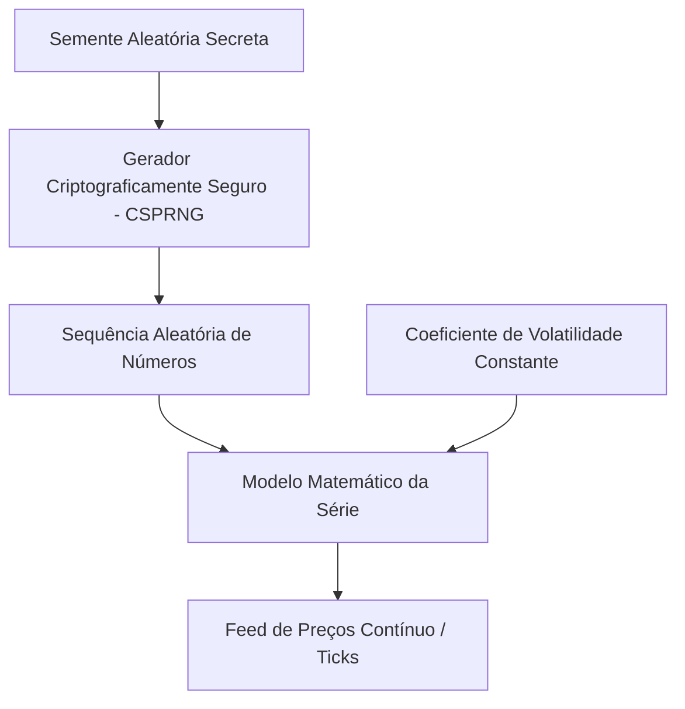

# Algoritmo de Índices Sintéticos da Deriv e Estratégia de Trading

Este documento detalha o funcionamento técnico dos índices sintéticos da Deriv (séries Volatility R_* e Range Break) e como o **Aether Quantum Engine** se posiciona estrategicamente para operá-los.

---

## 1. Como funciona o Algoritmo da Deriv

Os índices sintéticos da Deriv são gerados puramente por software e não são influenciados por eventos do mundo real ou notícias macroeconômicas.

### 1.1 Gerador CSPRNG

O motor central de preços da Deriv utiliza um **Gerador de Números Pseudo-Aleatórios Criptograficamente Seguro (CSPRNG)**.

- **Segurança criptográfica**: computacionalmente inviável prever o próximo tick a partir de histórico observável.
- **Auditorias externas**: entidades independentes (e.g., eCOGRA) certificam aleatoriedade e integridade.

### 1.2 Parâmetros e Coeficientes de Volatilidade

Cada símbolo possui coeficiente de desvio padrão fixo (Volatility 10, 50, 75, 100, Range Break). O mercado opera 24/7 com comportamento estatístico consistente.

---

## 2. Estratégias de Trading para Índices Sintéticos

Como prever a saída exata do CSPRNG é impossível, o foco é **exploração de distorções estatísticas, padrões temporais e gerenciamento de risco rigoroso**.

### 2.1 Padrões de Momento e Tendência com TCN

O Aether utiliza **TCN** (padrão), **LSTM** ou **GRU** com conexões dilatadas ou recorrentes.

- **Por que TCN?** Processa janelas longas de lookback (48 barras × 180 s) identificando persistência de tendência ou exaustão.
- **Detecção de regime**: EMAs, inclinação, ADX e votos de trend (`dl_trend.py`) alimentam o scoring direcional.

### 2.2 Reversão à Média (Mean Reversion)

Desvios extremos tendem a retornar à média em ativos com volatilidade fixa.

- **Features de volatilidade**: `vol_ratio`, Hurst, variance ratio.
- **Exaustão no resolver**: RSI e Keltner extremos aplicam `exhaustion_flip` e `mean_reversion` no score CALL/PUT — ajustam direção em vez de bloquear o símbolo.

### 2.3 Gestão de Risco com Kelly Fracionário e Martingale Controlado

- **Fração de Kelly**: stake proporcional a `trade_score` calibrado e win rate live.
- **Gate de qualidade**: múltiplas camadas filtram execuções fracas (score, edge, margem direcional, ADX, inversão).

### 2.4 Fases de Treinamento e Operação

- **FASE TREINO**: todos os símbolos retreinam ao menos uma vez por sessão (`session_trained`). Nenhuma ordem até concluir.
- **FASE OPERACAO**: motor seleciona o melhor candidato por `market_decision_score`. Ciclos sem candidato acima do piso de qualidade são **pulados** (não força trade).
- **Resolução direcional**: `execution_direction_resolver` combina DL, trend, exaustão e regime; conflitos mudam CALL/PUT e score.
- **Deploy gate**: modelos com `deploy_ok=false` não entram no pool.

### 2.5 Perfil de qualidade atual

| Camada | Comportamento |
|--------|---------------|
| Bloqueio técnico | `data`, `predict_error`, `training`, `deploy_ok=false` |
| Scoring direcional | Sempre CALL ou PUT quando tecnicamente válido |
| Gate de qualidade | Score ≥ 0.68, edge ≥ 0.04, margem direcional ≥ 0.05 |
| Inversão DL→exec | Exige score ≥ 0.74 |
| Modo normal | ADX ≥ 0.18 |
| Recovery | Pisos escalonados (0.64+) e martingale com convicção ≥ 0.64 |

---

## 3. Referências

- [arquitetura.md](arquitetura.md) — pipeline técnico
- [medallion.md](medallion.md) — princípios quant
- [README.md](../README.md) — execução
