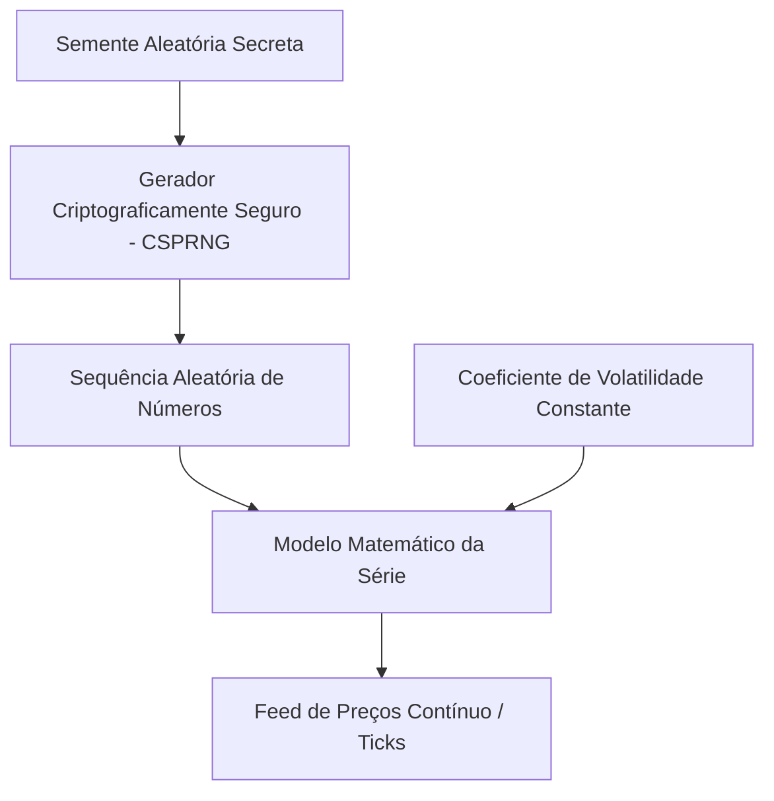

# Algoritmo de Índices Sintéticos da Deriv e Estratégia de Trading

Este documento detalha o funcionamento técnico dos índices sintéticos da Deriv (Volatility e **Drift** `RDBEAR`/`RDBULL`) e como o **Aether Quantum Engine** se posiciona estrategicamente para operá-los.

---

## 1. Como funciona o Algoritmo da Deriv

Os índices sintéticos da Deriv são gerados puramente por software e não são influenciados por eventos do mundo real ou notícias macroeconômicas.

### 1.1 Gerador CSPRNG

O motor central de preços da Deriv utiliza um **Gerador de Números Pseudo-Aleatórios Criptograficamente Seguro (CSPRNG)**.

- **Segurança criptográfica**: computacionalmente inviável prever o próximo tick a partir de histórico observável.
- **Auditorias externas**: entidades independentes (e.g., eCOGRA) certificam aleatoriedade e integridade.

### 1.2 Parâmetros e Coeficientes de Volatilidade

Cada símbolo possui parâmetros de volatilidade fixos (Volatility 10/50/75/100 na Deriv; no motor, o par **Drift** `RDBEAR`/`RDBULL`). O mercado opera 24/7 com comportamento estatístico consistente.

---

## 2. Estratégias de Trading para Índices Sintéticos

Como prever a saída exata do CSPRNG é impossível, o foco é **exploração de distorções estatísticas, padrões temporais e gerenciamento de risco rigoroso**.

### 2.1 Padrões de Momento e Tendência com TCN

O Aether utiliza **TCN** (padrão), **LSTM** ou **GRU** com conexões dilatadas ou recorrentes.

- **Por que TCN?** Processa janelas longas de lookback (48 barras × **900 s = 12 h**) identificando persistência de tendência ou exaustão com menor ruído CSPRNG que M3.
- **34 features**: OHLC normalizado, indicadores técnicos, microestrutura de ticks e regime (Hurst, ADX, vol_ratio, CMO).
- **Inferência**: Triton gRPC concorrente (`TritonGrpcClient`) quando `infra.triton.enabled`; fallback local via TorchScript em cache.
- **Detecção de regime**: EMAs, inclinação, ADX e votos de trend (`dl_trend.py`) alimentam o scoring direcional.

### 2.2 Exaustão micro e meta-regressor

Desvios extremos em M1 (RSI, Keltner, Bollinger) alimentam o vetor tabular **39D** do `aether-meta-classifier` (`LGBMRegressor` huber).

- **Regressão de payoff**: TCN fornece direção macro (`dl_direction`); meta-regressor estima `predicted_payoff_edge` com features cross-symbol (`prob_delta`, `vol_ratio_diff`, `rsi_spread`) e fluxo micro (`micro_tick_acceleration`, `keltner_deviation_ratio`).
- **Downgrade D-SQUEEZE** (`meta_payoff_regression`): quando `predicted_payoff_edge < -0.15` em squeeze M1 (`bb_width < 0.06` ou `micro_tick_acceleration < 0`), rebaixa `trade_score=0.52` e emite log `[D-SQUEEZE]` — sem inverter direção.
- **Treino offline**: alvo contínuo `Y = PnL_Real / Stake`; Optuna minimiza MAE; telemetria `train_mae` e `target_variance` (substitui balanceamento binário).
- **Telemetria consultiva**: `execution_direction_cross_corr` e `execution_volatility_booster` permanecem como insumo analítico, sem veto autônomo.

### 2.3 Gestão de Risco com Kelly Fracionário e Martingale Geométrico

- **Fração de Kelly**: stake proporcional a `trade_score` calibrado e win rate live.
- **Consensus Entropy Penalty**: quando a ordem final diverge da maioria dos votos técnicos (`call_votes`/`put_votes`), aplica penalidade convexa em `f*`; bypass absoluto quando `pending_total > 0`.
- **Martingale Geométrico**: em recovery, `Effective_Base × 2^consecutive_losses_linear` sem teto de nível.
- **Stop win por sessão ativa**: meta de lucro = 1% da banca inicial (`compounding_rate_daily`); ao atingir, fast-path (`clear_current_session_redis_keys` → `cancel_settlement_queue_fast` → `graceful_shutdown(fast_path=True)`); cada restart inicia sessão independente.
- **Stop loss interno desativado**: Martingale opera sem disjuntor de perda imposto pelo motor.
- **Gate de qualidade neutro**: sinal válido participa sempre do pool; sem SKIP por regime ou exaustão.

### 2.4 Fases de Treinamento e Operação

- **FASE TREINO**: todos os símbolos retreinam ao menos uma vez por sessão (`session_trained`). Nenhuma ordem até concluir.
- **FASE OPERACAO seletiva** (`mandatory_trade_each_cycle: false`): opera quando o melhor candidato passa no gate (score ≥ 0.68 normal). Ciclos sem candidato elegível são pulados.
- **FASE OPERACAO contínua** (`mandatory_trade_each_cycle: true`): uma ordem por ciclo; qualidade como penalidade; fallback de entropia garante participação mínima.
- **Resolução direcional**: TCN define `dl_direction`; meta-regressor refina stake via `predicted_payoff_edge` e downgrade D-SQUEEZE em compressão M1.
- **Deploy gate**: modelos com `deploy_ok=false` não entram no pool.

### 2.5 Perfil de qualidade atual

| Camada | Comportamento |
|--------|---------------|
| Bloqueio técnico | `data`, `predict_error`, `training`, `deploy_ok=false` |
| Classificação macro | TCN M15 define `dl_direction` |
| Stacking tabular | Meta-regressor LightGBM M1 sobre vetor **39D** + probabilidade TCN; saída `predicted_payoff_edge` |
| Downgrade squeeze | Edge `< -0.15` em compressão M1: `trade_score=0.52`; `[D-SQUEEZE]` |
| Gate de qualidade | Neutro: participa sempre do pool, sem skip por regime |
| Scoring direcional | TCN + meta GBDT; `exec_direction` alinhada à TCN |
| Recovery | Martingale Geométrico `Kelly_base × 2^n`; persistência até `pending_total = 0` |
| Kelly divergente | Consensus Entropy Penalty; waiver em recovery com `pending_total > 0` |

### 2.6 Isolamento de estado assíncrono

O motor serializa mutações críticas de risco e sessão via `asyncio.Lock` no `StateManager`:

- **Protegido pelo lock:** ciclo de inferência DL (`trading_cycle_entry`), liquidação (`settlement_logic`), barreira pós-reset linear (`session_persistence_barrier`).
- **Fora do lock:** ping WebSocket, reconexão de stream, auditoria profit_table — leem `read_cached_balance()` sem bloquear o loop de trading.
- **Manutenção broker:** `api_maintenance_guard` hiberna o ciclo quando a API sinaliza indisponibilidade, evitando starvation durante reset de liquidez.

Ver [arquitetura.md](arquitetura.md) seção 2.5 para o diagrama completo.

---

## 3. Referências

- [arquitetura.md](arquitetura.md) — pipeline técnico
- [medallion.md](medallion.md) — princípios quant
- [infra-docker.md](infra-docker.md) — Triton, meta-regressor 8005, Redis, sanity estressado
- [README.md](../README.md) — execução
