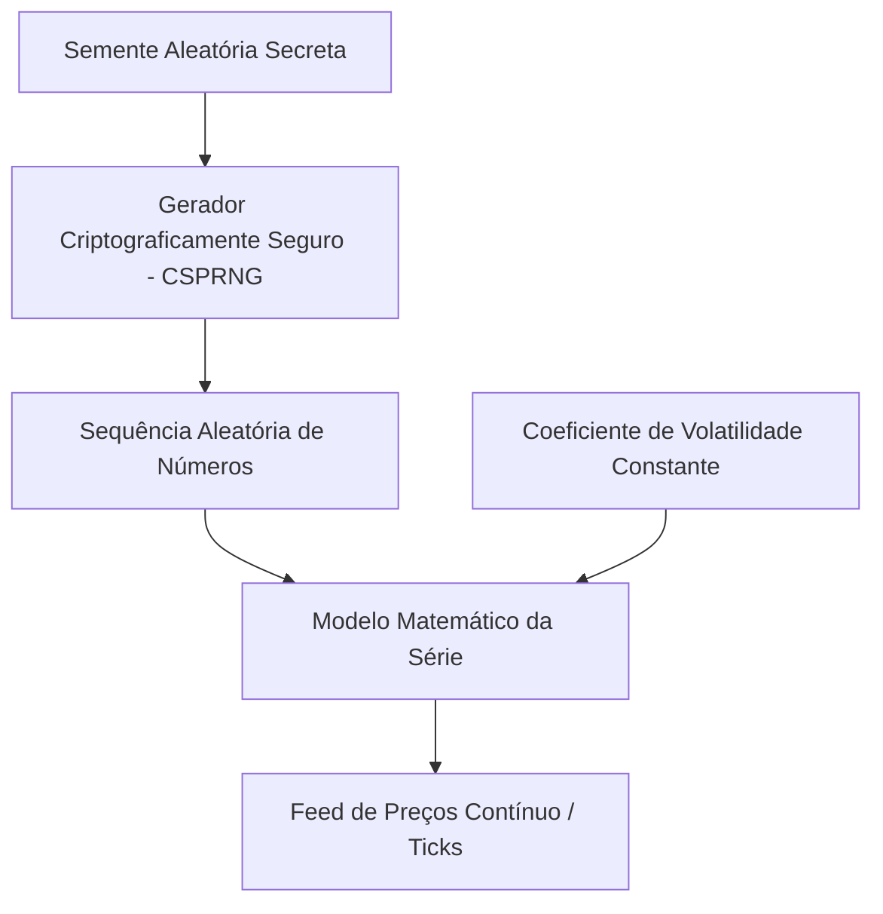

# Algoritmo de Índices Sintéticos da Deriv e Estratégia de Trading

Este documento detalha o funcionamento técnico dos índices sintéticos da Deriv (como as séries Volatility R_* e Range Break) e como o **Aether Quantum Engine** se posiciona estrategicamente para operá-los.

---

## 1. Como funciona o Algoritmo da Deriv

Os índices sintéticos da Deriv são gerados puramente por software e não são influenciados por eventos do mundo real ou notícias macroeconômicas.

### 1.1 Gerador CSPRNG (Cryptographically Secure Pseudo-Random Number Generator)
O motor central de preços da Deriv utiliza um **Gerador de Números Pseudo-Aleatórios Criptograficamente Seguro (CSPRNG)**.
- **Segurança Criptográfica**: Ao contrário de geradores simples (como LCG ou Mersenne Twister), os CSPRNGs são projetados para que seja computacionalmente impossível determinar a semente inicial (`seed`) ou prever o próximo número na sequência com base em qualquer quantidade de números gerados anteriormente.
- **Auditorias Externas**: O algoritmo é auditado periodicamente por entidades independentes de certificação de jogos (e.g., eCOGRA) para garantir total aleatoriedade e integridade.

### 1.2 Parâmetros e Coeficientes de Volatilidade
Embora cada tick individual seja estatisticamente imprevisível, o comportamento de longo prazo é rigorosamente governado por equações diferenciais estocásticas parametrizadas:
- **Coeficiente de Volatilidade**: Cada símbolo (e.g., Volatility 10, 50, 75, 100) possui um coeficiente de desvio padrão fixado. Isso define a amplitude média dos saltos (ticks).
- **Consistência 24/7**: Por ser puramente matemático, o mercado nunca fecha, não possui spreads flutuantes devido a notícias de mercado, e opera com o mesmo comportamento estatístico ininterruptamente.

---

## 2. Estratégias de Trading para Índices Sintéticos

Como prever matematicamente a saída exata do CSPRNG é impossível, o foco do trading deve ser a **exploração de distorções estatísticas, padrões temporais, e gerenciamento de risco rigoroso**.

### 2.1 Padrões de Momento e Tendência com TCN
O Aether utiliza uma **Rede Convolucional Temporal (TCN)** com conexões dilatadas.
- **Por que TCN?** Ao contrário de RNNs tradicionais, a TCN consegue processar janelas longas de lookback de maneira eficiente, identificando se a sequência de retornos recentes e wicks das velas indicam persistência de tendência ou exaustão.
- **Detecção de Regime**: O modelo analisa o spread de EMAs lentas/rápidas e a inclinação do RSI para filtrar sinais de tendência contra-tendência.

### 2.2 Reversão à Média (Mean Reversion)
Em ativos puramente aleatórios sob desvio padrão fixo, desvios extremos tendem a retornar à média histórica rapidamente.
- **Mapeamento de Desvios**: Calculamos a volatilidade relativa (`rel_vol`) comparando o desvio padrão de curto prazo com a média de longo prazo.
- **Z-Score de Distância**: Monitoramos a distância percentual do fechamento atual em relação à SMA de 20 períodos (`sma_dist`), fornecendo uma feature altamente preditiva para reversão.

### 2.3 Gestão de Risco com Kelly Fracionário e Martingale Controlado
Sem o gerenciamento adequado de banca, qualquer vantagem estatística (edge) se perde na ruína do jogador.
- **Fração de Kelly**: Ajustamos o tamanho do lote com base na probabilidade calibrada da previsão (`trade_score`) e na taxa de vitória ao vivo (`win rate live`).
- **Gating de Segurança**: Várias camadas barram execuções de baixa convicção (e.g., Brier score ruim no treino, gap grande entre probabilidade bruta e calibrada).

### 2.4 Fases de Treinamento e Operação
O motor nunca opera com modelo cru:
- **FASE TREINO**: ao iniciar a sessão, todos os símbolos retreinam pelo menos uma vez (`session_trained`), mesmo com checkpoint em disco. Nenhuma ordem é enviada até concluir. O slot de treino em background é dedicado aos modelos pendentes, com logs `DL TREINO` por época e blocos separados por linha em branco.
- **FASE OPERACAO**: com todos os modelos prontos, o motor tenta um trade por ciclo, escolhido por ranking de mercado que combina score calibrado, convicção bruta, acurácia de validação, Brier, deploy e alinhamento com o contexto binário da última vela. Ciclos sem candidato acima de `mandatory_min_trade_score` (0.53) são pulados.
- **Direção refinada**: quando a convicção bruta do modelo é fraca, extremos estatísticos da vela (`sma_z`) aplicam reversão à média na direção final, explorando a propriedade 2.2 acima.
- **Deploy gate**: modelos com `deploy_ok=false` não entram no pool obrigatório nem em recovery forçado.

### 2.5 Filtro de Exaustão por RSI Extremo (Filtro do Trader Sênior)
Sob as condições de volatilidade ininterrupta dos índices sintéticos da Deriv, tendências prolongadas esticam o RSI a patamares de exaustão estatística. Para mitigar o risco de comprar no topo ou vender no fundo antes de reversões súbitas:
- **Exaustão de Compra**: Se o RSI atual do ativo estiver acima de `rsi_overbought_threshold` (padrão `0.78`), novas ordens do tipo `CALL` são preventivamente bloqueadas pelo filtro de regime, antecipando uma provável exaustão de momentum.
- **Exaustão de Venda**: Se o RSI atual do ativo estiver abaixo de `rsi_oversold_threshold` (padrão `0.22`), novas ordens do tipo `PUT` são preventivamente bloqueadas pelo filtro de regime, evitando vender em suportes extremos de exaustão.
