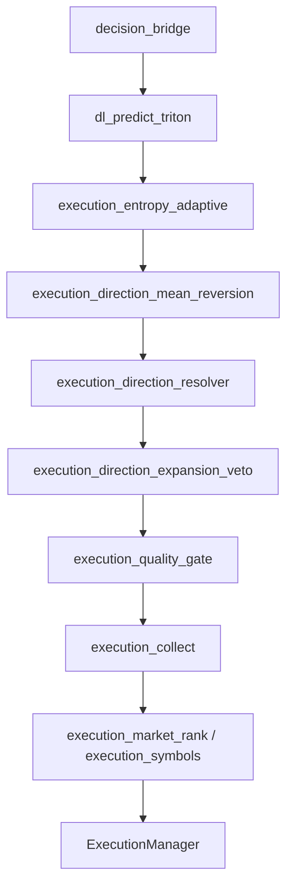

# Estrutura do repositório

Layout de software com infraestrutura Docker local opcional (`infra/docker/`).

```
aether-quantum-engine/
├── infra/docker/                       # Redis (AOF), TimescaleDB, MinIO, Triton (GPU)
├── app/
│   ├── src/
│   │   ├── application/services/
│   │   │   ├── deep_learning/          # TCN/LSTM/GRU, labels, predict, Triton bridge
│   │   │   ├── orchestrator/           # Ciclo, execução, settlement, session_target_bootstrap, watchdog, graceful shutdown
│   │   │   ├── execution_*.py          # Direção, resolver, mean-reversion, qualidade, ranking
│   │   │   ├── log_dedupe.py
│   │   │   └── auth_manager.py
│   │   ├── domain/                     # Modelos, risk_manager, stop_win_target, risk_recovery_state, consensus_stake_penalty, martingale
│   │   ├── infrastructure/
│   │   │   ├── inference/              # triton_grpc_client, triton_inference_client, triton_model_sync
│   │   │   ├── state/                  # redis_state_pipeline, redis_state_store
│   │   │   ├── storage/                # minio_model_store, torchscript_sanity, torchscript_sanity_probes
│   │   │   └── ...                     # WebSocket, stream, stream_reconnect, tick_buffer, trade
│   │   └── presentation/               # Logger terminal
│   ├── tests/unit/                     # Pytest (cobertura 100% em src)
│   ├── scripts/
│   │   ├── batch/                      # launch-all-demo, launch-train, _run_engine
│   │   ├── monitor/                    # live_monitor
│   │   ├── operations/                 # clean_workspace, deriv_pat_connect, reset_demo_balance
│   │   └── wsl/                        # setup.sh (WSL)
│   ├── aether_paths.py
│   ├── run.py                          # Entrada de execução (modo execute)
│   └── train.py                        # Entrada de treino DL (modo train)
├── config/settings.json                # Configuração versionada
├── data/                               # state.json, dl/, deriv/ (runtime)
├── logs/                               # engine.log, monitor.log
├── docs/
├── linters/                            # pre-commit, commitlint, release
├── .github/workflows/                  # CI
├── run.py                              # Atalho para app/run.py
└── train.py                            # Atalho para app/train.py
```

## Camadas em `app/src`

| Pasta | Responsabilidade |
|-------|------------------|
| `application/services/deep_learning` | Features **34D**, TCN/LSTM/GRU, `dl_predict_async`, `dl_predict_triton`, `dl_trend`, deploy gate, TorchScript |
| `application/services/orchestrator` | `Orchestrator`, `ExecutionManager`, `session_target_bootstrap`, `execution_collect`, `execution_recovery_gate`, `watchdog_service`, `graceful_shutdown`, settlement, `post_settlement_cycle`, `orchestrator_run_loop` |
| `application/services` | `execution_direction_resolver`, `execution_direction_mean_reversion`, `execution_direction_expansion_veto`, `execution_direction_cross_corr`, `execution_entropy_adaptive`, `execution_quality_gate`, `execution_market_rank`, `execution_mandatory_pick`, `log_dedupe`, `auth_manager` |
| `domain` | `Candle`, `Trade`, `RiskManager`, `StopWinManager` (`stop_win_target.py`), `risk_recovery_state`, `consensus_stake_penalty`, `recovery_hurst_gate`, `probability_entropy`, Kelly, martingale, cooldowns, `stake_sizing` |
| `infrastructure/inference` | `TritonGrpcClient` (gRPC aio persistente), `triton_inference_client`, `triton_model_sync`, `triton_tensor_builder`, `triton_model_metadata` |
| `infrastructure/state` | `redis_state_pipeline` (MULTI/EXEC atômico), `redis_state_store`, ports `StateStore` |
| `infrastructure/storage` | `minio_model_store`, `torchscript_sanity`, `torchscript_sanity_probes` (probes estressados) |
| `infrastructure` (demais) | `WebSocketManager`, `StreamHandler`, `stream_reconnect`, `TickBuffer`, `TradeHandler`, Timescale, MinIO |
| `presentation/terminal` | `setup_logger`, `BlankLineSquasher`, formatação de logs |

Decisão exclusivamente Deep Learning quando `deep_learning.enabled` é verdadeiro. Treino e execução são processos separados (`train.py` / `run.py`).

## Módulos de execução (pipeline atual)



| Arquivo | Papel |
|---------|-------|
| `triton_grpc_client.py` | Canal `grpc.aio.insecure_channel` persistente; timeout 2 s por inferência; `infer_symbols_concurrent` via `asyncio.gather`; fallback TorchScript em timeout |
| `watchdog_service.py` | `AetherWatchdog` — detecta inanição de ticks (>30 s) e reconecta stream sem derrubar o motor |
| `stream_reconnect.py` | Reabertura controlada de WS + subscrições OHLC/tick após STALE_DATA |
| `graceful_shutdown.py` | Encerramento ordenado de watchdog, Triton, Timescale, Redis e WebSocket |
| `execution_direction_mean_reversion.py` | Flip contra DL em exaustão + contração de vol (`vol_ratio < 0.80`) |
| `execution_direction_expansion_veto.py` | Veto de inversão em expansão (`vol_ratio > 1.15`); suavização Kelly |
| `execution_entropy_adaptive.py` | Comprime peso DL via entropia de probabilidade |
| `execution_direction_resolver.py` | Scoring CALL/PUT unificado; `direction_margin`, `direction_inverted` |
| `execution_quality_gate.py` | Penalidade de score/edge; pisos recovery com Hurst |
| `execution_collect_helpers.py` | `recovery_hurst_blocks_collect`, mandatory fallback, logs EXEC_SEL |
| `execution_collect.py` | Coleta e seleção (modo seletivo ou contínuo) |
| `consensus_stake_penalty.py` (domain) | Penalidade convexa Kelly por divergência ordem vs votos; smoothing 40% em recovery com `trade_score > 0.70` |
| `risk_recovery_state.py` (domain) | Reset de `consecutive_losses` condicionado a `pending_loss == 0` |
| `redis_state_pipeline.py` | Escrita atômica snapshot + risco + `session:current` + `session:current:start_balance` + `session:current:target_win` + `recovery:skip_counter` |
| `session_target_bootstrap.py` | Bootstrap/restore/clear de metas por sessão ativa; log `SESSAO INICIADA` |
| `stop_win_target.py` (domain) | Cálculo de `target_win` com juros compostos; chaves Redis da sessão corrente |

## Dados e artefatos

| Caminho | Uso |
|---------|-----|
| `data/state.json` | Estado geral de contratos e banca (legado) |
| `data/session_state.json` | Métricas da sessão ativa corrente (`session_start_balance`, `target_win`, P&L) |
| `data/dl/{symbol}.pth` | Checkpoints PyTorch + calibrador + métricas |
| `data/dl/{symbol}_ts.pt` | TorchScript trace para inferência Triton |
| `infra/docker/triton-models/{symbol}/` | Layout Triton (`model.pt`, `config.pbtxt`) |
| `data/deriv/pat_bindings.json` | Cache PAT → App ID |
| `logs/engine.log` | Auditoria operacional |

Caminhos resolvidos por `aether_paths.repo_path()` a partir da raiz do repositório.

## Comandos úteis (WSL)

Primeira vez no WSL: `make setup-wsl` (Git, Conda no `~/.bashrc`, hooks).

```bash
make install
make test
make lint
make docker-up
make train
make run
make clean
```

Pre-commit: `make pre-commit` instala hooks; `git commit` dispara lint, testes e segurança.
