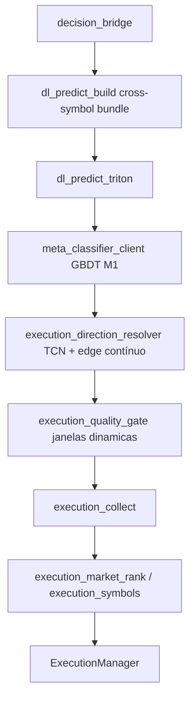
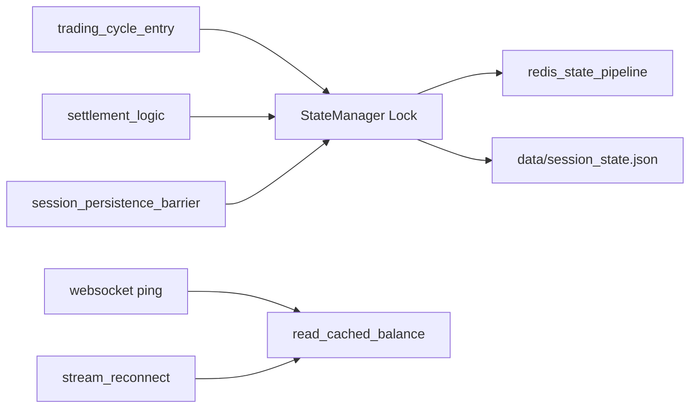

# Estrutura do repositório

Layout de software com infraestrutura Docker local opcional (`infra/docker/`).

```
aether-quantum-engine/
├── infra/docker/                       # Redis (AOF), TimescaleDB, MinIO, Triton (GPU), meta-classifier
├── app/
│   ├── src/
│   │   ├── application/services/
│   │   │   ├── deep_learning/          # TCN/LSTM/GRU, labels, predict, dl_predict_build, Triton bridge
│   │   │   ├── orchestrator/           # Ciclo, execução, settlement, barreira atômica, persistência, watchdog, graceful shutdown
│   │   │   │   ├── orchestrator_atomic_state.py
│   │   │   │   ├── orchestrator_persistence.py
│   │   │   │   ├── session_persistence_barrier.py
│   │   │   │   ├── api_maintenance_guard.py
│   │   │   │   ├── trading_cycle_entry.py
│   │   │   │   ├── orchestrator_data_signature.py
│   │   │   │   └── ...
│   │   │   ├── execution_*.py          # Resolver TCN+meta, quality gate adaptativo, cross-symbol, ranking
│   │   │   ├── log_dedupe.py
│   │   │   └── auth_manager.py
│   │   ├── domain/                     # Modelos, risk_manager, stop_win_target, risk_recovery_state, consensus_stake_penalty, dlambert_sizing
│   │   ├── infrastructure/
│   │   │   ├── inference/              # triton_grpc_client, meta_classifier_client, triton_model_sync
│   │   │   ├── state/                  # state_manager (asyncio.Lock), redis_state_pipeline, redis_state_store, json_state_store
│   │   │   ├── storage/                # minio_model_store, torchscript_sanity, torchscript_sanity_probes
│   │   │   └── ...                     # WebSocket, stream, stream_reconnect, tick_buffer, trade
│   │   └── presentation/               # Logger terminal
│   ├── tests/unit/                     # Pytest (~1893 testes; cobertura 100% em src)
│   ├── scripts/
│   │   ├── batch/                      # launch-all-demo, launch-train, _run_engine
│   │   ├── monitor/                    # live_monitor
│   │   ├── operations/                 # clean_workspace, deriv_pat_connect, train_meta_classifier, train_meta_optuna, train_meta_vector, reset_demo_balance
│   │   └── wsl/                        # setup.sh (WSL)
│   ├── aether_paths.py
│   ├── run.py                          # Entrada de execução (modo execute)
│   └── train.py                        # Entrada de treino DL (modo train)
├── config/settings.json                # Configuração versionada
├── data/                               # state.json, dl/, deriv/ (runtime)
├── logs/                               # engine.log, monitor.log
├── docs/
├── linters/                            # pre-commit, commitlint, release
├── .github/workflows/                  # CI
├── run.py                              # Atalho para app/run.py
└── train.py                            # Atalho para app/train.py
```

## Camadas em `app/src`

| Pasta | Responsabilidade |
|-------|------------------|
| `application/services/deep_learning` | Features **34D**, TCN/LSTM/GRU, `dl_predict_build` (bundle cross-symbol), `dl_predict_async`, `dl_predict_triton`, `dl_trend`, deploy gate, TorchScript |
| `application/services/orchestrator` | `Orchestrator`, `ExecutionManager`, `trading_cycle_entry`, `orchestrator_data_signature`, `orchestrator_atomic_state`, `orchestrator_persistence`, `session_persistence_barrier`, `api_maintenance_guard`, `execution_collect`, `execution_recovery_gate`, `watchdog_service`, `graceful_shutdown`, `settlement_*`, `settlement_queue_ops`, `post_settlement_cycle`, `orchestrator_run_loop` |
| `application/services` | `execution_direction_resolver` (TCN + edge contínuo D-SQUEEZE), `meta_payoff_regression`, `meta_classifier_stacking`, `execution_quality_gate` (margem + payoff), `execution_quality_gate_cluster`, `execution_quality_gate_fallback`, `execution_direction_cross_corr` (telemetria), `execution_market_rank`, `execution_symbols`, `execution_mandatory_pick`, `log_dedupe`, `auth_manager` |
| `domain` | `Candle`, `Trade`, `RiskManager`, `StopWinManager` (`stop_win_target.py`), `risk_recovery_state`, `consensus_stake_penalty`, `recovery_hurst_gate`, `probability_entropy`, Kelly, `dlambert_sizing` (Martingale Geométrico), `recovery_conviction`, cooldowns, `stake_sizing` |
| `infrastructure/inference` | `TritonGrpcClient` (gRPC aio persistente), `triton_inference_client`, `meta_classifier_client`, `triton_model_sync`, `triton_tensor_builder`, `triton_model_metadata` |
| `infrastructure/state` | `state_manager` (`asyncio.Lock`, `atomic_state_context`, `read_cached_balance`), `redis_state_pipeline` (MULTI/EXEC atômico), `redis_state_store`, `json_state_store`, ports `StateStore` |
| `infrastructure/storage` | `minio_model_store`, `torchscript_sanity`, `torchscript_sanity_probes` (probes estressados) |
| `infrastructure` (demais) | `WebSocketManager`, `StreamHandler`, `stream_reconnect`, `TickBuffer`, `TradeHandler`, Timescale, MinIO |
| `presentation/terminal` | `setup_logger`, `BlankLineSquasher`, formatação de logs |

Decisão exclusivamente Deep Learning quando `deep_learning.enabled` é verdadeiro. Treino e execução são processos separados (`train.py` / `run.py`).

## Módulos de execução (pipeline atual)



| Arquivo | Papel |
|---------|-------|
| `dl_predict_build.py` | `prepare_meta_classifier_cross_symbol_bundle` — telemetria micro M1 paralela + spreads cross-symbol antes do prefetch HTTP |
| `triton_grpc_client.py` | Canal `grpc.aio.insecure_channel` persistente; timeout 2 s por inferência; `infer_symbols_concurrent` via `asyncio.gather`; fallback TorchScript em timeout |
| `meta_classifier_client.py` | Consulta assíncrona httpx ao container porta 8005; timeout 1,0 s; retorna `predicted_payoff_edge`; fallback neutro em falha |
| `meta_payoff_regression.py` | Edge `> 0` preserva score TCN; edge `< -0.15` em squeeze rebaixa para `0.52`; log `[D-SQUEEZE]` |
| `meta_classifier_features.py` | Extração tabular 39D (34 TCN + 3 cross-symbol + 2 fluxo micro); `meta_classifier_column_names()` |
| `meta_classifier_cross_symbol.py` | Triplet cross-symbol: `prob_delta` (abs), `vol_ratio_diff` e `rsi_spread` (spreads lineares assinados) |
| `train_meta_vector.py` | Montagem vetorizada do dataset 39D com alinhamento epoch; alvo `Y = PnL_Real / Stake` |
| `train_meta_optuna.py` | Optuna + `LGBMRegressor` huber; minimiza MAE; `n_jobs=2`; `LOKY_MAX_CPU_COUNT=4` no boot |
| `watchdog_service.py` | `AetherWatchdog` — detecta inanição de ticks (>30 s) e reconecta stream sem derrubar o motor |
| `stream_reconnect.py` | Reabertura controlada de WS + subscrições OHLC/tick após STALE_DATA |
| `graceful_shutdown.py` | Encerramento ordenado; `fast_path=True` cancela fila de settlement e aborta tasks pós-liquidação |
| `settlement_queue_ops.py` | `cancel_settlement_queue_fast` — cancela worker e drena fila sem handshake `task_done` |
| `post_settlement_cycle.py` | Breath pós-liquidação; curto-circuito stop win; teto 2× ciclo incompleto |
| `orchestrator_run_loop.py` | Loop principal; `_enforce_post_settlement_deadlock_exit` → `emergency_save_session_state` + `sys.exit(0)` |
| `execution_direction_resolver.py` | TCN define `dl_direction`; meta-regressor refina via `predicted_payoff_edge`; `ensure_direction_margin` expõe `abs(P(lado) − 0.50)` |
| `execution_quality_gate.py` | Janelas dinâmicas regular/recovery; `direction_margin_from_probability`, `ensure_direction_margin`, `passes_execution_quality` |
| `execution_quality_gate_cluster.py` | `quality_conviction_suspends_cluster`, log `[AETHER] QUALITY_GUARD` |
| `execution_quality_gate_fallback.py` | Bloqueia fallback obrigatório em recovery quando todos os candidatos foram vetados |
| `orchestrator_data_signature.py` | Assinatura `m1b:...;m1:...;m15:...` para invalidar cache por fronteira M1 |
| `dlambert_sizing.py` (domain) | Martingale `Effective_Base × 2^n` com ancoragem `max(override, U)` |
| `risk_stake_calc.py` (domain) | Bypass de consensus penalty quando `pending_total > 0` |
| `execution_collect_helpers.py` | `recovery_hurst_blocks_collect`, mandatory fallback, logs EXEC_SEL |
| `execution_collect.py` | Coleta contínua; quality gate como penalidade; fallback bloqueado em recovery se todos vetados |
| `consensus_stake_penalty.py` (domain) | Penalidade Kelly base por divergência técnica; waiver absoluto em regime de recovery ativo |
| `risk_recovery_state.py` (domain) | Reset do expoente consecutivo condicionado à extinção real de `pending_loss` |
| `redis_state_pipeline.py` | Escrita atômica MULTI/EXEC do bundle de risco, snapshot e chaves de sessão no Redis |
| `session_target_bootstrap.py` | Bootstrap e clearing de metas compostas de 2,60% atreladas ao processo vivo |
| `stop_win_target.py` (domain) | Cálculo centralizado de `target_win` e gerenciamento de estados de sessão composta |
| `state_manager.py` (infra) | `asyncio.Lock` central; `atomic_state_context()`; `mirror_balance()` / `read_cached_balance()` |
| `orchestrator_atomic_state.py` | Facade do lock para o orquestrador; `orchestrator_balance_snapshot()` para infra read-only |
| `orchestrator_persistence.py` | `save_full_state()` (locked) e `persist_full_state_unlocked()` (sem reentrância) |
| `session_persistence_barrier.py` | Barreira pós-reset linear D'Alembert; yield 0,1 s; flag `_session_persistence_write_active` |
| `api_maintenance_guard.py` | Hibernação cooperativa em manutenção/reset de liquidez do broker Deriv |
| `trading_cycle_entry.py` | Entrada do ciclo M1; assinatura M1+M15; lock atômico; `quality_conviction_suspends_cluster` antes de `execute_cluster` |

## Concorrência assíncrona (barreira atômica)



| Regra | Detalhe |
|-------|---------|
| Serialização | Inferência DL, liquidação e persistência de risco não coexistem |
| Reentrância | Seções já protegidas usam `_persist_full_state_unlocked()` |
| Infra read-only | Ping WS, reconexão e profit audit leem `_balance_snapshot` sem lock |
| Testes | `MagicMock` como `state_mgr` bypassa o lock (evita deadlock em mocks) |

## Dados e artefatos

| Caminho | Uso |
|---------|-----|
| `data/state.json` | Estado geral de contratos e banca (legado) |
| `data/session_state.json` | Métricas da sessão ativa corrente (`session_start_balance`, `target_win`, P&L) |
| `data/dl/{symbol}.pth` | Checkpoints PyTorch + calibrador + métricas |
| `data/dl/{symbol}_ts.pt` | TorchScript trace para inferência Triton |
| `infra/docker/triton-models/{symbol}/` | Layout Triton (`model.pt`, `config.pbtxt`) |
| `infra/docker/meta-classifier/` | Container FastAPI Python 3.13-slim; `POST /v2/predict_meta`; healthcheck `urllib` em `/health` (porta host **8005**) |
| `infra/docker/meta-models/` | Artefatos LightGBM do meta-regressor (`.pkl`, `FEATURE_DIM=39`); `LGBMRegressor` huber treinado com `feature_name` explícito |
| `data/deriv/pat_bindings.json` | Cache PAT → App ID |
| `logs/engine.log` | Auditoria operacional |

Caminhos resolvidos por `aether_paths.repo_path()` a partir da raiz do repositório.

## Comandos úteis (WSL)

Primeira vez no WSL: `make setup-wsl` (Git, Conda no `~/.bashrc`, hooks).

```bash
make install
make test
make lint
make docker-up
make train
make run
make clean
```

Pre-commit: `make pre-commit` instala hooks; `git commit` dispara lint, testes e segurança.
