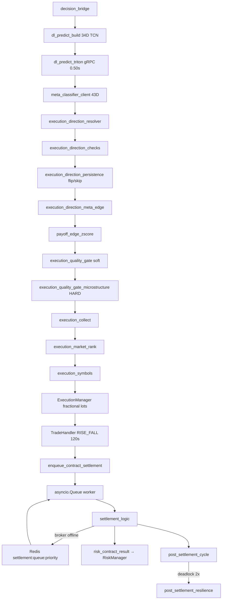

# Estrutura do repositório

Layout de software com infraestrutura Docker local opcional (`infra/docker/`). O código de produção vive em **`app/src/`** com **246 módulos Python** organizados em quatro camadas DDD. Testes: **305** arquivos `test_*.py` em `app/tests/` com cobertura **100%** em `app/src`.

```
aether-quantum-engine/
├── app/
│   ├── aether_paths.py                 # Resolução de caminhos a partir da raiz do repo
│   ├── aether_asyncio.py               # Wrapper asyncio.run; silencia ruído de debug
│   ├── run.py                          # Entrada de execução (modo execute)
│   ├── train.py                        # Entrada de treino DL (modo train)
│   ├── pyproject.toml
│   ├── requirements.txt
│   ├── requirements-dev.txt
│   ├── scripts/
│   │   ├── batch/                      # launch-all-demo, launch-all-live, launch-train, _run_*
│   │   ├── monitor/                    # live_monitor, monitor_redis, monitor_state, monitor_ui
│   │   ├── operations/                 # clean_workspace, deriv_pat_connect, train_meta_*
│   │   └── wsl/setup.sh
│   ├── src/                            # 246 módulos Python (DDD)
│   └── tests/
│       ├── unit/                       # application, domain, infrastructure, presentation, scripts
│       ├── conftest.py
│       └── market_symbols.py
├── config/
│   ├── settings.json
│   └── python.json
├── data/                               # Runtime: state.json, session_state.json, dl/, deriv/
├── docs/
│   ├── arquitetura.md
│   ├── CHANGELOG.md
│   ├── deriv-api.md
│   ├── deriv-api-aether.md
│   ├── deriv-indices-algorithm.md
│   ├── infra-docker.md
│   ├── medallion.md
│   ├── README.md
│   └── structure.md
├── infra/docker/                       # Redis, TimescaleDB, MinIO, Triton, meta-classifier
├── linters/
├── Makefile
├── README.md
├── run.py                              # Atalho → app/run.py
└── train.py                            # Atalho → app/train.py
```

---

## Regra DDD entre camadas

```
presentation  →  application  →  domain
                    ↓
              infrastructure (adapters)
```

| Camada | Pasta | Módulos | Responsabilidade |
|--------|-------|---------|------------------|
| Application | `application/services/` | ~161 | Casos de uso: orquestração, DL, execução modular, meta-classificador, guards |
| Domain | `domain/` | ~39 | Lógica pura: risco Kelly + Soft Recovery, AntiTrendLock (política), RiskPolicy, modelos, side_equilibrium |
| Infrastructure | `infrastructure/` | ~45 | Adaptadores: Deriv API (retry 5xx), Redis, Triton, MinIO, Timescale |
| Presentation | `presentation/` | 1 | Logging de terminal |

---

## Entry points (`app/`)

| Arquivo | Função |
|---------|--------|
| `aether_paths.py` | `repo_path()` — caminhos absolutos a partir da raiz |
| `aether_asyncio.py` | Wrapper de `asyncio.run`; silencia ruído de debug do asyncio |
| `run.py` | Bootstrap `engine_session`, cria `Orchestrator`, `aether_asyncio.run(orch.run())` |
| `train.py` | Bootstrap de treino, `orch.run_training()` |

---

## Application — raiz (`application/services/`)

| Módulo | Responsabilidade |
|--------|------------------|
| `auth_manager.py` | Autenticação PAT Deriv, sessão REST/OTP |
| `bb_width_adaptive_squeeze.py` | D-SQUEEZE: média harmônica de `bb_width` (settings: adaptativo **desabilitado**) |
| `direction_loss_tracker.py` | Perdas consecutivas por direção (singleton) |
| `direction_persistence_guard.py` | Anti-trend-lock com flip cross-symbol e telemetria `REGIME_GUARD` |
| `direction_persistence_guard_helpers.py` | Auxiliares de probabilidade cross-symbol e deduplicação de logs do guard |
| `direction_persistence_guard_part2.py` | Continuacao do anti-trend-lock |
| `execution_direction.py` | Resolução CALL/PUT e elegibilidade mandatory/recovery |
| `execution_direction_checks.py` | Pré-checagens, clamps, sniper stubs, price zone prévia |
| `execution_direction_cross_corr.py` | Peso DL via correlação cruzada |
| `execution_direction_discordance.py` | Veto RSI/DI + votos técnicos (`discordance_veto_enabled`) |
| `execution_direction_fallback.py` | Fallback quando pool DL vazio (scored + last resort) |
| `execution_direction_meta_edge.py` | Piso dinâmico de edge meta e `negative_edge_skip` |
| `execution_direction_persistence.py` | Flip toxic escape ou skip após losses consecutivos |
| `execution_direction_resolver.py` | Orquestra resolve + finalize (meta, zona, SIDE_EQ) |
| `execution_entropy_fallback.py` | Fallback por menor entropia Shannon |
| `execution_loss_protection.py` | Hard filters de loss protection |
| `execution_mandatory_pick.py` | Seleção obrigatória por ranking |
| `execution_market_rank.py` | Ranking de mercado e `market_decision_score` |
| `execution_price_zone_gate.py` | Zona BB/Keltner + `align_or_keep_meta_side` |
| `execution_quality_gate.py` | Gate TCN soft: margem direcional + meta payoff edge |
| `execution_quality_gate_cluster.py` | Suspensão cooperativa do cluster (TCN vs meta) |
| `execution_quality_gate_config.py` | Parsers/resolvers do quality_gate SSOT |
| `execution_quality_gate_drawdown.py` | Dynamic Recovery Relaxation: pisos TCN/Meta vs passivo + waiver Z |
| `execution_quality_gate_fallback.py` | Bloqueio de fallback em recovery |
| `execution_quality_gate_meta.py` | Filtro pelo meta-regressor (z-score payoff) |
| `execution_quality_gate_microstructure.py` | Vetoes HARD: `adx_starvation`, `vol_ratio_starvation`, `val_accuracy_gate` |
| `execution_quality_gate_reason.py` | Motivos textuais e mensagens `QUALITY_GUARD` / `EXECUTION_FLOW` |
| `execution_quality_gate_starvation.py` | Válvula de escape por inanição de ciclos |
| `execution_runtime_config.py` | Resolve bloco orchestrator.execution do SSOT |
| `execution_sniper_gates.py` | Banda de calibração neutra e `hurst_regime_allowed` |
| `execution_symbols.py` | Símbolos elegíveis e ranking |
| `execution_symbols_recovery.py` | Pool e ranking em recovery |
| `execution_volatility_bb.py` | Bollinger width com vol implícita |
| `execution_volatility_booster.py` | Modificador por estouro macro/micro (600 s / 120 s) |
| `execution_volatility_threshold.py` | Thresholds dinâmicos por regime |
| `force_trade_mode.py` | Modo force-trade / mandatory |
| `infra_timing_config.py` | Timeouts/reconnect/history/stream/meta/triton SSOT |
| `live_signal_metrics.py` | - |
| `live_signal_metrics_config.py` | Knobs de telemetria live_signal_metrics |
| `log_dedupe.py` | `LogDeduper` — deduplicação por canal/minuto; `log_info_if_changed` / `log_warning_if_changed` |
| `market_audit_log.py` | Auditoria unificada de mercado |
| `market_audit_log_helpers.py` | Helpers do market audit log |
| `meta_classifier_cross_symbol.py` | Features cross-symbol de arbitragem |
| `meta_classifier_features.py` | Vetores tabulares para stacking |
| `meta_classifier_flow_features.py` | Features de velocidade micro |
| `meta_classifier_stacking.py` | Stacking tabular com edge contínuo |
| `meta_payoff_regression.py` | Edge LightGBM + soft score (sem flip de lado) |
| `meta_payoff_shadow.py` | Shadow calibração para hard veto |
| `meta_payoff_veto_gate.py` | Soft/hard veto Z-Score (`meta_veto_mode`: none/soft/hard) |
| `payoff_edge_zscore.py` | Z-Score adaptativo (janela 15–45) sobre `predicted_payoff_edge` |
| `regime_micro_freeze.py` | Freeze micro de regime |
| `settings_knobs.py` | Facades de knobs de aplicacao sobre config_knobs |
| `side_equilibrium_gate.py` | Gate SIDE_EQ na execucao |
| `side_equilibrium_store.py` | Store de equilibrio CALL/PUT |

### Application — strategy (`application/services/strategy/`)

| Módulo | Responsabilidade |
|--------|------------------|
| `decision_mode.py` | `resolve_decision_mode` — modo DL ativo |
| `__init__.py` | Pacote de modos alternativos |

### Application — orchestrator (`application/services/orchestrator/`)

| Módulo | Responsabilidade |
|--------|------------------|
| `__init__.py` | Pacote vazio |
| `api_maintenance_guard.py` | Hibernação durante manutenção do broker |
| `config_symbols.py` | Normalização de símbolos e âncora |
| `decision_mode_banner.py` | Banner de modo de decisão no startup |
| `engine_mode.py` | Modos train vs execute |
| `engine_session.py` | Bootstrap compartilhado run.py / train.py |
| `execution_blockers.py` | Logs quando nenhuma ordem é enviada |
| `execution_collect.py` | Coleta e seleção de candidatos do cluster |
| `execution_collect_gather.py` | Coleta contínua sem veto de qualidade |
| `execution_collect_helpers.py` | Helpers: hedge, fallback, Hurst |
| `execution_cuda.py` | Limpeza opcional de cache CUDA pós-ciclo |
| `execution_manager.py` | **`ExecutionManager`** — ordens, settlement, reconcile |
| `execution_manager_execute.py` | Execucao efetiva de ordem no manager |
| `execution_orders.py` | Envio de ordens e subscribe de contratos |
| `execution_proposal.py` | Retry de proposta com redução de stake |
| `execution_quality_skip_yield.py` | Yield após rejeição silenciosa do meta-gate |
| `execution_recovery_gate.py` | Pisos de qualidade em modo recovery |
| `execution_settlement.py` | Aguarda liquidação e reconcilia |
| `graceful_shutdown.py` | Encerramento gracioso |
| `metrics_utils.py` | Métricas neutras do orquestrador |
| `orchestrator_atomic_state.py` | Contexto atômico de leitura/escrita |
| `orchestrator_data_signature.py` | `resolve_signature_boundary_seconds`, `seconds_until_next_signature_boundary`, assinatura micro+macro (prefixos legados `m5`/`m15` para 120/600 s) |
| `orchestrator_persistence.py` | Snapshot atômico sessão/risco/mercado |
| `orchestrator_run_loop.py` | Loop principal; recovery transparente pós-deadlock |
| `orchestrator_settlement_queue.py` | Worker assíncrono: consome Redis priority + fila in-memory local |
| `orchestrator_state_restore.py` | Restore Redis no boot |
| `orchestrator_state_session.py` | Restore de sessão e assinaturas Redis |
| `post_settlement_cycle.py` | Agendamento pós-liquidação com fôlego |
| `post_settlement_loss_cooldown.py` | Inércia temporal pós-LOSS |
| `post_settlement_resilience.py` | Recovery transparente e timeouts resilientes |
| `reconnect_cycle_release.py` | Libera ciclo apos reconexao WS |
| `regime_freeze_yield.py` | Yield quando regime FREEZE suspende ciclo |
| `result_utils.py` | Normalização de resultado de contratos |
| `session_persistence_barrier.py` | Barreira atômica pós-reset D'Alembert |
| `session_target_bootstrap.py` | Bootstrap de metas stop-win por sessão |
| `settlement_backfill.py` | Fallback via profit_table / portfolio |
| `settlement_detect.py` | Detecção de contrato liquidado |
| `settlement_logic.py` | Liquidação e pós-processamento de contratos |
| `settlement_outcome.py` | - |
| `settlement_queue_ops.py` | Fila Redis `settlement:queue:priority` (ZSET), push/consume/cancel fast-path |
| `settlement_reconciliation.py` | Reconciliação atômica pós-reconexão WS |
| `settlement_utils.py` | Utilitários de liquidação |
| `settlement_ws_queries.py` | Consultas WS para reconciliação |
| `trading_cycle_entry.py` | Pré-condições, lock e execução do ciclo |
| `trading_cycle_entry_guards.py` | Guards de stop-win, assinatura, cadência e contratos |
| `training_run.py` | Sessão de treino DL (train.py) |
| `warm_up_buffer_guard.py` | Aquecimento do TickBuffer pós-reconexão |
| `watchdog_service.py` | Watchdog de inanição de ticks |
| `ws_bootstrap.py` | Bootstrap WebSocket PAT e streams |

### Application — deep learning (`application/services/deep_learning/`)

| Módulo | Responsabilidade |
|--------|------------------|
| `decision_bridge.py` | Ponte DL → Orquestrador |
| `dl_bootstrap_train.py` | Treino inicial sequencial de todos os símbolos |
| `dl_bridge_helpers.py` | Entradas de decisão, cooldown, reexportes |
| `dl_calibration.py` | Calibração de probabilidades |
| `dl_calibration_fit.py` | Ajuste de calibradores no holdout |
| `dl_calibration_isotonic.py` | Regressão isotônica (PAV) |
| `dl_calibration_tolerance.py` | Override TCN macro quando raw&gt;0.65 ou &lt;0.35; zona neutra config-driven (settings: OFF) |
| `dl_congestion.py` | Metricas de congestao de mercado |
| `dl_cycle_brief.py` | Linhas curtas do ciclo DL |
| `dl_cycle_log.py` | Logs compactos do ciclo DL |
| `dl_deferred_train.py` | Retreino em background |
| `dl_deploy.py` | Gate de deploy e persistência no runtime |
| `dl_deploy_eval.py` | Mini walk-forward de deploy (`force_local=True`) |
| `dl_device.py` | Seleção CPU/CUDA |
| `dl_feature_build.py` | Séries de preço e indicadores (34D) |
| `dl_feature_indicators.py` | Indicadores técnicos normalizados |
| `dl_feature_indicators_advanced.py` | Indicadores avançados normalizados |
| `dl_feature_matrix.py` | Linhas, matrizes e tensores de features |
| `dl_feature_oscillators.py` | Osciladores para feature build |
| `dl_features.py` | Reexport de feature build, matrix e sequence extract |
| `dl_gate_config.py` | Config do gate de deploy |
| `dl_gating.py` | Utilitários de probabilidade para execução |
| `dl_horizon.py` | Horizonte de label alinhado ao contrato |
| `dl_hurst.py` | Hurst e variance ratio |
| `dl_indicator_config.py` | Config fail-closed de indicadores DL |
| `dl_labels.py` | Rótulos binários Rise/Fall / Triple Barrier |
| `dl_lstm.py` | Classificador LSTM/GRU |
| `dl_market_data.py` | Leitura OHLC e microestrutura do stream |
| `dl_model_artifacts.py` | Download/upload via ModelArtifactStore |
| `dl_model_checkpoint.py` | Persistência PyTorch / TorchScript |
| `dl_model_factory.py` | Fábrica de arquiteturas |
| `dl_model_types.py` | Tipos e constantes DL |
| `dl_outcomes.py` | Peso de amostras a partir de trades reais |
| `dl_params.py` | Leitura de parâmetros deep_learning |
| `dl_params_blocks.py` | Blocos de parsing de parâmetros |
| `dl_params_timeframe.py` | - |
| `dl_predict.py` | Predição sync por símbolo |
| `dl_predict_async.py` | Predição assíncrona por símbolo |
| `dl_predict_build.py` | Montagem de entrada de decisão DL |
| `dl_predict_cache.py` | Cache de predição por fingerprint |
| `dl_predict_metrics.py` | Métricas dinâmicas e squeeze no entry |
| `dl_predict_telemetry.py` | Telemetria micro + bundle cross-symbol meta |
| `dl_predict_triton.py` | Predição via Triton (fail-closed obrigatório em produção) |
| `dl_retrain.py` | Agenda retreino por vela/loss/janela |
| `dl_sequence_extract.py` | Sequências TCN a partir de OHLC |
| `dl_splits.py` | Splits temporais purged com embargo |
| `dl_startup.py` | Fetch inicial e prontidão de checkpoint |
| `dl_symbol_runtime.py` | Runtime de modelo por símbolo |
| `dl_symbol_train.py` | Treino walk-forward por símbolo |
| `dl_symbol_train_success.py` | Persistência pós-treino |
| `dl_tcn.py` | TCN dilatado + **cabeça auxiliar de regressão** (`regression_head`) para regularização multi-task |
| `dl_training.py` | Treino walk-forward com split purged |
| `dl_training_epochs.py` | Loop de épocas e perda mascarada |
| `dl_training_gate.py` | Gates de treino inicial / histórico mínimo |
| `dl_trend.py` | Direção consensual de tendência |
| `model.py` | Fachada TCN/LSTM, checkpoint e predição |

## Domain (`domain/`)


### Config SSOT (`domain/`)

| Módulo | Responsabilidade |
|--------|------------------|
| `config_knobs.py` | SSOT: load/merge fail-closed de blocos do settings.json |

### Models (`domain/models/`)

| Módulo | Responsabilidade |
|--------|------------------|
| `trade.py` | `TradeDirection`, `Proposal`, `Contract`, `TradeResult` |
| `market_data.py` | `Candle` |

### Math (`domain/math/`)

| Módulo | Responsabilidade |
|--------|------------------|
| `probability_entropy.py` | `binary_entropy`, `entropy_penalty_factor`, `adaptive_entropy_ceiling` |
| `__init__.py` | Pacote vazio |

### Analytics (`domain/analytics/`)

| Módulo | Responsabilidade |
|--------|------------------|
| `side_equilibrium.py` | Leis dos pequenos/grandes números CALL/PUT; hard skip / soft Kelly |

### Symbols (`domain/symbols/`)

| Módulo | Responsabilidade |
|--------|------------------|
| `drift_symbols.py` | Universo `R_10`; `hedge_peer`, `is_high_side`, `sym_is_low_barrier` |

### Risk (`domain/risk/`)

| Módulo | Responsabilidade |
|--------|------------------|
| `bayesian_win_rate.py` | - |
| `consensus_stake_helpers.py` | - |
| `consensus_stake_penalty.py` | Soft recovery stake + caps + consensus penalty |
| `dlambert_sizing.py` | Kelly + progressão Soft Recovery |
| `executed_stake_reconciliation.py` | Stake executada vs planejada |
| `kelly_base_fraction.py` | Compressão da fração Kelly |
| `kelly_f_star_adjustments.py` | Ajustes f* (consenso, divergência) |
| `kelly_runtime_config.py` | Knobs Kelly runtime SSOT |
| `recovery_conviction.py` | Pisos de convicção em recovery |
| `recovery_hurst_decay.py` | Decaimento do piso Hurst |
| `recovery_hurst_gate.py` | Piso logarítmico por Hurst |
| `recovery_state_config.py` | Knobs de estado de recovery SSOT |
| `risk_cluster.py` | Finalização de cluster |
| `risk_contract_result.py` | `apply_contract_settlement_result` |
| `risk_cooldown.py` | `RiskCooldownMixin` |
| `risk_manager.py` | **`RiskManager`** — Kelly, cluster, recovery |
| `risk_manager_restore.py` | Restore de snapshot |
| `risk_policy.py` | `RiskPolicy` + `validate_engine_risk_config` no boot |
| `risk_proposal_skip.py` | `ProposalSkipMixin` |
| `risk_recovery_state.py` | Estado financeiro de recovery; `evaluate_anti_trend_lock` (política pura AntiTrendLock) |
| `risk_stake_calc.py` | Stake: Kelly EXPLORE; Soft Recovery RECOVER |
| `risk_stake_calc_helpers.py` | - |
| `risk_stake_flow.py` | `apply_stop_win_kelly_boost`, `emit_cycle_stake_log` |
| `soft_recovery_config.py` | Knobs Soft Recovery SSOT |
| `soft_recovery_policy.py` | Soft Recovery paramétrico: cap, amort, passo fixo U×1.15, hard floor micro, micro-residual |
| `stake_sizing.py` | Kelly, regime EXPLORE/RECOVER, consenso, round_stake |
| `stake_sizing_consensus.py` | - |
| `stake_target_proximity.py` | Amortecimento por proximidade da meta |
| `stop_win_target.py` | `StopWinManager`, meta de lucro por sessão |
| `super_concordance_kelly.py` | Expansão Kelly em super-consenso |
| `symbol_loss_cooldown.py` | Cooldown por loss recente |

## Infrastructure (`infrastructure/`)

### API Deriv (`infrastructure/api/`)

| Módulo | Responsabilidade |
|--------|------------------|
| `deriv_rest_client.py` | Cliente REST PAT + OTP |
| `deriv_pat_session.py` | Fluxo PAT: health, accounts, OTP |
| `deriv_pat_binding.py` | Cache de App ID para PAT |
| `deriv_credentials.py` | App ID e credenciais Deriv |
| `deriv_http.py` | HTTP seguro para Deriv |
| `deriv_granularity.py` | Granularidades OHLC aceitas |
| `websocket_manager.py` | WebSocket assíncrono; single-flight connect; RTT medido (`last_rtt_seconds`) |

### Handlers (`infrastructure/handlers/`)

| Módulo | Responsabilidade |
|--------|------------------|
| `stream_handler.py` | Fluxo em tempo real e histórico local |
| `tick_buffer.py` | Buffer de ticks e microestrutura |
| `stream_timeframe.py` | Granularidades macro/micro duplas (600 s / 120 s; assinatura legado m15/m5) |
| `stream_candle_apply.py` | Aplicação incremental de velas |
| `stream_tick_sidecar.py` | Ingestão de ticks e persistência de barras |
| `stream_ohlc_fetch.py` | Busca OHLC sem alterar buffer |
| `stream_reconnect.py` | Reconexão controlada OHLC/tick |
| `stream_reconnect_profit_audit.py` | Auditoria profit_table pós-instabilidade |
| `history_fetch.py` | Paginação resiliente ticks_history |
| `trade_handler.py` | Propostas e compra de contratos |

### State (`infrastructure/state/`)

| Módulo | Responsabilidade |
|--------|------------------|
| `trading_state.py` | `TradingState` — estado compartilhado |
| `state_manager.py` | `StateManager` — sessão e `asyncio.Lock` |
| `persistence_manager.py` | Salvar/carregar estado JSON |
| `redis_state_store.py` | StateStore Redis com debounce |
| `redis_state_pipeline.py` | Escrita atômica MULTI/EXEC |
| `json_state_store.py` | StateStore JSON (testes/sem infra) |

### Inference (`infrastructure/inference/`)

| Módulo | Responsabilidade |
|--------|------------------|
| `triton_inference_client.py` | Facade de inferência Triton |
| `triton_grpc_client.py` | Cliente gRPC aio persistente |
| `triton_http.py` | HTTP para Triton |
| `triton_model_sync.py` | Sync TorchScript MinIO → Triton |
| `triton_model_metadata.py` | Metadados HTTP de modelos |
| `triton_tensor_builder.py` | Montagem de tensores OHLC |
| `meta_classifier_client.py` | Cliente HTTP meta-classificador |
| `meta_classifier_pool.py` | Pool singleton do cliente meta |
| `meta_classifier_types.py` | Tipos de payload meta |

### Storage (`infrastructure/storage/`)

| Módulo | Responsabilidade |
|--------|------------------|
| `minio_model_store.py` | Armazenamento MinIO de checkpoints |
| `local_model_store.py` | Checkpoints locais (testes/cache) |
| `torchscript_sanity.py` | Validação forward pass TorchScript/Triton |
| `torchscript_sanity_probes.py` | Tensores de stress para sanidade |

### Market (`infrastructure/market/`)

| Módulo | Responsabilidade |
|--------|------------------|
| `timescale_writer.py` | Persistência assíncrona em TimescaleDB |
| `timescale_correlation_reader.py` | Matriz de correlação cruzada |
| `timescale_correlation_worker.py` | Worker de refresh da matriz |
| `null_market_writer.py` | Writer nulo (testes/sem Timescale) |

### Factories (`infrastructure/factories/`)

| Módulo | Responsabilidade |
|--------|------------------|
| `infra_factory.py` | `create_infra_services`, `InfraServices` |

---

## Presentation (`presentation/`)

| Módulo | Responsabilidade |
|--------|------------------|
| `terminal/logger.py` | `setup_logger`, `AetherFormatter`, `BlankLineSquasher`, `CooldownDeduplicationFilter` |

---

## Scripts (`app/scripts/`)

| Caminho | Função |
|---------|--------|
| `batch/launch-all-demo.bat` | Launcher demo Windows |
| `batch/launch-all-live.bat` | Launcher live Windows |
| `batch/launch-train.bat` | Launcher treino Windows |
| `monitor/live_monitor.py` | Monitor Rich ao vivo |
| `monitor/monitor_redis.py` | Inspeção Redis |
| `monitor/monitor_state.py` | Inspeção de estado |
| `monitor/monitor_ui.py` | UI de monitoramento |
| `operations/clean_workspace.py` | Lint, pytest, segurança, limpeza (pre-commit) |
| `operations/clean_workspace_stage.py` | Estágios isolados do clean_workspace |
| `operations/clean_runtime_artifacts.py` | Limpeza de artefatos de runtime |
| `operations/deriv_pat_connect.py` | Conexão/teste PAT Deriv |
| `operations/reset_demo_balance.py` | Reset de saldo demo |
| `operations/train_meta_classifier.py` | Treino do meta-classificador |
| `operations/train_meta_data.py` | Preparação de dados meta |
| `operations/train_meta_optuna.py` | Otimização Optuna meta (max IR) |
| `operations/train_meta_vector.py` | Treino de vetores meta |
| `wsl/setup.sh` | Setup do ambiente WSL |

---

## Testes (`app/tests/`)

```
app/tests/
├── conftest.py
├── market_symbols.py
├── memory_reclaim.py
├── torch_test_support.py
└── unit/
    ├── test_run.py
    ├── application/          # orchestrator, DL, execution, meta, settlement Redis
    ├── domain/
    │   ├── math/
    │   └── risk/
    ├── infrastructure/
    ├── presentation/
    └── scripts/
```

Convenção: espelha as camadas DDD. Cobertura obrigatória **100%** em `app/src/`. Contagem atual: **~287** arquivos `test_*.py`.

---

## Pipeline de execução



---

## Concorrência assíncrona

| Componente | Caminho | Papel |
|------------|---------|-------|
| Lock central | `state_manager.py` | `asyncio.Lock` + `atomic_state_context` |
| Facade | `orchestrator_atomic_state.py` | Delega ao StateManager |
| Ciclo | `trading_cycle_entry.py` | Lock envolvendo inferência + execução |
| Liquidação | `settlement_logic.py` + `orchestrator_settlement_queue.py` | Worker assíncrono; fila in-memory + Redis priority; lock em `_complete_contract_settlement` |
| Barreira | `session_persistence_barrier.py` | Pós-reset linear D'Alembert |
| Recovery | `post_settlement_resilience.py` | Reset transparente de contadores pós-deadlock |

---

## Dados e artefatos

| Caminho | Uso |
|---------|-----|
| `data/state.json` | Estado geral legado |
| `data/session_state.json` | Métricas da sessão ativa |
| `data/dl/{symbol}.pth` | Checkpoints PyTorch |
| `data/dl/{symbol}_ts.pt` | TorchScript para Triton |
| `infra/docker/triton-models/{symbol}/` | Layout Triton |
| `infra/docker/meta-models/` | LightGBM `.pkl` (43D) |

---

## Comandos úteis (WSL)

```bash
make app-install
make app-lint
make app-test
make docker-up
make docker-up-core
make docker-smoke
make app-train
make app-run
make app-pre-commit-run
```

Infra Docker híbrida: profiles `core`/`gpu`/`ml` (padrão `core,gpu,ml`). Detalhes em [`infra-docker.md`](infra-docker.md).

Verificação estrutural: máximo **300 linhas** por arquivo em `app/src/` (estágio lint do `clean_workspace.py`).
