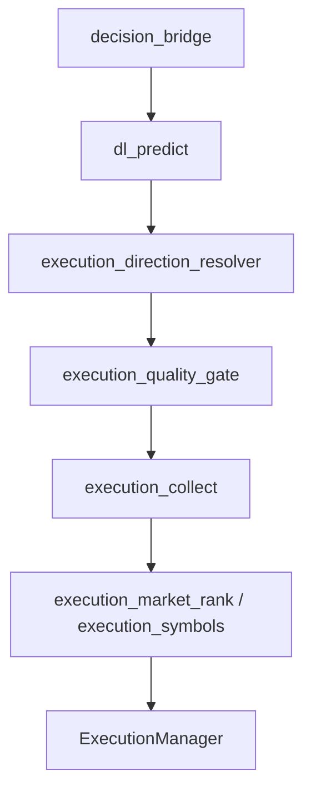

# Estrutura do repositório

Layout de software com infraestrutura Docker local opcional (`infra/docker/`).

```
aether-quantum-engine/
├── infra/docker/                       # Redis, TimescaleDB, MinIO (compose)
├── app/
│   ├── src/
│   │   ├── application/services/
│   │   │   ├── deep_learning/          # TCN/LSTM/GRU, labels, predict, logs DL
│   │   │   ├── orchestrator/           # Ciclo, execução, settlement, recovery gate
│   │   │   ├── execution_*.py          # Direção, resolver, qualidade, ranking, recovery
│   │   │   ├── log_dedupe.py
│   │   │   └── auth_manager.py
│   │   ├── domain/                     # Modelos, risk_manager, martingale, stake
│   │   ├── infrastructure/             # WebSocket, stream, tick_buffer, trade, persistência
│   │   └── presentation/               # Logger terminal
│   ├── tests/unit/                     # Pytest (cobertura 100% em src)
│   ├── scripts/
│   │   ├── batch/                      # launch-all-demo, launch-train, _run_engine
│   │   ├── monitor/                    # live_monitor
│   │   ├── operations/                 # clean_workspace, deriv_pat_connect, reset_demo_balance
│   │   └── wsl/                        # setup.sh (WSL)
│   ├── aether_paths.py
│   ├── run.py                          # Entrada de execução (modo execute)
│   └── train.py                        # Entrada de treino DL (modo train)
├── config/settings.json                # Configuração versionada
├── data/                               # state.json, dl/, deriv/ (runtime)
├── logs/                               # engine.log, monitor.log
├── docs/
├── linters/                            # pre-commit, commitlint, release
├── .github/workflows/                  # CI
├── run.py                              # Atalho para app/run.py
└── train.py                            # Atalho para app/train.py
```

## Camadas em `app/src`

| Pasta | Responsabilidade |
|-------|------------------|
| `application/services/deep_learning` | Features 19D, TCN/LSTM/GRU, `dl_predict`, `dl_trend`, `dl_cycle_brief`, `dl_cycle_log`, deploy gate, TorchScript |
| `application/services/orchestrator` | `Orchestrator`, `ExecutionManager`, `execution_collect`, `execution_recovery_gate`, settlement, `post_settlement_cycle` |
| `application/services` | `execution_direction_resolver`, `execution_quality_gate`, `execution_direction`, `execution_market_rank`, `execution_symbols`, `execution_mandatory_pick`, `execution_direction_fallback`, `log_dedupe`, `auth_manager` |
| `domain` | `Candle`, `Trade`, `RiskManager`, Kelly, martingale, cooldowns, `stake_sizing` |
| `infrastructure` | `WebSocketManager`, `StreamHandler`, `TickBuffer`, `TradeHandler`, ports `StateStore` / `MarketSeriesWriter` / `ModelArtifactStore`, Redis, Timescale, MinIO |
| `presentation/terminal` | `setup_logger`, `BlankLineSquasher`, formatação de logs |

Decisão exclusivamente Deep Learning quando `deep_learning.enabled` é verdadeiro. Treino e execução são processos separados (`train.py` / `run.py`).

## Módulos de execução (pipeline atual)



| Arquivo | Papel |
|---------|-------|
| `execution_direction_resolver.py` | Scoring CALL/PUT unificado; `direction_margin`, `direction_inverted` |
| `execution_quality_gate.py` | Pisos de score, edge, ADX, inversão |
| `execution_direction.py` | `build_execution_candidate`, hedge recovery |
| `execution_recovery_gate.py` | Pool técnico; floors de recovery para martingale |
| `execution_collect.py` | Coleta, seleção e skip de ciclo |
| `execution_market_rank.py` | `market_decision_score`, ranking |
| `execution_symbols.py` | Seleção do melhor candidato do cluster |
| `execution_direction_fallback.py` | Fallbacks em modo mandatory |

## Dados e artefatos

| Caminho | Uso |
|---------|-----|
| `data/state.json` | Estado geral de contratos e banca |
| `data/session_state.json` | Métricas diárias da sessão e limites de Stop Win |
| `data/dl/{symbol}.pth` | Checkpoints PyTorch + calibrador + métricas |
| `data/dl/{symbol}_ts.pt` | TorchScript trace para inferência rápida |
| `data/deriv/pat_bindings.json` | Cache PAT → App ID |
| `logs/engine.log` | Auditoria operacional |

Caminhos resolvidos por `aether_paths.repo_path()` a partir da raiz do repositório.

## Comandos úteis (WSL)

Primeira vez no WSL: `make setup-wsl` (Git, Conda no `~/.bashrc`, hooks).

```bash
make install
make test
make lint
make train
make run
make clean
```

Pre-commit: `make pre-commit` instala hooks; `git commit` dispara lint, testes e segurança.
